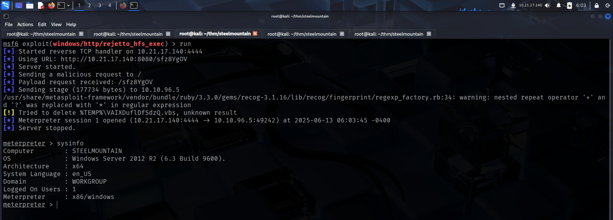

To access the machine, click on the link given below:
- https://tryhackme.com/room/steelmountain

# SCANNING

I performed an **nmap** aggressive scan on the target to get a comprehensive list of details including open ports, running services, configurations etc.

# FOOTHOLD

I visited the web applications that were hosted on the target and found an **HTTP File Server** running on port 8080.

I then searched for exploits related to this specific version of the File server and found some.

Since there was a **Metasploit** version of the exploit, I started the **Metasploit** framework and selected the exploit.

I then configured the appropriate parameters.

Finally, I ran the exploit and got a reverse shell.

I initially gained a 32-bit shell, so I migrated to a 64 bit process to get a 64 bit shell.

I then captured the user flag from *bill*'s Desktop.

# PRIVILEGE ESCALATION

After capturing the user flag, I downloaded **PowerUp.ps1** on my local system and transferred it to the target for local enumeration.

Executing **`Invoke-AllChecks`** revealed an **Unquoted Service Path** misconfiguration on a service running as Local System.

To exploit the misconfiguration, I first created an **exe** file with the same name as the service directory with a space in its name.

I then uploaded this application to the parent directory of the directory with the space in its name.

Finally, I restarted the service using **sc**.

I started a reverse shell listener on another instance of **metasploit** and got a reverse shell.

Since I had **nt authority** privileges, I captured the root flag from *Administrator*'s Desktop.

---
