Link to machine : https://tryhackme.com/r/room/tomghost

# RECONAISSANCE

I performed an **nmap** aggressive scan to find open ports and the services running on the target. It also performs script scans making the recon process more efficient.

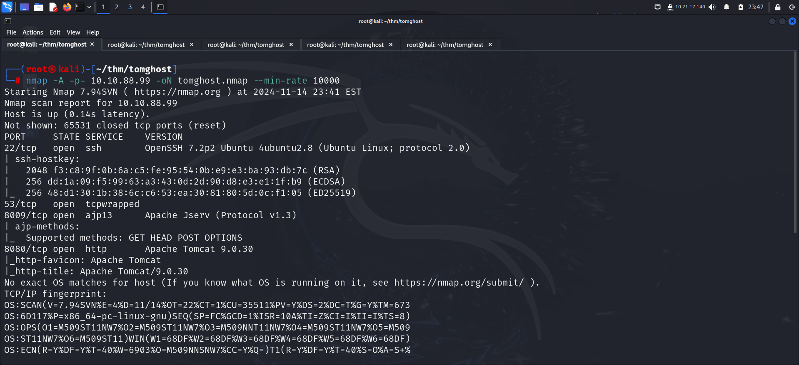

# FOOTHOLD

The **nmap** scan revealed a tomcat server running on the target so I accessed it through my browser.

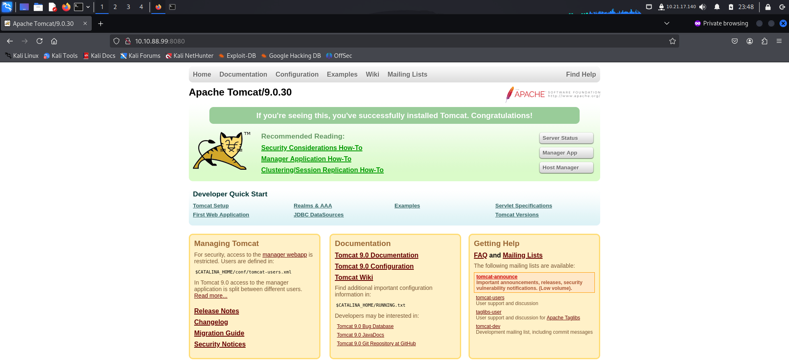

I also bruteforced directories to increase my attack surface.

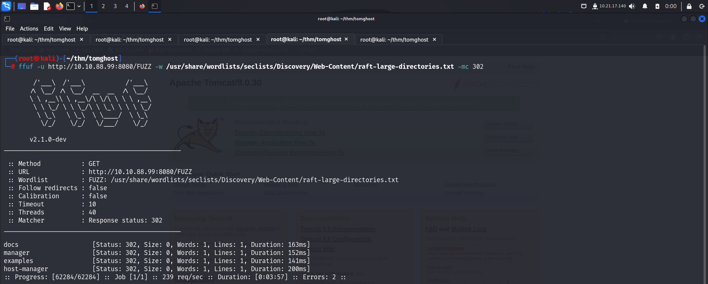

I discovered the manager console but was denied access to it.

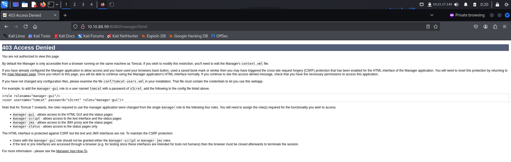

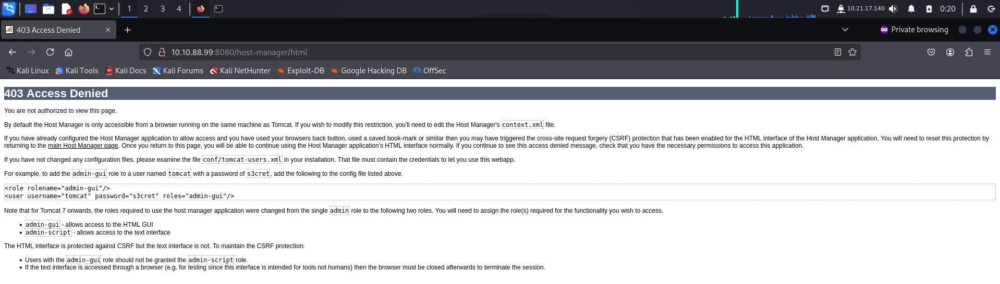

Since I did not know much about AJP, I read about it on **hacktricks**. I found that the tomcat server might be vulnerable to CVE-2020-1938.

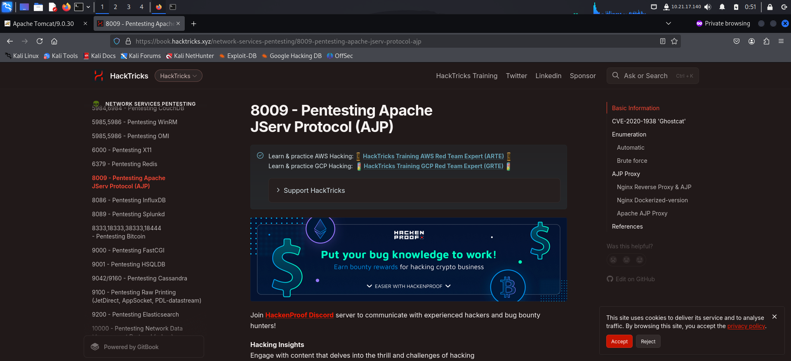

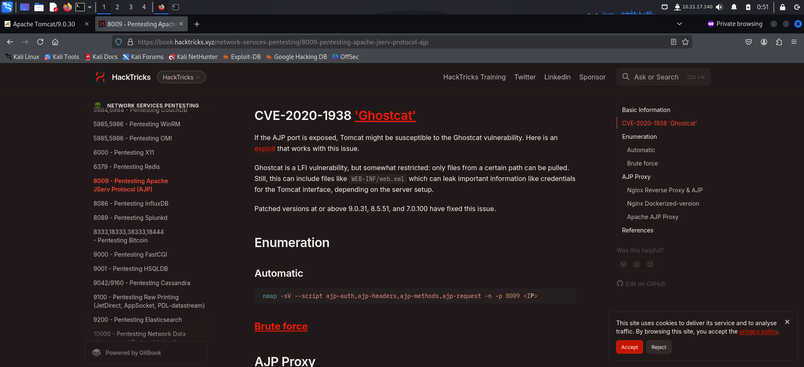

Hence, I looked for exploits and found some in **exploit-db**

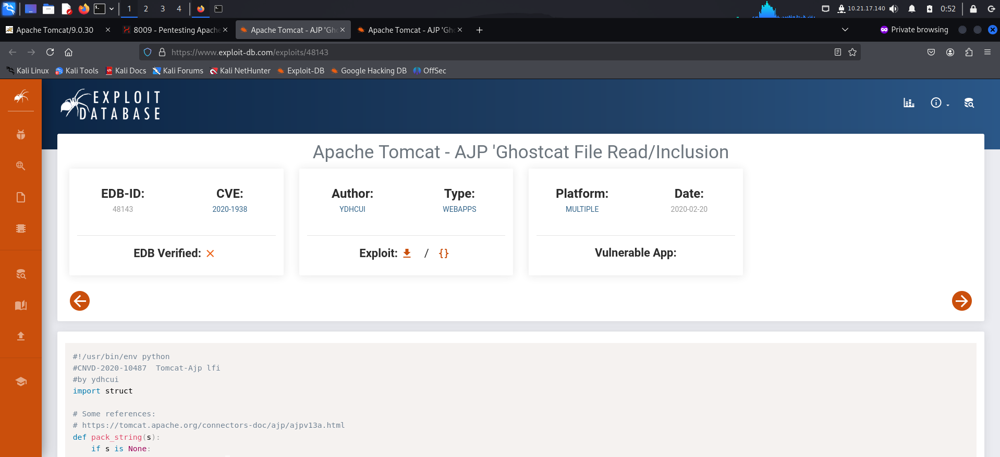

I downloaded and ran the exploit to get a username and password.

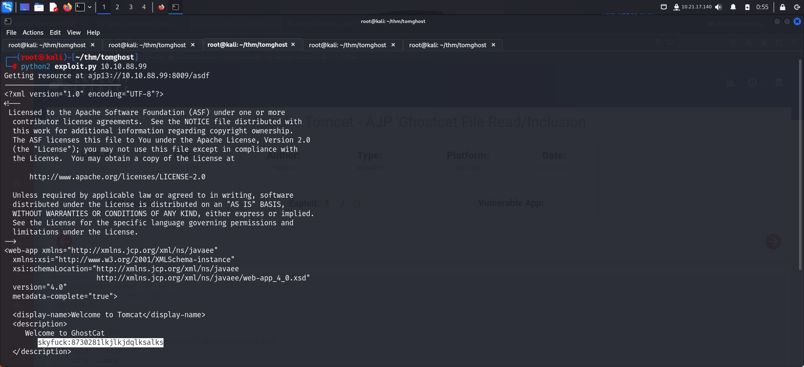

I tested if the credentials could be used for **ssh** and finally used **ssh** to get shell access on the target.

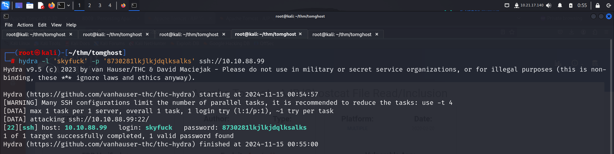

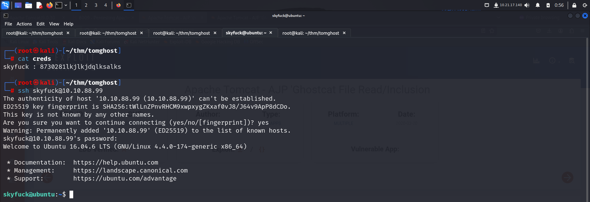

I found a **gpg** encrypted file and a **gpg** key.

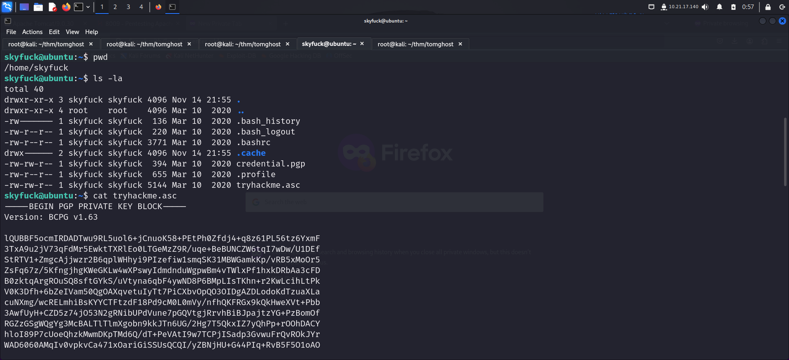

I also found the user flag in *merlin*'s home directory.

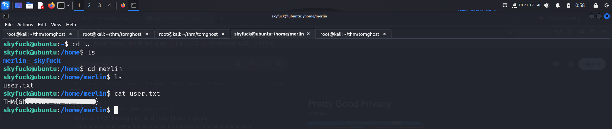

# PRIVILEGE ESCALATION

I downloaded **linpeas** to do privilege escalation checks but found nothing interesting.

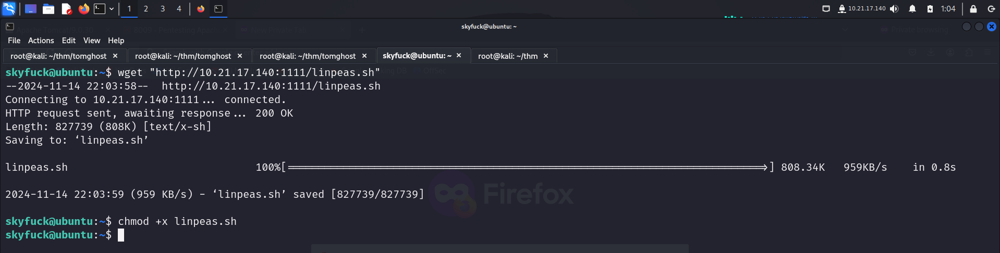

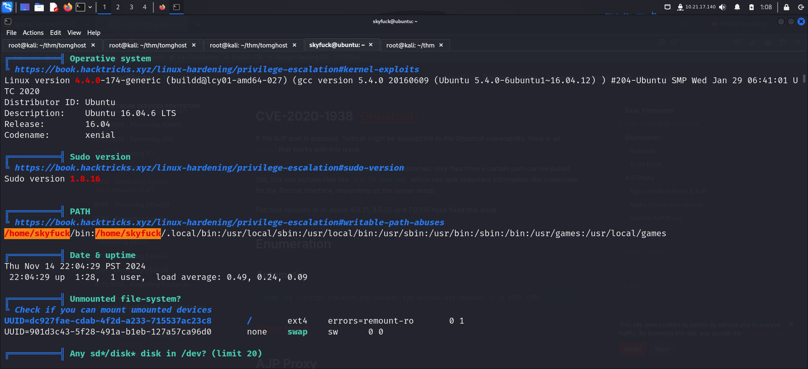

Since I had an encrypted file that I hadn't analyzed, I transferred the file and the key to my local system.

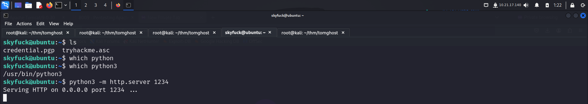

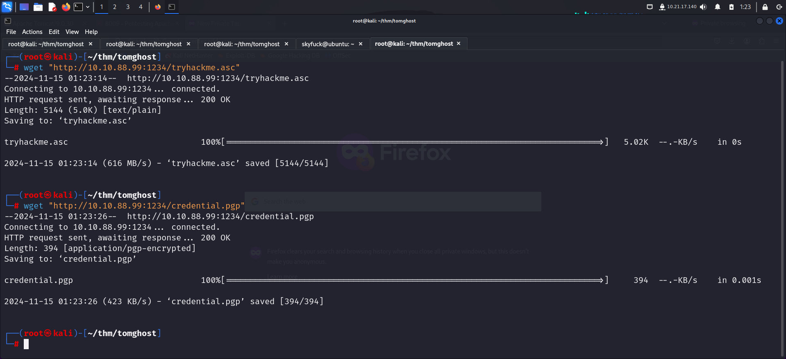

I imported the **gpg** key and tried decrypting the **encrypted** file, however, I was asked for a passphrase.

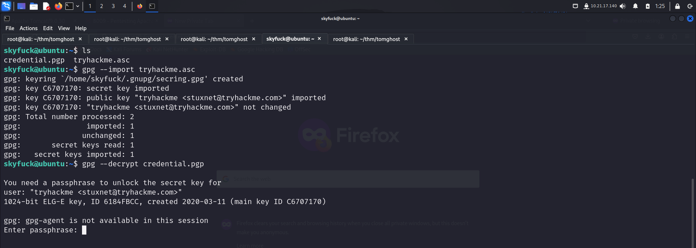

Since I did not have a passphrase, I attempted to crack it using **john**. I first converted the key file to **john** format and then cracked it to find the password.

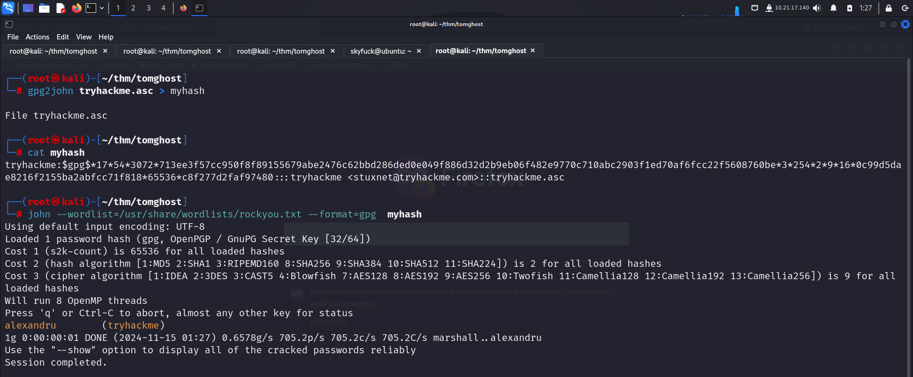

After finding the valid password, I decrypted the file and found credentials for *merlin*.

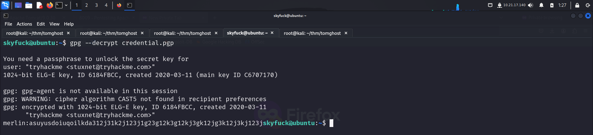

I switched user to *merlin*

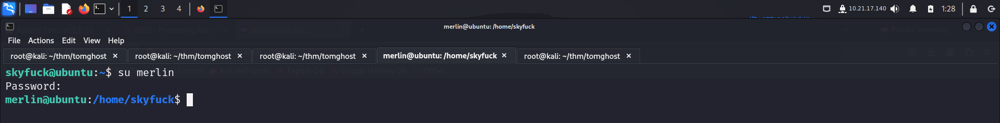

Then I looked for my **sudo** privileges and found I was allowed to execute **zip** as root.

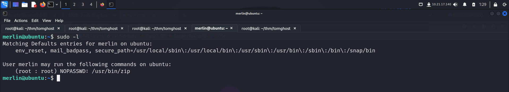

I visited **gtfobins** and found a way to exploit the **sudo** privileges to get a privileged access.

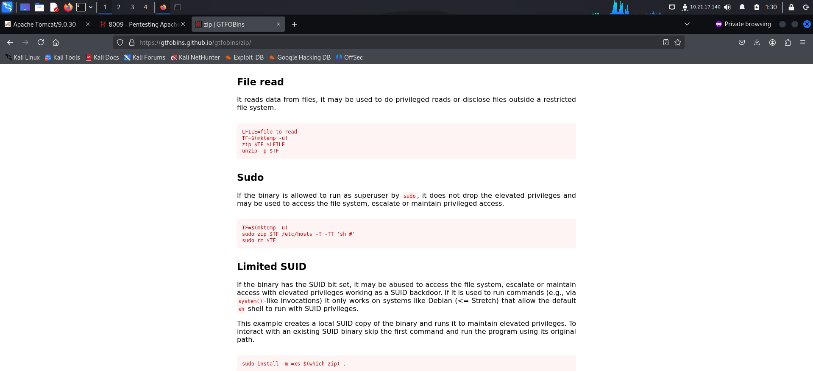

I used the method shown in **gtfobins** to get root access.

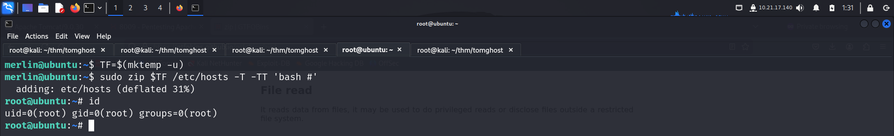

Finally I captured the root flag from the */root* directory.

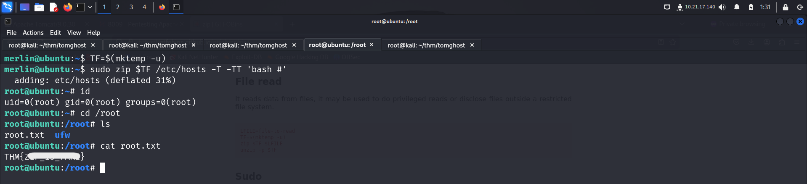

That's it from my side.
Happy hacking :)

---