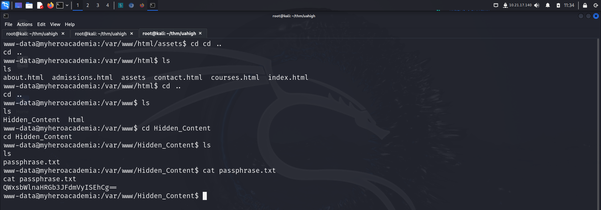
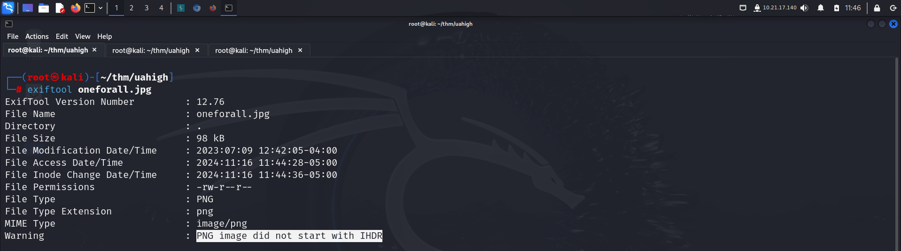
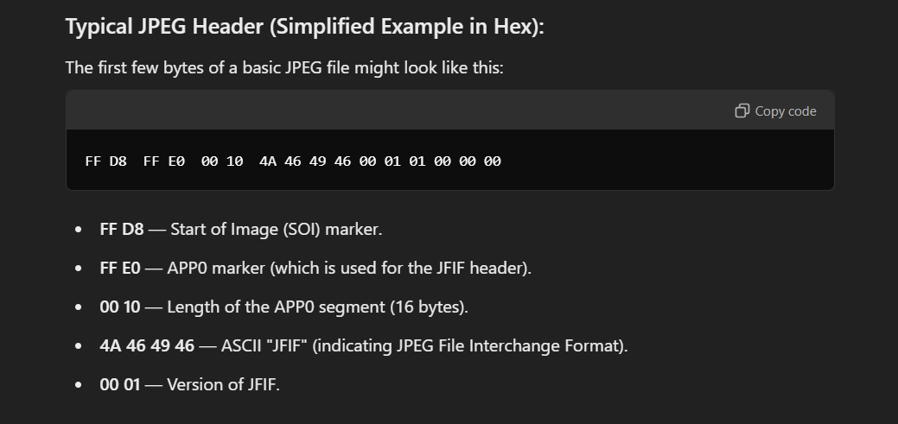

Link to machine : https://tryhackme.com/room/yueiua

# RECONNAISSANCE

I performed an **nmap** aggressive scan to find open ports and the services running on them.

# FOOTHOLD

The **nmap** scan revealed a web application running so I accessed it through my browser.

There was a form field so I analyzed the server response by entering test data.

I then used **ffuf** to find hidden directories on the web app.

I accessed the newly discovered directory but found nothing.

I then found hidden files using **ffuf**.

I accessed the files and found nothing at first. However, when I tried passing command through common variables on *index.php*, I received a url base64 encoded response.

Hence, I was able to execute os commands on the target. I viewed the source code of *index.php* using this.

I then checked if the machine had **netcat** so that I could try and initiate a reverse shell connection.

I then visited **revshells** and copied an **nc mkfifo** command to get a reverse shell. Upon execution, I received a shell on my **netcat** listener.

After spawning a pty shell, I found a passphrase that was base64 encoded.

Decoding it revealed a password.

I found the user from the */home* directory and tries switching to it using the password.

However, I failed.

I then looked deeper and found some images inside the *assets* directory.

I downloaded the images on my local system and viewed their file type.

*oneforall.jpg* seemed to have some contents so I viewed its exif data.

The file had an extension of **jpg** but the file type shown was **png**. So I loaded the file in an online hex editor and viewed the magic headers.

The image had the magic header bytes of **png** type.

I switched the file headers and downloaded the new image file.

Everything seemed fine now.

Finally, I tried extracting data from the image. I used the base64 decoded password that I had found in the passphrase.txt file as the password.

I had found the credentials of *deku* so I logged in using **ssh**.

I captured the user flag from *deku*'s home flag.

# PRIVILEGE ESCALATION

I looked at my **sudo** privileges and found I was allowed to execute a bash script. I read the bash script and found it allowed us to execute commands.

In Bash, the `eval` command is used to evaluate and execute a string as a shell command.

I executed the script and added a new rule in the **sudoers** file allowing my current user to execute all commands as **sudo** without a password.

I verified the changes by viewing my **sudo** privileges.

I then executed **bash** as **sudo** and got shell as root. Finally I captured the root flag from */root* directory.

Happy hacking !

---
