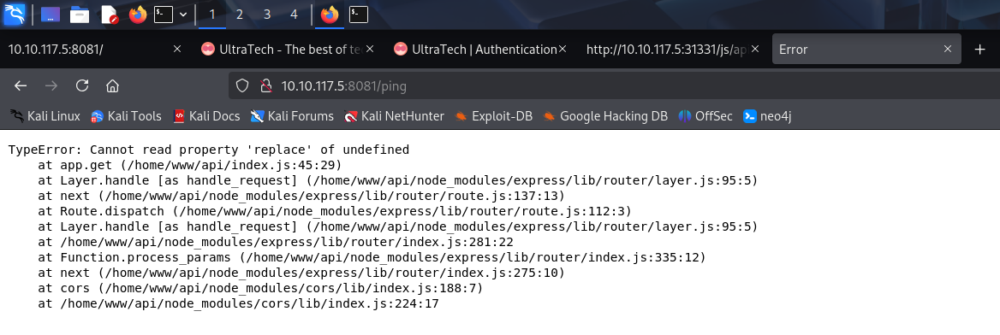

Link to the machine: https://tryhackme.com/room/ultratech1

# RECONNAISSANCE

I performed an **nmap** aggressive scan on the target to discover open ports and the services running on them.


# FOOTHOLD

The **nmap** scan revealed http service running on port 8081 and port 31331. To find out more about these services, I accessed them through my browser.


Port 8081 seemed to host an API. This API was probably being used by the service running on port 31331.  I performed a directory bruteforce on the web page using **ffuf** and found a bunch of pages.


I accessed *robots.txt* and found a link to another page.


The sitemaps page revealed a few more endpoints.


Upon accessing the *partners.html* page, I landed on a login panel.


I tried logging in using default credentials but failed. I still had the API service so I performed a directory bruteforce on it to reveal 2 more endpoints.


The source code of the login panel also contained an interesting file called *api.js*.


This file contained the logic behind the authentication process of the login panel. It first pinged the API service to check its availability through the `/ping` endpoint. It then authenticated the credentials through the `/auth` endpoint.


I tried accessing the `/ping` endpoint to get some more information. This just revealed the path where the web application was running.



Then, following the code from *api.js*, I made a request to the */ping* endpoint to ping the server.


The output made it seem as an os command execution in the backend, so I tried chaining another command to the request.


Hence I was able to execute commands on the server. I found an **sqlite** file containing credentials of 2 users, `r00t` and `admin`.


I cracked the hash using **crackstation** and saved them for later use.


I then verified if the credentials were valid for other services running on the target: **ftp** and **ssh**.


The `r00t` credentials worked however the `admin` credentials failed. I then logged into the web application as admin and found a message.


Then I got shell access on the target machine using **ssh**.


# PRIVILEGE ESCALATION

Upon access, I looked for files under different user directories in the */home* directory but found nothing interesting. I then looked for programs running with **suid** bit and found **pkexec**. **Pkexec** is used by **Pollkit** to execute commands and was found to be vulnerably few years back. Since the machine was old, this version was likely vulnerable.


I navigated to the **PwnKit** exploit page on github and downloaded it on my local system.


I then downloaded the exploit from my local system onto the target system and provided execution rights to it. Upon executing the exploit, I got root access.


I navigated to the */root* directory and found a message inside **private.txt**.


An alternate way to escalate privileges was by viewing processed running as root.  Using **ps**, I listed all process and filtered the ones running as root. Here I found **docker**.


I visited https://gtfobins.github.io/gtfobins/docker/ and found a way to break the shell restrictions and get root access.  I however, modified the command a bit and used this to get root access:

```bash
docker run -v /:/mnt --rm -it bash chroot /mnt bash
```
- This command uses the `bash` image (or a more typical Debian-based image, assuming the default image has bash installed).
- The `bash` shell is invoked inside the `chroot` environment.


# SUMMARY

Here's a high level summary of how I pwned **UltraTech**:
- I abused the os command execution functionality and injected my own command to get user credentials.
- I used the credentials to get shell access on the target.
- I was able to get root access by 2 different methods:
	- Exploiting suid bit on **pkexec** using **PwnKit**.
	- Exploiting **docker** running as root.

That's it from my side! Until next time.

---


