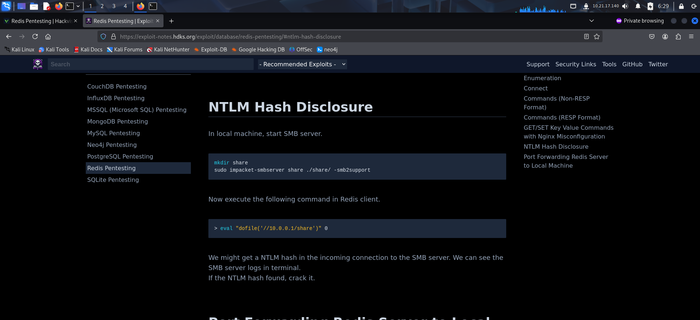

To access the machine, click on the link given below:
https://tryhackme.com/room/vulnnetactive

# SCANNING

I performed an **nmap** aggressive scan on the target to find open ports and the services running on them.

# FOOTHOLD

I found **redis** to be running so I searched online for ways I could interact with the service and found this article: https://hackviser.com/tactics/pentesting/services/redis

I looked for ways I could exploit this and found this article. It seems I could relay my ntlm credentials through smb.

I started responder on my interface

I then tried accessing a share on my system and found the NLTM hash on responder.

I saved the hash and cracked it using **john**.

I then listed the shares using the newly discovered credentials.

I connected to the server using my credentials and accessed `Enterprise-Share`

I then downloaded the ps1 script and it seemed like it deleted the contents of the Documents directory.

I replaced the contents with a reverse shell and uploaded it back into the system.

I soon got a reverse shell.

I navigated to Desktop and found the user flag.

# PRIVILEGE ESCALATION

I then uploaded **PowerUp** for local enumeration.

I created a temp directory and shifted the script to it.

Finally, I executed the script and found interesting configs. I seemed to have the **SeImpersonatePrivilege**.

This could be used to launch a potato attack and gain administrative access. So I tried exploiting it using **EfsPotato**.

I tried executing the payload but it kept failing.

So I created an msfvenom payload to get a meterpreter shell.

I uploaded the payload through smb and executed it to get a reverse meterpreter shell on metasploit.

After getting a shell, I used **`getsystem`** command to automatically escalate privilege and gain NT AUTHORITY\SYSTEM access.

Finally, I captured the root flag from Administrator's desktop.

---
