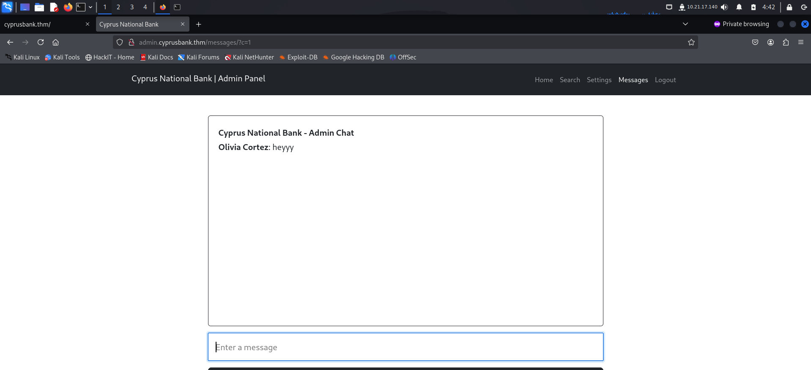
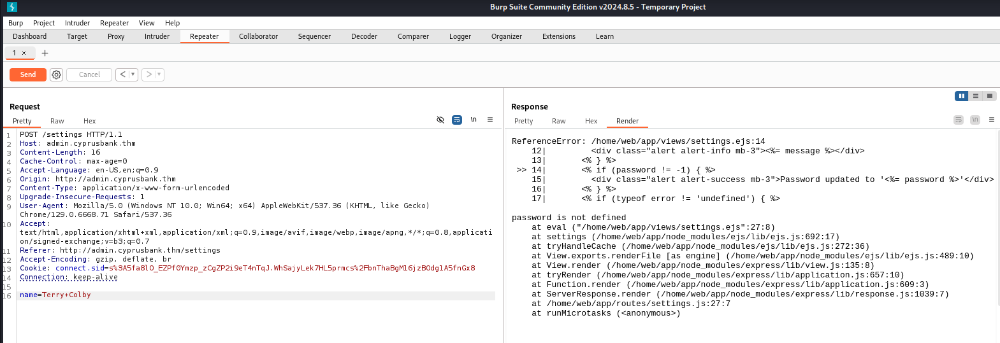
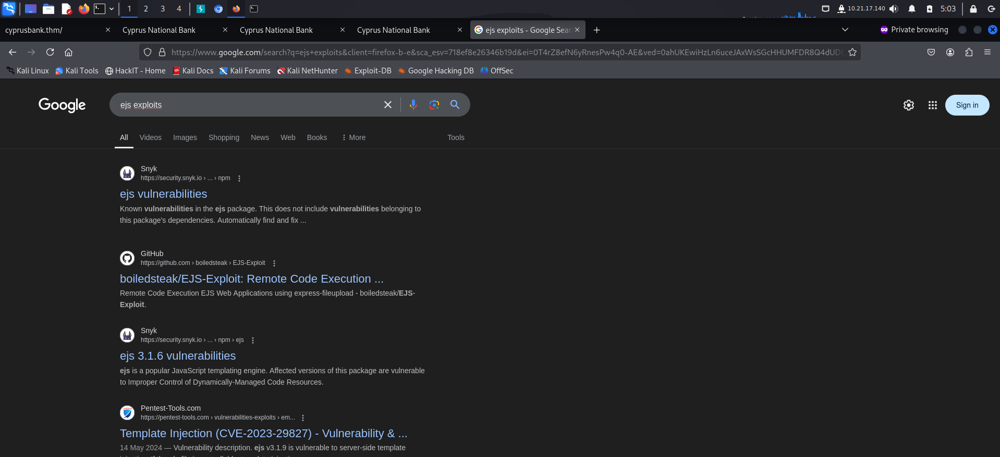
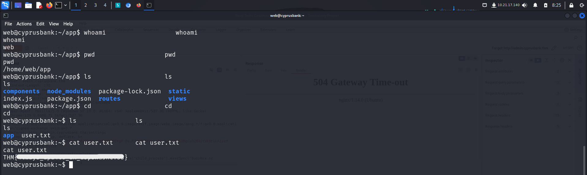
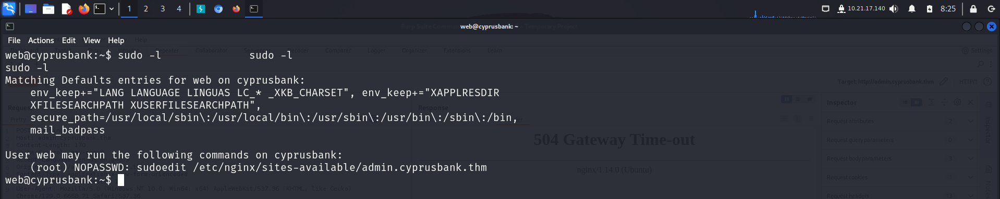
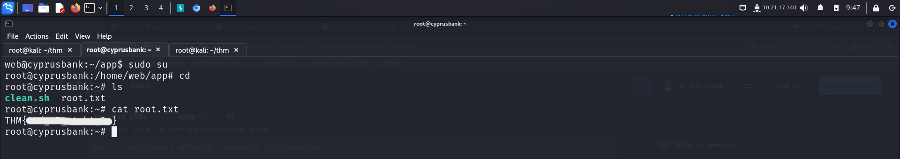

> Welcome to my writeup where I am gonna be pwning the **WhiteRose** machine from **TryHackMe**. This challenge has two flags, and our goal is to capture both. Let’s get started!

# GETTING STARTED

To access the challenge, click on the link given below:
https://tryhackme.com/r/room/whiterose

> [!NOTE] 
> This writeup documents the steps that successfully led to pwnage of the machine. It does not include the dead-end steps encountered during the process (which were numerous). This is just my take on pwning the machine and you are welcome to choose a different path.

# RECONAISSANCE

I performed an **nmap** aggressive scan to find open ports and the services running on them.


I also saved the credentials that were given to me by the creator.


# FOOTHOLD

Since the **nmap** scan revealed port 80 to be running, I tried to access it through my browser but couldn't do so as the domain was not being identified. Hence, I manually mapped the domain to the machine IP in the **`/etc/hosts`** file.


I then tried accessing the website.


The home page revealed nothing interesting, so I tried brute forcing available subdomains.


> [!NOTE] Note
> I initially tried fuzzing subdomains using `FUZZ.cyprus.thm` as the target without specifying the `Host` header but this didn't work. So I looked around on the internet and found a better way of performing subdomain fuzzing. Here's a breakdown simple explanation and purpose of the above command:
> - The `/etc/hosts` entry maps the IP to a particular domain. This IP is only mapped to that particular domain and not to any subdomains related to it unless explicitly mentioned.
> - The HTTP `Host` header is a part of web requests that tells the server which website the client wants to connect to. So if I type example.com, the browser sends a request with `Host: example.com` header.
> - So I can use this mechanism to check if a particular IP has a subdomain in it by looking for different `Host` header values on a domain.
> - Also, `-fw 1` Filters out responses with 1 word in the response, typically used to ignore consistent error responses.

After finding a subdomain, I mapped it in the `/etc/hosts` file.


I navigated to the **admin** panel that I had discovered and tried logging in using the credentials that I had been given at the start.


I logged in as **Olivia** and was able to view information about customers and their transactions.


I looked in the *Messages* tab and found a bunch of messages.


From the url, I found that the page displayed messages based on the parameter **`c`**. So I tried changing its value to view more messages. On `c=10`, I found the credentials of the privileged admin account.




I used these credentials to log in as a privileged user.


Now I could view information that was hidden from **Olivia**.


I visited the *Settings* tab and found an option to change user passwords. I tried changing password of **Terry Colby**.


However, it didn't actually work. I couldn't log in as **Terry** with the new password. So I sent another request and analyzed it on **Burp Suite**.


I forwarded the request to **Repeater** for further testing and analyzed the application behavior for different password values. I tested for SQL injection and empty password field but got no response in return.


However, when I removed the **password** field altogether, I received an error that revealed backend information.



 The error message specified `settings.ejs`. I did not know much about `ejs` so I asked **chatgpt**.

> EJS (Embedded JavaScript) is a templating engine for Node.js. It allows you to embed JavaScript code within HTML and helps you generate HTML markup with dynamic content. With EJS, you can create reusable templates that render data passed from the server, making it easier to build dynamic web applications.

Next, I looked for exploits on google and found a bunch of addressing a remote code execution vulnerability.



So I then looked for **rce** exploits and found a bunch of articles.


I appended the payload to my request and forwarded it. However, the **nc** version on the server did not support the `-e` argument.


Since, normal `nc` didn't work, I visited **revshells** to look for other ways. The `busybox` payload worked.


Before forwarding the payload, I had started a reverse shell listener. Upon execution, I received a reverse shell.


I found the first flag in the *web* user's `home` directory.



# PRIVILEGE ESCALATION

I listed the **sudo** privileges of the user and found it could edit a configuration file. I viewed the file using the allowed command.




> The shell was super buggy and unstable, so I spawned a more robust shell using the following steps:
> - background current session using `ctrl+z`
> - enter: `stty raw -echo; fg`

I did not have any idea as to what had to be done. So I looked for ways I could use the available command to escalate my privilege.


I found an article that demonstrated a way to exploit this configuration.


Hence I followed the steps to set **vim** as the default editor for **/etc/sudoers** file.

```bash
export EDITOR="vim -- /etc/sudoers"
```


I then executed the available command.


This opened the **/etc/sudoers** file in **vim** editor. I simply allowed my user to execute all commands without a password similar to the **root** using the below command.

```bash
web ALL=(ALL:ALL) NOPASSWD: ALL
```


Finally, I switched to user using **sudo** to become **root** and captured the final flag from the **`/root`** directory.



---

That's it from my side! Until next time :)

