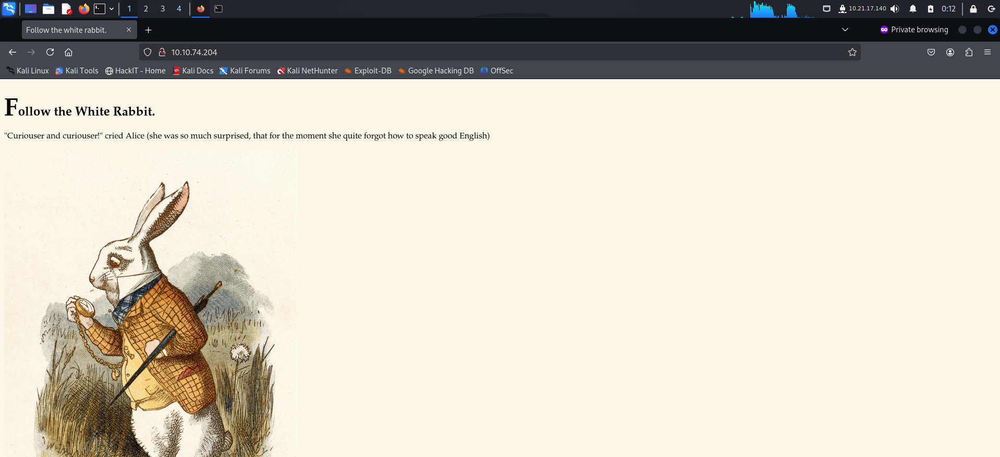
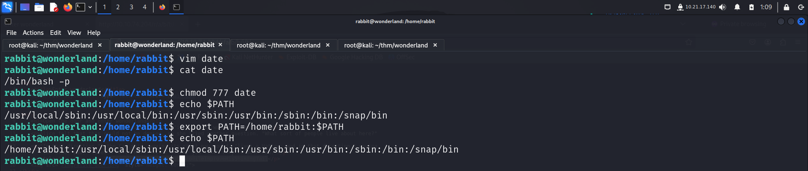

Welcome to my writeup where I am gonna be pwning the **Wonderland** machine from **TryHackMe**. This challenge has two flags, and our goal is to capture both. Let’s get started!

# GETTING STARTED

To access the challenge, click on the link given below:
https://tryhackme.com/room/wonderland

> [!NOTE] 
> This writeup documents the steps that successfully led to pwnage of the machine. It does not include the dead-end steps encountered during the process (which were numerous). This is just my take on pwning the machine and you are welcome to choose a different path.

# RECONNAISSANCE

I performed an **nmap** aggressive scan on the target to find open ports and the services running on it.

# FOOTHOLD

I then visited the website.

I brute forced directories and files on the target using **ffuf** to discover more content.

I visited the pages that I discovered.

I kept brute forcing the directories recursively...

The source code of this page contained the login credentials of **alice**.

Hence, I logged in as **alice**.

My home directory contained the root flag, hence the user flag was likely present in the root directory.

Hence I captured the user flag from the root directory.

# PRIVILEGE ESCALATION

I viewed my **sudo** privileges and found I was allowed to execute a python script.

The script did not mention the complete path of the module being used, so I created a new file using that name with a code to spawn a bash shell.

Since, I was allowed to execute the script as rabbit, I got shell access as that user.

I then visited rabbit's home page and found a binary that had suid bit and was owned by root.

I executed the binary and got some output.

To analyze the binary, I transferred it onto my local system.

I then ran **strings** to extract strings from the binary. This binary executed linux commands however  did not specify the complete path to them.

To exploit this, I created a new file called **date** and added my own code to spawn a privileged bash shell. I then gave it execution permission and injected my directory at the start of my path environment variable.

Finally, I executed the script and got access as another user called *hatter*.

I got *hatter*'s password from */home/hatter* and used it to switch my user.

I then looked for binaries with capabilities and found **perl**.

I visited **gtfobins** and found a way to exploit this to get privileged access.

I pasted the command and got **root** access on the target.

Finally, I captured the root flag present in *alice*'s home directory.

That's it from my side, until next time !

---
