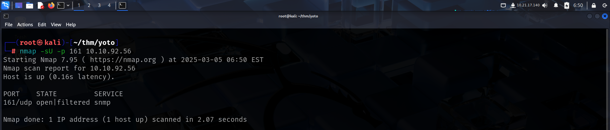
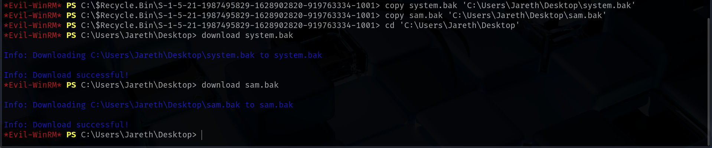

Link to machine : https://tryhackme.com/room/yearoftheowl

# SCANNING

I performed an **nmap** aggressive scan on the target to find a bunch of ports open.

# FOOTHOLD

I enumerated the services running on the target but was unable to find anything interesting.

I then tried performing a **udp** scan and found **snmp** to be open.

I enumerated **snmp** using **snm-check** and found a username.

I bruteforced the **smb** password of this user from *rockyou.txt* using **crackmapexec**.

I then enumerated the shares using this credential, but found nothing.

I then checked if the credentials were valid for **winrm** and **rdp**.

I then used **winrm** to get shell access on the target.

Finally I captured the user flag from *Jareth*'s *Desktop*.

# PRIVILEGE ESCALATION

I downloaded and ran **winPEAS** to find misconfigurations.

I found a backup of the **sam** and **system**.

Hence, I copied these backups to the desktop from the recycle bin and downloaded them on my system.

I then cracked the using **impacket-secretsdump** and found the Administrator hash.

I then used the Administrator's LM hash to get shell access on the target using **winrm** and captured the root flag from *Desktop*.

That's it from my side! Until next time.

---
