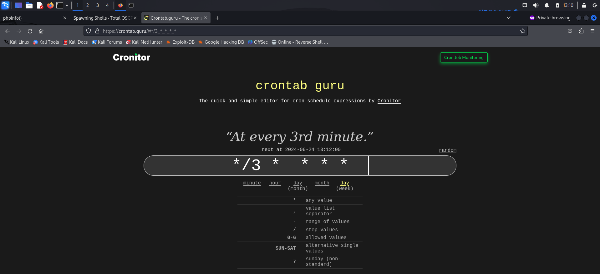

# GETTING STARTED

To download **dpwwn 1**, click on the link given below:

https://www.vulnhub.com/entry/dpwwn-1,342/

> [!NOTE] 
> This writeup documents the steps that successfully led to pwnage of the machine. It does not include the dead-end steps encountered during the process (which were numerous). This is just my take on pwning the machine and you are welcome to choose a different path.

# RECONNAISSANCE

I began with an **nmap** network scan to identify the target.

```bash

┌──(root㉿kali)-[~/ctf/dpwwn1]
└─# nmap -sn 192.168.1.0/24                 
Starting Nmap 7.94SVN ( https://nmap.org ) at 2024-06-24 10:33 EDT
Nmap scan report for RTK_GW (192.168.1.1)
Host is up (0.0044s latency).
MAC Address: F8:C4:F3:D0:63:13 (Shanghai Infinity Wireless Technologies)
Nmap scan report for dpwwn-01 (192.168.1.11)
Host is up (0.00035s latency).
MAC Address: 00:0C:29:5A:52:C7 (VMware)
Nmap scan report for kali (192.168.1.12)
Host is up.
Nmap done: 256 IP addresses (3 hosts up) scanned in 3.70 seconds
```

I then performed an **nmap** aggressive scan to find open ports and services.


# INITIAL ACCESS

I viewed the *http* service running on port 80 in a browser and landed on a testing page.


I then ran a **ffuf** scan to find directories and files on this server.


I visited *info.php* and found the **php** information. Here, potential users were revealed.


Hence, I tried both the users *root* and *apache* with blank passwords.


Now that I found a valid credential, I accessed the database using this.


Here, I found a set of credentials in the *users* table.


I used these credentials to connect via **ssh**.


With this, I gained a foothold on the machine.
# PRIVILEGE ESCALATION

I ran the **[linux smart enumeration](https://github.com/diego-treitos/linux-smart-enumeration)** to find any misconfigurations.


Through this, I discovered that the bash script present in my home directory was being executed as a **cronjob**. Cron jobs are scheduled tasks that are executed automatically after certain conditions are fulfilled.


Hence, the file was being executed as *root* through the **crontab**. To understand the execution schedule of the script, I visited **[crontab guru](https://crontab.guru/)**.



To gain privileged access, I visited [**revshells**](https://www.revshells.com/) and selected a bash payload, then inserted it into the script.


```bash

rlwrap nc -lnvp 4444
```

Finally, I waited for 3 minutes and got a reverse connection on my **netcat** listener.


I spawned a **tty** shell and captured the flag from the */root* directory.


# CLOSURE

Here's a brief summary of how I gained access to **dpwwn 1**:

1. I identified potential users from the **phpinfo** page using web fuzzing.
2. One of these users had credentials for the **mysql** server on the target, which allowed me to access the system via **ssh**.
3. A script in the *mystic* user's directory was executed by *crontab* as *root*, providing me with a reverse shell as *root*.
4. With *root* access, I retrieved the flag located in */root*.


That's all from my side! Happy Hacking :)

---------------