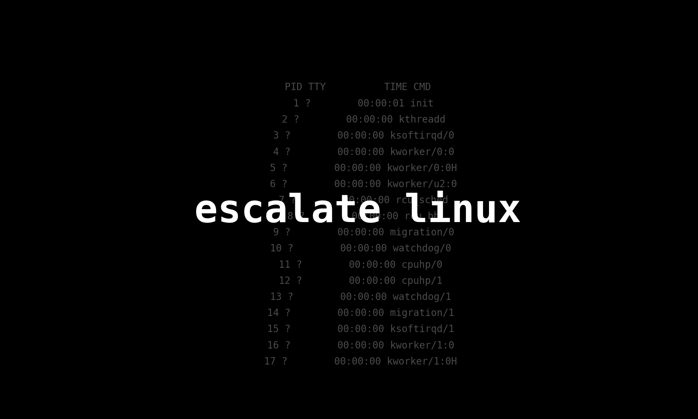
# GETTING STARTED

To download escalate linux, click [here](https://www.vulnhub.com/entry/escalate_linux-1,323/)

> [!NOTE] 
> This writeup documents the steps that successfully led to pwnage of the machine. It does not include the dead-end steps encountered during the process (which were numerous). This is just my take on pwning the machine and you are welcome to choose a different path.

**Note**: The IP address of my machines may change throughout the walkthrough because I worked on them in different locations. Please bear with me as you follow along.
# RECONNAISSANCE

I started by performing a network scan using **nmap** to identify the target IP.

```bash

┌──(root㉿kali)-[~/ctf/escalate-lin]
└─# nmap -sn 192.168.1.0/24                  
Starting Nmap 7.94SVN ( https://nmap.org ) at 2024-06-18 11:09 EDT
Nmap scan report for RTK_GW (192.168.1.1)
Host is up (0.033s latency).
MAC Address: F8:C4:F3:D0:63:13 (Shanghai Infinity Wireless Technologies)
Nmap scan report for osboxes (192.168.1.18)
Host is up (0.00012s latency).
MAC Address: 00:0C:29:BD:9D:F8 (VMware)
Nmap scan report for kali (192.168.1.12)
Host is up.
Nmap done: 256 IP addresses (3 hosts up) scanned in 7.37 seconds
```

After identifying the target IP as *192.168.1.18*, I scanned it using **nmap** to find open ports and running services.

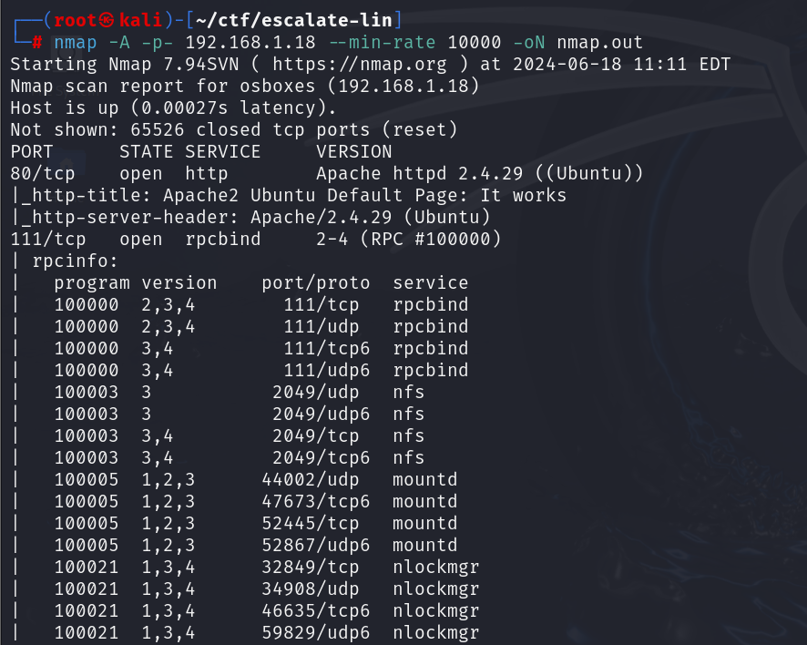
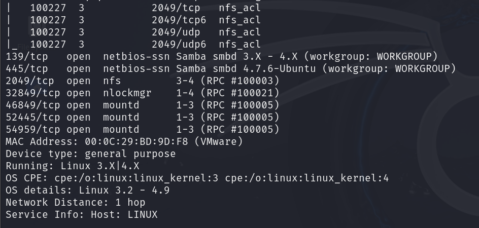

# INITIAL ACCESS

I accessed the HTTP server through my browser and landed on a default page.

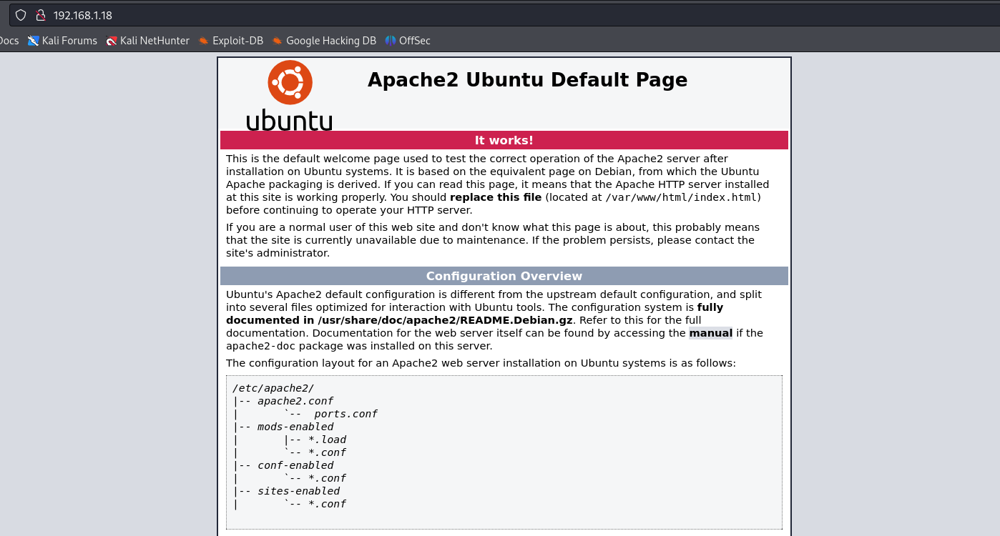

So, I ran a **ffuf** scan to find other files present on the web server.

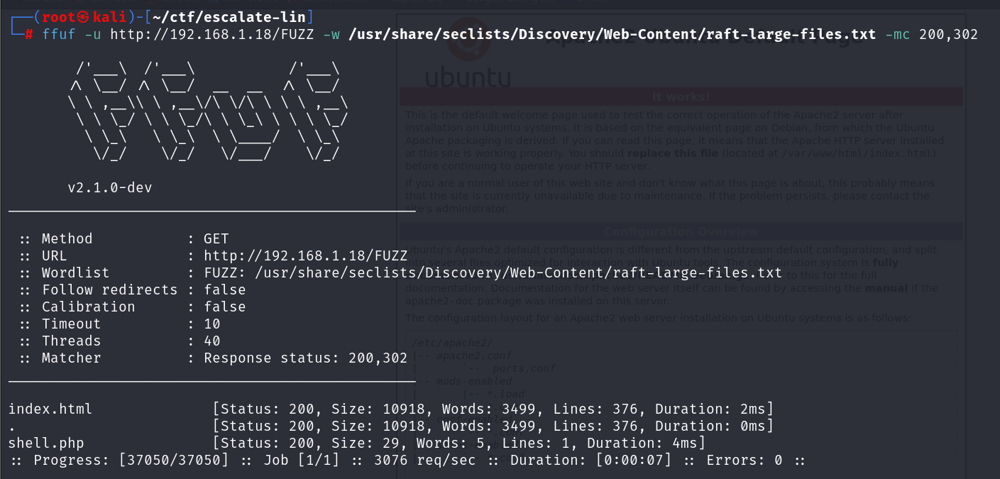

The **ffuf** scan identified a file called *shell.php*, so I accessed it using **curl**.

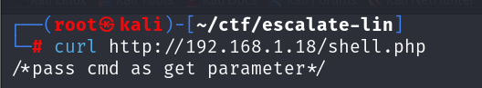

This gave me a hint about what it wanted. I used **curl** to send a _GET_ request to the server. I also added `?cmd=whoami` to the URL to check if `cmd` was a variable in the PHP file that could take some values.

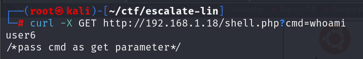

I was able to execute a system command, indicating the vulnerability to command injection.

To gain initial access, I first verified if the target had **nc** and **bash**.

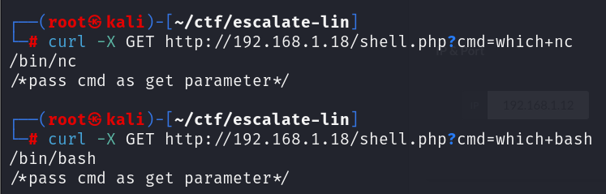

Then I went to **[revshells](https://www.revshells.com/)** and configured a reverse shell **nc mkfifo** payload with my listening IP and port.

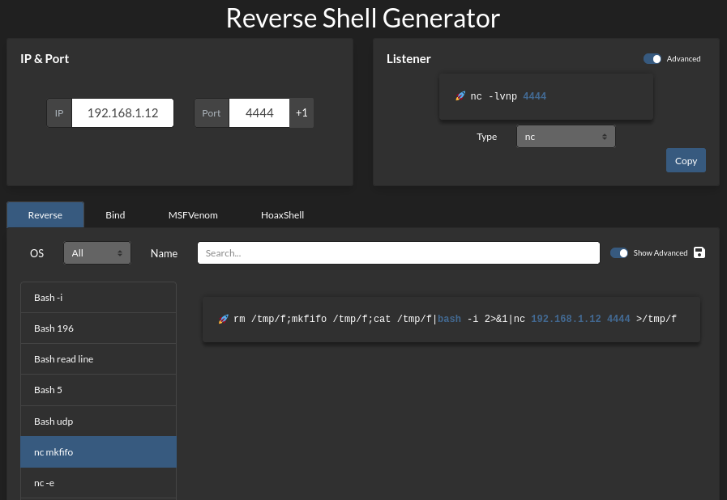

I then started a **nc** listener

```bash

rlwrap nc -lnvp 4444
```

Finally, I sent the payload through **curl** after *URL encoding* it.

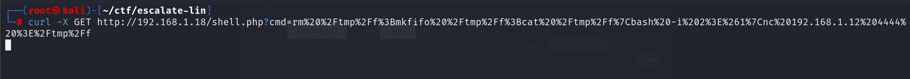

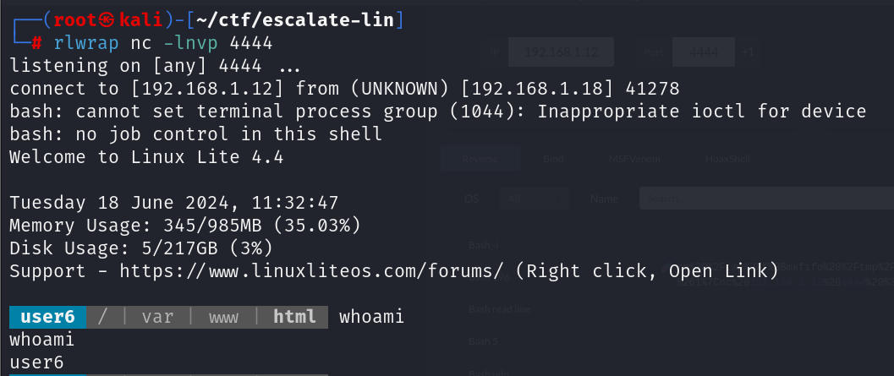

Hence, I gained initial access to the system.

Since I was still a service user, I tried to spawn a TTY shell using a command I found from this article:

https://sushant747.gitbooks.io/total-oscp-guide/content/spawning_shells.html

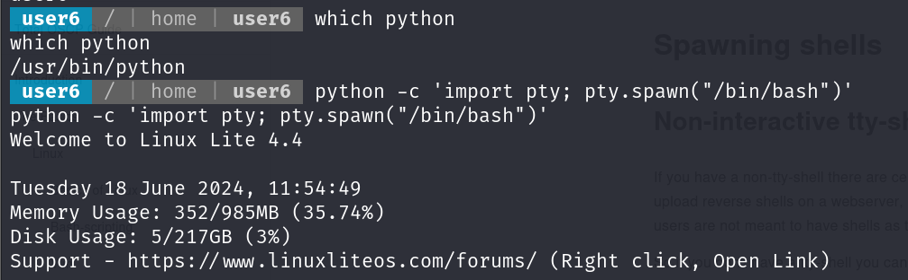

# PRIVILEGE ESCALATION

I used the following bash command to find files in the machine owned by root and with SUID bit.

```bash

find / -user root -perm -u=s -ls 2>/dev/null
```

I found 2 interesting files

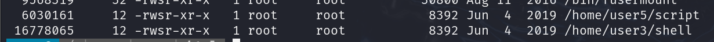

### 1. USING /USER3/SHELL

I executed the **shell** program in the */home/user3/* directory and gained root access.

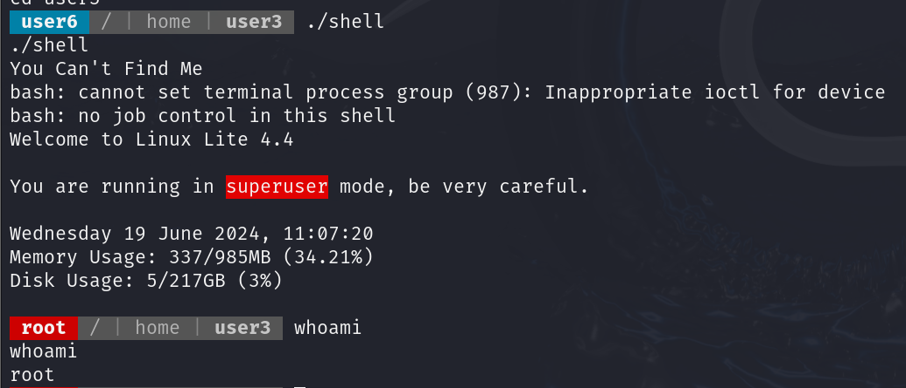

### 2. MODIFYING THE /USER5/SCRIPT FILE

I executed the **script** program present in the *user5* directory and obtained results similar to **ls**.

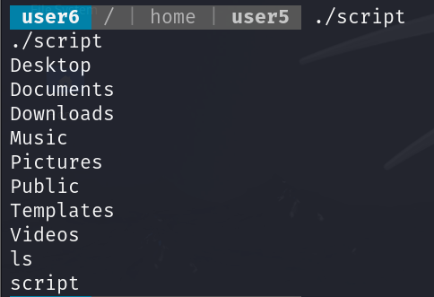

You can also use **[pspy](https://github.com/DominicBreuker/pspy)** to monitor the processes.

I navigated to the *tmp* directory and wrote a bash script named **ls**.

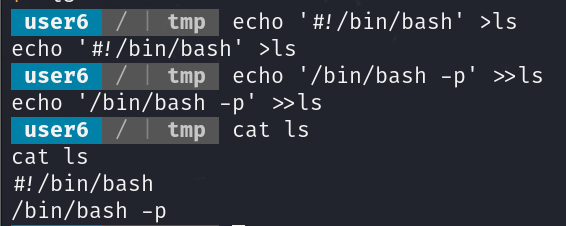

Then, I added this path to my environment variable.

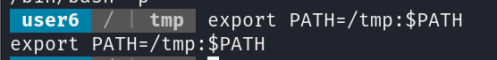

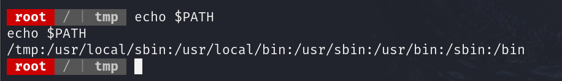

Finally, I executed the script.

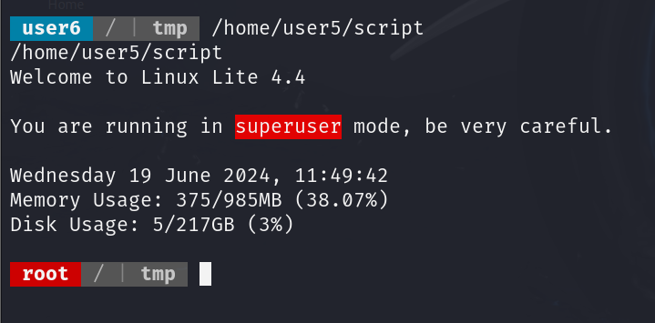


> [!NOTE] note
> This worked because when I executed the script, it attempted to run **`ls`**. Since I had already added my folder to the path, it found the location of the binary in the */tmp* folder (its own folder).

### 3. CRACKING THE ROOT PASSWORD

Since the */user5/script* executes the **ls** command, I created a new script called **ls** in the */tmp* directory with a command to read the shadow file. Then, I added the */tmp* directory to my path variable.

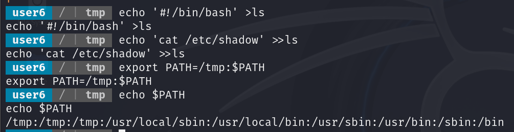

Finally, I gave this file execution permission and ran **/home/user5/script**.

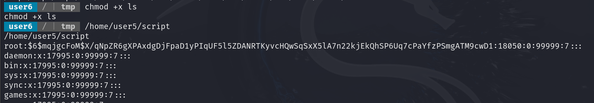

**`$6$`** indicates the usage of **SHA-512** for hashing. I copied the password field from this and pasted it into a different file on my system. Then, I used **john** to crack the password.

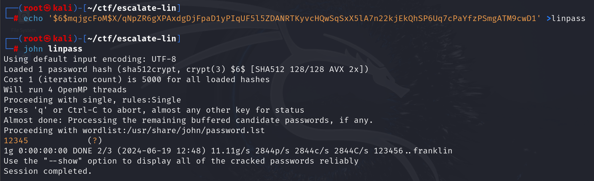

I then switched to *root*.

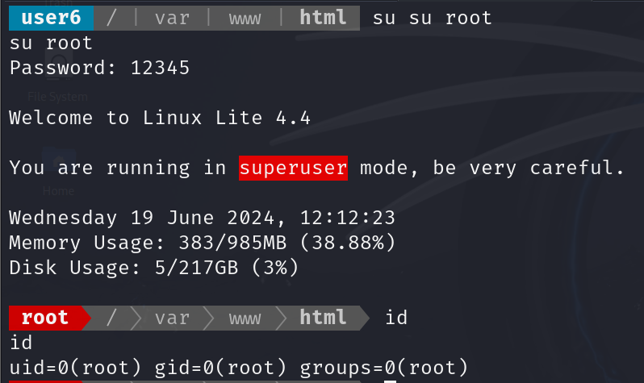

### 4. USING USER1 PRIVILEGES

I used the **ls** binary to change the password of *user1* using the */home/user5/script*.

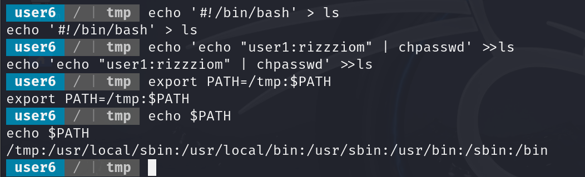
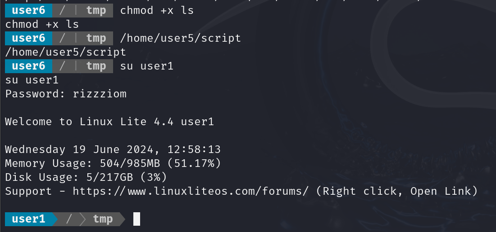

I then viewed my sudo permissions using **sudo -l**.

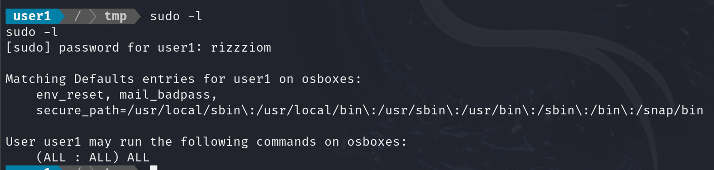

It turned out that *user1* had permission to run the **sudo** command without a password. Therefore, I used it to switch to *root*.

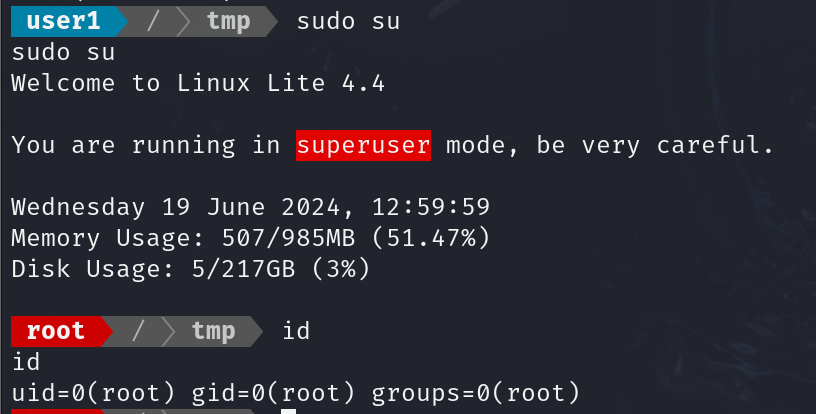

### 5. USING /ETC/PASSWD READ PERMISSION

I read the */etc/passwd* file.

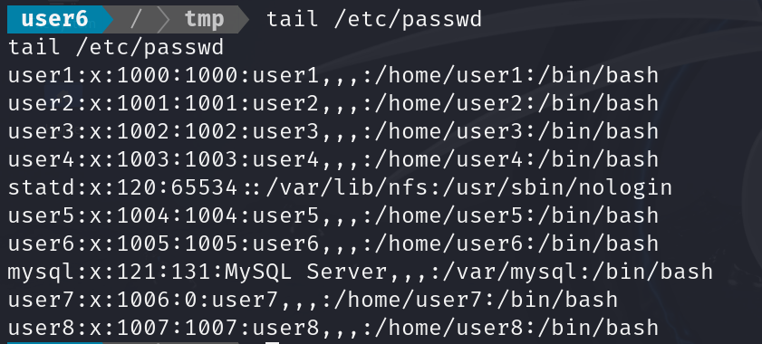

User7 had a group id of 0 i.e root. So I used the */home/user5/script* to change the password of every user. Then I switched to user 7.

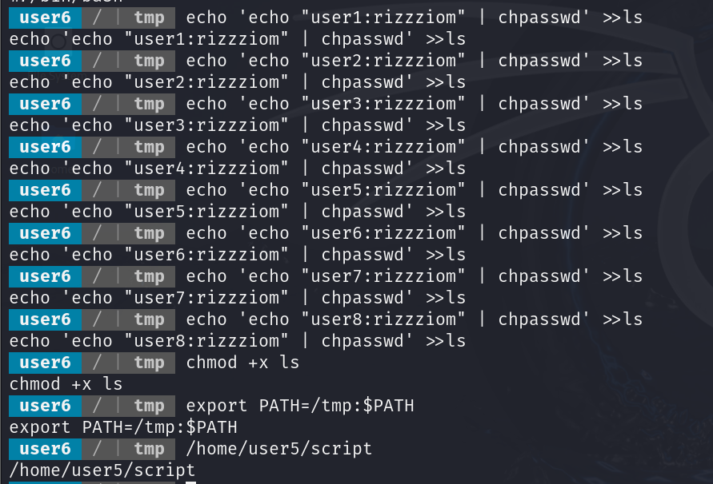

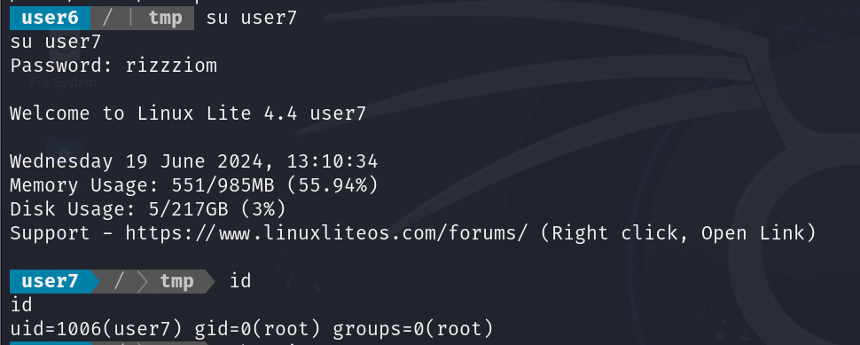

### 6. ADDING NEW USER TO /ETC/PASSWD

I viewed the permissions on the */etc/passwd* file and found that users had write permission in it.

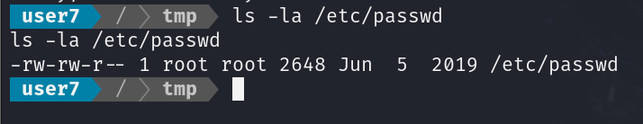

Hence, I created a new user: *rizzziom* with password *pass123* and ID *0*.

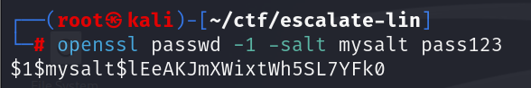

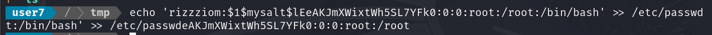

 Finally I switched to *rizzziom*

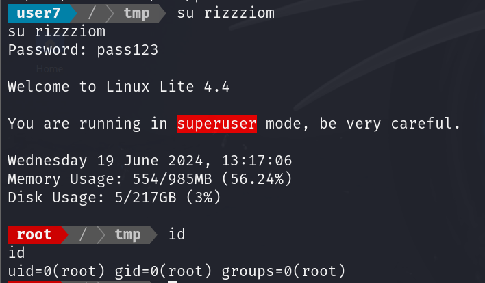

# CLOSURE

Getting initial access on the system was fairly simple; I just used the command injection vulnerability to get a reverse shell. As for the privilege escalation, I demonstrated six methods that gave me **root** access.

That's it from my side :)


------------------------------------------------------------------------------------