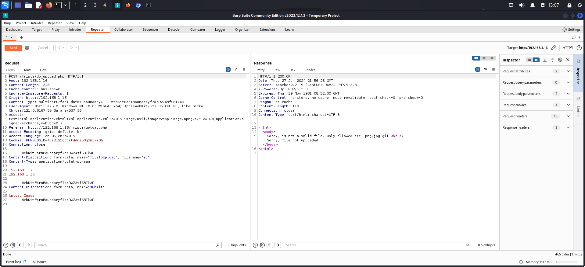
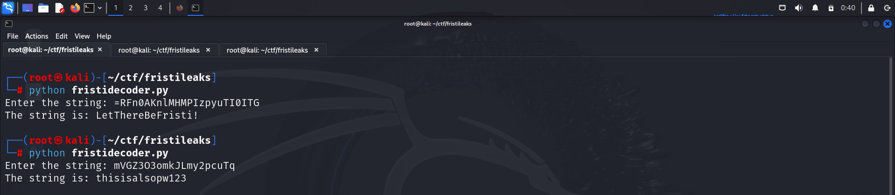

# GETTING STARTED

To download **Fristileaks**, click on the link given below:
- https://www.vulnhub.com/entry/fristileaks-13,133/

> [!NOTE] 
> This writeup documents the steps that successfully led to pwnage of the machine. It does not include the dead-end steps encountered during the process (which were numerous). This is just my take on pwning the machine and you are welcome to choose a different path.

The IP address of the machines changed in the walkthrough as I was working in different places. Please bear with me.
# RECONNAISSANCE

I started by performing a network scan using **netdiscover** to identify the target IP.

```bash

┌──(root㉿kali)-[~/ctf/fristileaks]
└─# netdiscover -r 192.168.1.0/24 

 Currently scanning: Finished!   |   Screen View: Unique Hosts                                                                                  
5 Captured ARP Req/Rep packets, from 5 hosts.   Total size: 300                                    
_____________________________________________________________________________
   IP            At MAC Address     Count     Len  MAC Vendor / Hostname      
 -----------------------------------------------------------------------------
 192.168.1.1     f8:c4:f3:d0:63:13      1      60  Shanghai Infinity Wireless Tech   
 192.168.1.9     98:59:7a:e8:18:cc      1      60  Intel Corporate                     
 192.168.1.16    08:00:27:a5:a6:76      1      60  PCS Systemtechnik GmbH              
 192.168.1.3     8a:6d:45:aa:87:f3      1      60  Unknown vendor                      
 192.168.1.18    8a:2d:1a:44:b7:ad      1      60  Unknown vendor
```

I then performed an **nmap** aggressive scan on the target.


# INITIAL ACCESS

I visited port 80 in the browser.


I then performed a **ffuf** scan to find files on the web server.


Upon visiting *robots.txt*, I found 3 files.


I accessed these files but found nothing.


I then tried fuzzing using **dirb** and discovered a directory called *cgi-bin*.


Since none of the directories provided anything useful, I tried using some terms that would not be part of common wordlists. When I tried */fristi/*, I encountered a login form.


I viewed the source code and found a potential username and a hint of having base64 encoded data.


I went to a base64 decoder website to decode this data.


Since it was a PNG image, I used a base64 to PNG converter to gather more information about it.


I attempted to log in using *eezeepz | keKkeKKeKKeKkEkkEk* and successfully gained access.


I clicked on the *upload file* link and accessed a file upload functionality.


I turned on Burp Suite and attempted to upload a text file, but encountered an error.



Upon changing the *filename*, I successfully uploaded the file.


Upon visiting the *Uploads/* directory, I received a text response.


I now went to **[revshells](https://www.revshells.com/)** and configured the **pentestmonkey php reverse shell** payload with my listening IP and port, and started a listener.


I then uploaded the payload to the server.


Finally, I accessed the file.


# PRIVILEGE ESCALATION

### USING KERNEL EXPLOIT
I looked at my kernel information.


I found an exploit for this kernel on **exploit db**.


I downloaded this on my system and transferred it to the target.


I then compiled it according to the instructions given in the payload script.


Hence, I gained root access.
### USING CRON
I found a note in the */var/www/* directory.


I navigated to the *eezeepz* directory and found another note.


Hence, I added a payload to get a reverse shell in the *runthis* file.


After a couple of minutes, I got a reverse shell.


I found encrypted data in the */home/admin* directory along with a Python script that encrypted it.


Here's how the encoding works:

`base64string = base64.b64encode(str)` : encodes the string with base64.
`codes.encode(base64string[::-1], 'rot13')` : reverses the base64 encoded string and then encodes it with rot13.

Hence, to decode this, I wrote a simple Python script. This script can be downloaded from my **[github](https://github.com/RIZZZIOM/fristidecoder.git)** repo. The file owner also gave me a hint about whose password was stored in these files.




I then switched to *fristigod*.


I found a binary running as **root**.


I tried executing it using the syntax shown above.


I looked at the users available on the system by viewing the */etc/passwd* file.


This file revealed a user called *fristi*, so I tried executing the command using it.


Since this executed successfully, I used it to gain **root** access.


Finally, I captured the flag from */root*.


# CLOSURE

Here's a summary of how I compromised **fristileaks**:
- I discovered a login page at */fristi/*.
- Through the source code of the page, I found the username and password.
- I exploited a file upload vulnerability to gain a reverse shell.
- For privilege escalation, I pursued 2 approaches:
1. I utilized a kernel exploit.
   - I employed the **dirtycow** exploit from **exploit-db** to gain root access by creating a new user.
2. I exploited **cronjobs**.
   - Leveraging **cronjobs**, I accessed the *admin* user.
   - I discovered credentials for both *admin* and *fristigod* in the */admin* directory.
   - Switching to *fristigod*, I found a script running as root.
   - I used the script to achieve **root** access.
- Finally, I captured the flag from the */root* directory.


Thats it from my side, until next time :)

---