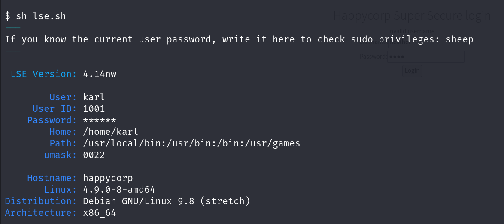

# GETTING STARTED

To download HappyCorp, click [here](https://www.vulnhub.com/entry/happycorp-1,296/). 

> [!NOTE] 
> This writeup documents the steps that successfully led to pwnage of the machine. It does not include the dead-end steps encountered during the process (which were numerous). This is just my take on pwning the machine and you are welcome to choose a different path.

This box has 2 flags and our goal is to capture them both.

# RECONNAISSANCE

I began by scanning the network to identify the target IP.

```bash

┌──(root㉿kali)-[~/ctf/happycorp]
└─# nmap -sn 192.168.1.0/24                               
Starting Nmap 7.94SVN ( https://nmap.org ) at 2024-06-17 06:19 EDT
Nmap scan report for RTK_GW (192.168.1.1)
Host is up (0.0014s latency).
MAC Address: F8:C4:F3:D0:63:13 (Shanghai Infinity Wireless Technologies)
Nmap scan report for happycorp (192.168.1.11)
Host is up (0.00026s latency).
MAC Address: 00:0C:29:0D:6E:0B (VMware)
Nmap scan report for kali (192.168.1.12)
Host is up.
Nmap done: 256 IP addresses (7 hosts up) scanned in 4.05 seconds
```

After identifying the target IP as *192.168.1.11*, I started an **nmap** aggressive scan to find open ports and running services.


# CAPTURING FLAG 1

I visited the **admin.php** listing and discovered it was just a rabbit hole. It only revealed the existence of a user called *heather* (name present on the home page) but provided no other useful information. Additionally, there was no point in attempting SQL injection.


So, I moved on to port **2049**, which is **nfs**.

I checked the mount using **showmount**.


The *karl* directory was mounted, so I mounted my own directory and tried accessing the contents inside *karl*.


To read the *.ssh* file, I created a new user with UID 1001.


I navigated to the *.ssh* directory and found the first flag.


# CAPTURING FLAG 2

The *.ssh* folder could be useful for initial access, so I copied it onto my system.


I navigated inside this folder and viewed the private key.


This key was encrypted with a password. Therefore, I attempted to crack this password using **john**.


Using these credentials, I attempted to log in using **ssh**. However, I ended up in an **rbash** environment.


So I attempted to access a normal shell using **ssh**.


Now that I had shell access, I downloaded the **[lse](https://github.com/diego-treitos/linux-smart-enumeration)** script from GitHub onto my system and then transferred it to the target.


Finally, I ran the script.



The script discovered an SUID bit in the **cp** command.


I also verified this manually.


So, I was allowed to copy a file with root privileges. Now, I could move onto privilege escalation.

### ESCALATING PRIVILEGE USING SSH AUTHORIZED KEYS

> To escalate my privilege, I added my public key to the *authorized_keys* file and copied this file to the */root* directory. This way, I was able to **ssh** as root without a password.

So I created my **ssh** key.


I copied my public key and pasted it into the victim machine.


Finally, I copied the *.ssh* folder into the root directory and reconnected as root.


### ESCALATING PRIVILEGE BY CREATING A NEW USER

> I created a new user on my system, added this user with ID 0 into the */etc/passwd* file of the target, and logged in as this user.

So, through the mounted directory, I copied the */etc/passwd* file from the victim onto my system.


I then created a new user with username **nemesis** and password **bypass**.


> [!INFO] 
> **-1** indicates **MD5 hash**.
>  **-salt** option specifies the salt to use for the hash. In this case, the salt is `mimir`. A salt is a random value added to the password before hashing to ensure that identical passwords result in different hashes.

I then pasted the following into the copied **passwd** file.
`nemesis:$1$mimir$mU/..cXck3dFQW1wl98mT:0:0:root:/root:/bin/bash`


I transferred the file back into the main system and moved it into the intended directory.


Finally, I switched users to escalate privilege.

```bash

$ su nemesis
Password: 
root@happycorp:/home/karl/tmp#
```

------------------------------------------------------------------------------------

I moved into the *root* directory and captured the second flag.


# CLOSURE

Here's how I pwned HappyCorp:
- I utilized the network share mounted through *nfs* to gain access to the */home/karl* directory.
- I created a new user with the necessary user-id value and found the first flag in the *.ssh* directory.
- I discovered an unusual suid bit set on the **cp** command.
- Exploiting this, I gained root access using two different methods:
	- I added my public key to the *authorized_keys* file on the target machine.
	- I created a new user with UID 0 and added this user to the */etc/passwd* file on the target machine.
- With root access secured, I obtained the final flag from the *root* directory.


That's it from my side! Until next time:)

------------------------------------------------------------------------------------