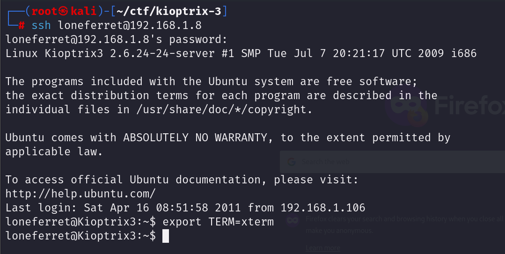

# GETTING STARTED

To download Kioptrix 3, click [here](https://www.vulnhub.com/entry/kioptrix-level-12-3,24/)

**DISCLAIMER**
> This writeup documents the steps that successfully led to pwnage of the machine. It does not include the dead-end steps encountered during the process (which were numerous). I recommend attempting to solve the lab independently. If you find yourself stuck on a phase for more than a day, you may refer to the writeups for guidance. Please note that this is just one approach to capturing all the flags, and there are alternative methods to solve the machine.

# RECONNAISSANCE

I start by using **nmap** to scan the network and identify the target.

```bash

┌──(root㉿kali)-[~/ctf/kioptrix-3]
└─# nmap -sn 192.168.1.0/24          
Starting Nmap 7.94SVN ( https://nmap.org ) at 2024-06-09 23:43 EDT
Nmap scan report for RTK_GW (192.168.1.1)
Host is up (0.052s latency).
Nmap scan report for 192.168.1.8
Host is up (0.00017s latency).
MAC Address: 00:0C:29:7C:23:2A (VMware)
Nmap scan report for kali (192.168.1.12)
Host is up.
Nmap done: 256 IP addresses (3 hosts up) scanned in 7.15 seconds
```

The target IP is _192.168.1.8_. Next, I perform an aggressive **nmap** scan to discover the open ports and services running on the target.


# GETTING INITIAL ACCESS

Upon receiving the scan results, I opened a web browser to access the target on port 80


A redirection link on this page took me to another page that appeared incomplete.


I clicked on _Inspect Element_, navigated to the _Network_ tab, and refreshed the page to view the received packets.


The issue is that my PC cannot recognize this domain. So, I modify the `/etc/hosts` file to map the domain _kioptrix3.com_ to the target IP.


I refresh the page and get proper results this time.


I inspected the page but didn't find anything special, so I returned to the main page. Here, I noticed a login panel that revealed the CMS being used.

Hence I searched for exploits on _Lotus CMS_ using **Google** and found several options. I then downloaded an exploit available on GitHub.


I started a listener using netcat and executed the bash script.

```bash

rlwrap nc -lnvp 4444
```

```shell

./lotsuRCE.sh 192.168.1.8
```


With this, I gained a reverse shell of the system.

To streamline my activities, I exported my terminal and spawned a *pty* shell for ease of use.

```bash

export TERM=xterm
python -c 'import pty; pty.spawn("/bin/bash")'
```

# GETTING USER ACCESS

I navigated to the *home* directory and discovered two additional users.


The *loneferret* user had a file containing an intriguing message.


Executing this command would require a password, so I examined the running services and identified MySQL.


It's in **safe** mode, so I would need another set of credentials to access it. Therefore, I searched for anything interesting in my own directory.

I found a set of credentials in `home/www/kioptrix3/gconfig.php`


So I log into mysql using these credentials.


I found the md5 hashed password of both *dreg* and *loneferret* in the `gallery` database.


I quickly head to [crackstation](https://crackstation.net/) to crack these


| username   | password |
| ---------- | -------- |
| dreg       | Mast3r   |
| loneferret | starwars |
I log in as *loneferret* using the password that I cracked using **ssh**.



# PRIVILEGE ESCALATION

I checked the command history of this user.


Hence I execute the command `sudo ht`


I pressed **F3** and was presented with an option to open any file. Since I was running the software using sudo privileges, I accessed and captured the flag from `/root/Congrats.txt`.


I'm crafting a backdoor to gain root access to the target system.

### USING SSH KEYS
I generated a set of SSH keys in my terminal.

```bash

ssh-keygen -t rsa -b 4096 -C "keyfork3"
```

Next, I copied the public key stored in **id_rsa.pub**.


Afterward, I pasted this into a new text file within the root directory on the target system.

```markdown

ALT+F -> new -> text -> paste the ssh key -> save as -> /root/.ssh/authorized_keys
```


Now I can log in as *root*.
### USING THE /ETC/PASSWD FILE
I updated the **id** value in the `/etc/passwd` file of *loneferret* to **0**.


By reconnecting as *loneferret*, I gained root access.
### USING THE SUDOERS FILE
I can modify the permissions of *loneferret* in the **sudoers** file located in `/etc/sudoers`.


Now, I can execute *root* commands without encountering any restrictions.


# CLOSURE

Here's a comprehensive summary of my successful penetration of the **Kioptrix L3** system:
- I exploited the CMS to gain initial access.
- Discovered user credentials within the `gconfig.php` file.
- Utilized **ht** software with **sudo** privileges to locate the flag in the root directory.
- Implemented three distinct methods to establish a backdoor.

That concludes my walkthrough. Until next time! :)


------------------------------------------------------------------------------------