> Welcome to my writeup where I am gonna be pwning the **MHZ_C1F** machine from [VulnHub](https://www.vulnhub.com/). This challenge has two flags, and our goal is to capture both. Let’s get started!

# GETTING STARTED

To download **mhz_c1f**, click on the following link: https://www.vulnhub.com/entry/mhz_cxf-c1f,471/

> [!NOTE] 
> This writeup documents the steps that successfully led to pwnage of the machine. It does not include the dead-end steps encountered during the process (which were numerous). This is just my take on pwning the machine and you are welcome to choose a different path.

# RECONNAISSANCE

I started of by performing an **nmap** aggressive scan on the target to identify open ports and the services running on them.

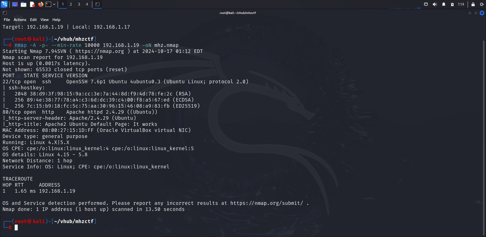

The nmap scan revealed only 2 open ports, ssh and http.

# FOOTHOLD

I visited the target's webpage and landed on a default apache page.

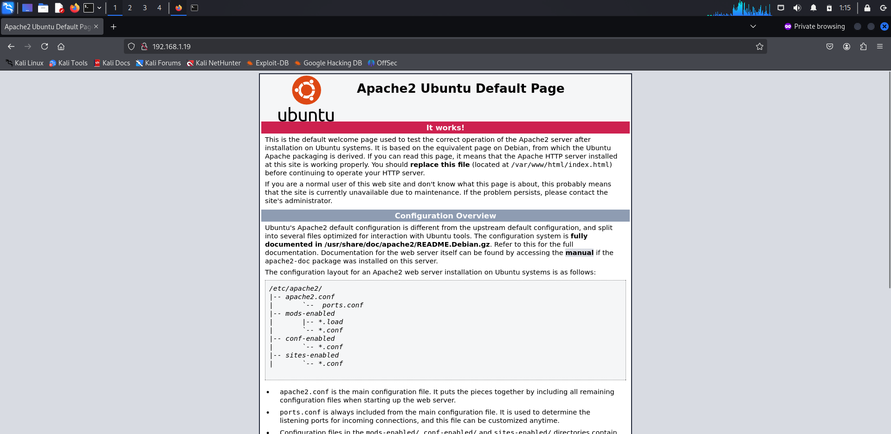

I performed a directory and file fuzz using **ffuf** and found a file **notes.txt**.

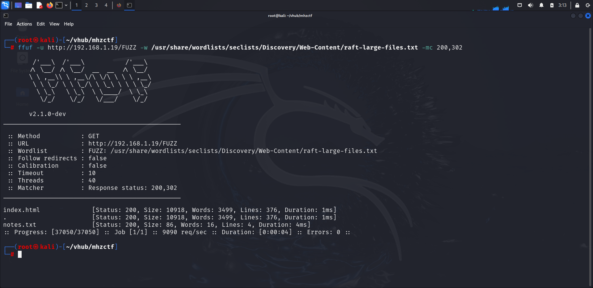

I accessed the path and found a message hinting towards another directory.

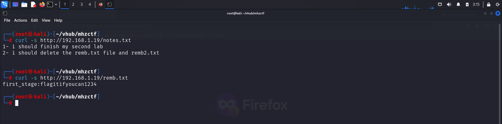

The contents of `remb.txt` looked like credentials, and the second file didn't seem to exist on the website.

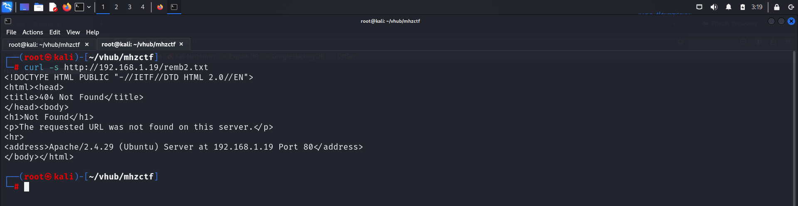

I saved the credentials and tried using it to log in through **ssh**.

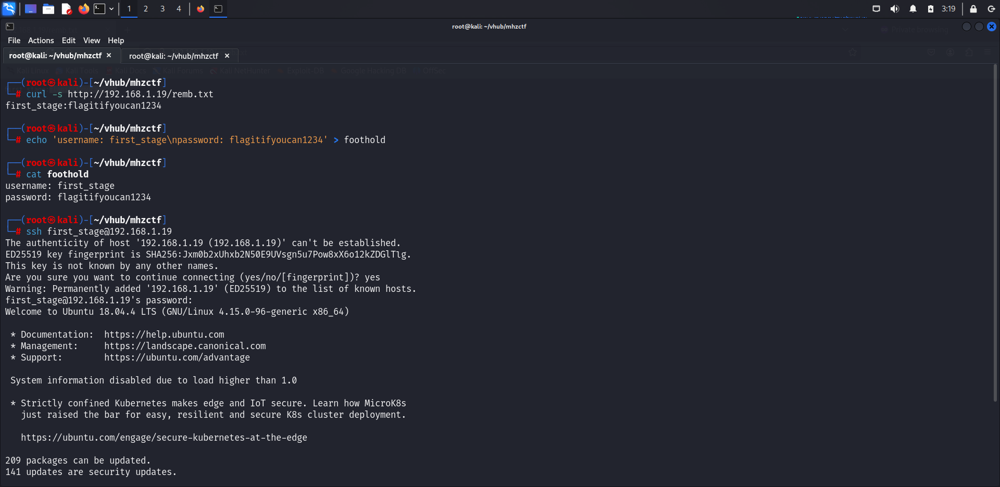

I was greeted with a generic shell, so I spawned a pty shell using **python**.

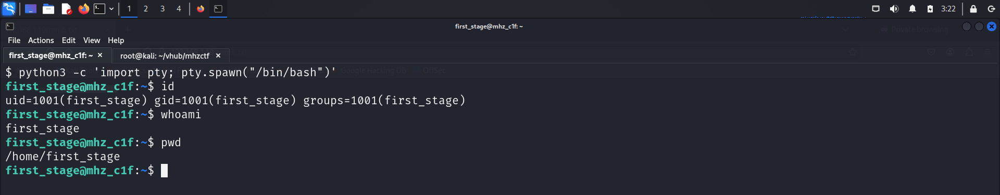

The user's home directory contained the **first flag** 

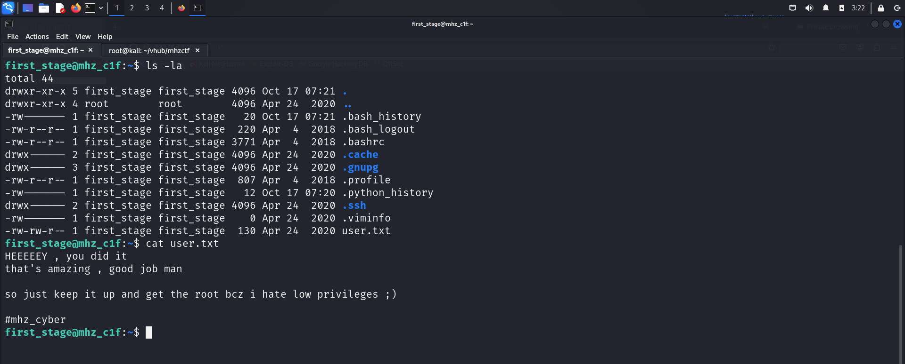

# PRIVILEGE ESCALATION

I quickly downloaded **linux smart enumeration** script on my local system and transferred it onto the target to find juicy information.

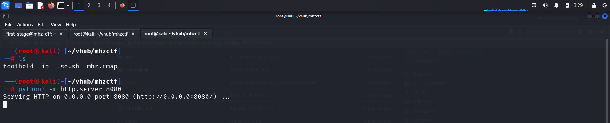

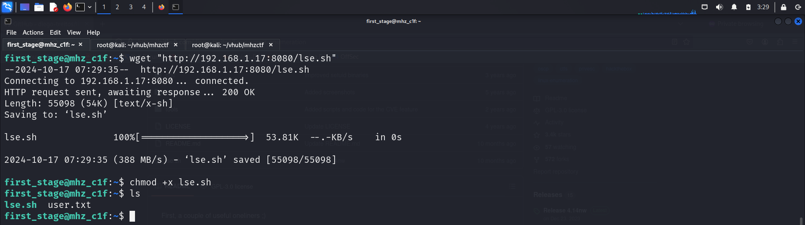

I then executed the script, but got no useful information.

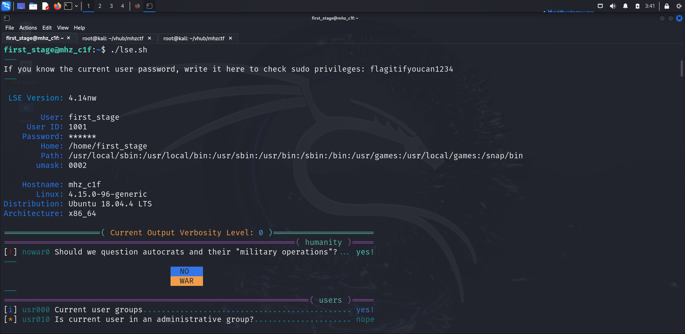

I then looked for something else. The home directory contained another user directory called `mhz_c1f` which had a directory of painting images.

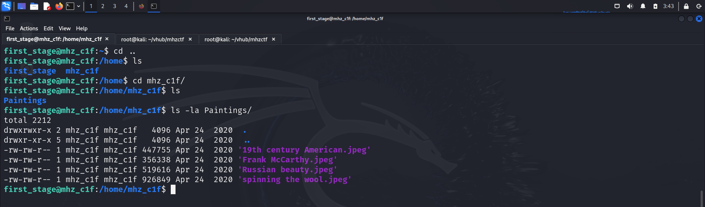

This looked interesting so I copied those paintings onto my system using **scp** as ssh was enabled on the target.

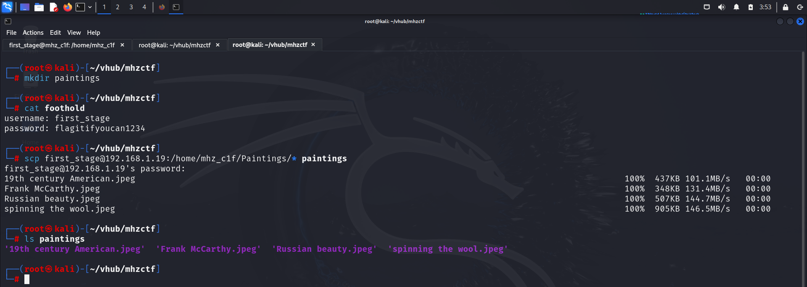

I used **binwalk** to find information about the images.

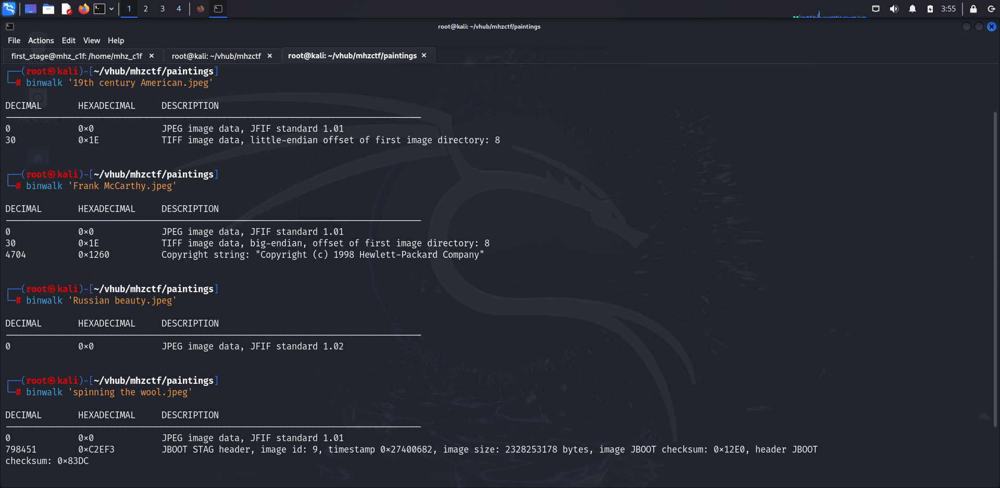

I then tried extracting data from each image with a blank password. I failed on the first 3 images but, the information from the last image was successfully extracted.

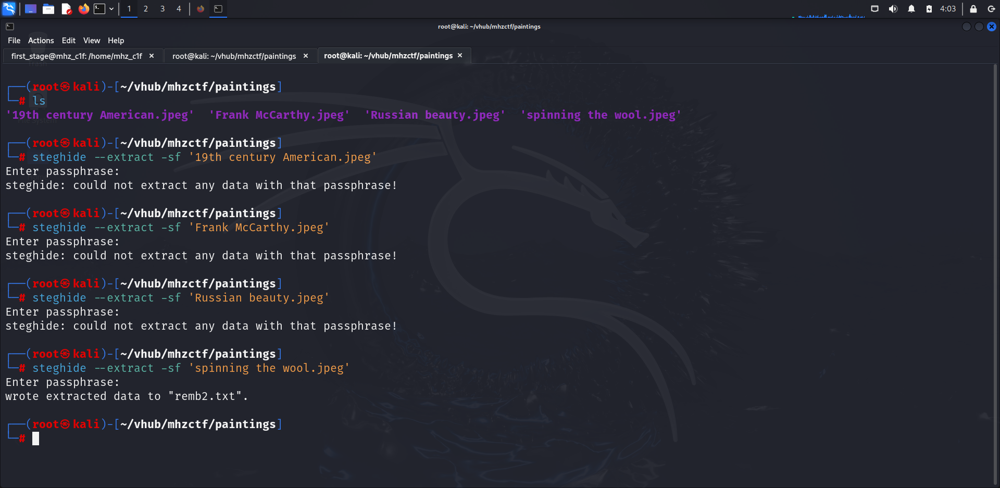

I read the file and found another set of credentials.

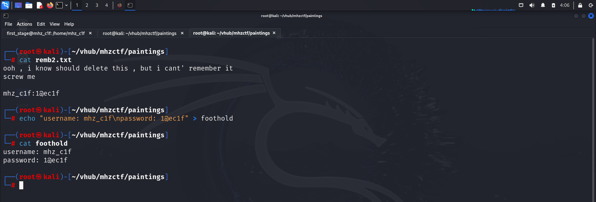

I tried to use this to log in through **ssh** but it didn't work.

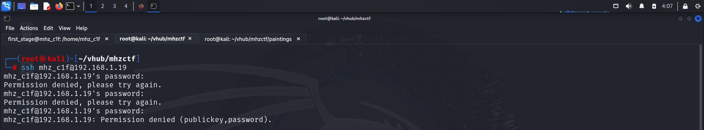

I then tried switching my user from the shell I already had and was able to successfully do so.

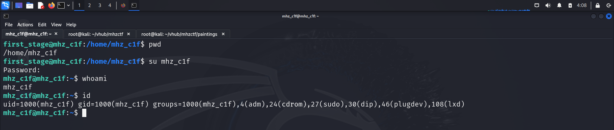

Now I again ran the **lse** script as the new user and found a very interesting configuration.

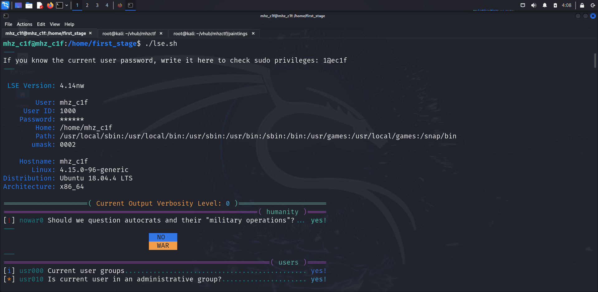

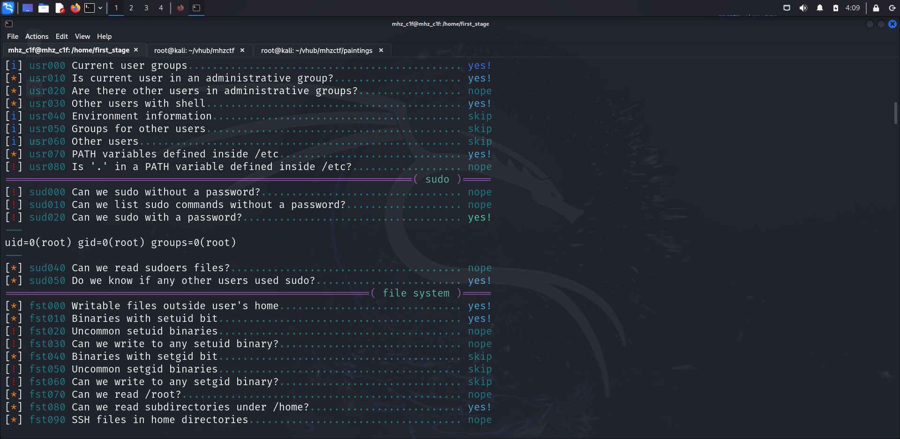

The user was allowed to run all commands as sudo without any password. So I cross checked this manually and used it to spawn a bash shell as root.

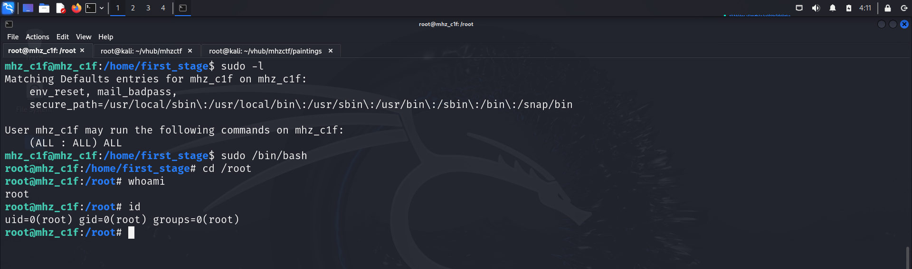

Finally, I captured the root flag from the root user's home directory.

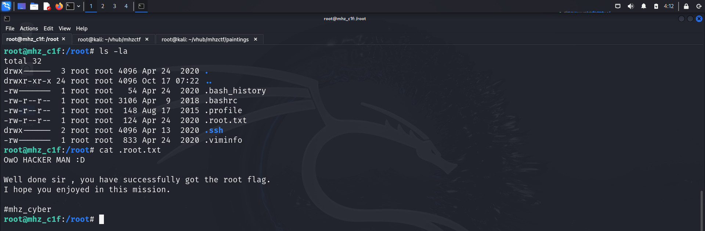

# CLOSURE

Here's a summary of how I pwned the machine:
- I found a set of credentials by web fuzzing.
- I was able to log in through ssh using those credentials.
- The home directory had another user who had a couple of images.
- I transferred those images onto my system and performed stegnography to reveal another set of credentials.
- I used those to switch my user.
- I checked the sudo privileges of this user and found the user could run sudo commands without a password.
- I leveraged this vulnerability to spawn a bash shell as root and captured the final flag from the root user's home directory.

That's it from my side:) 
Until next time!

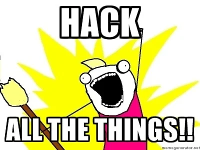

---

Happy Hacking! 🎉