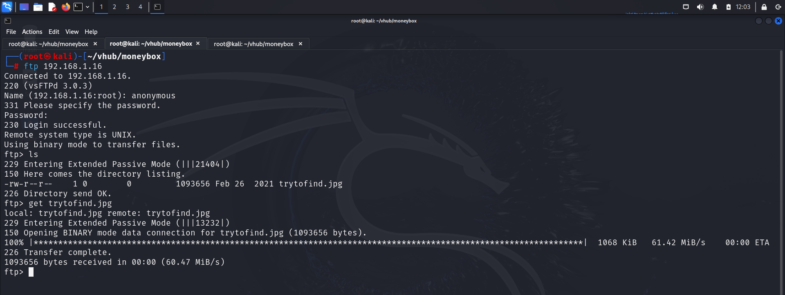
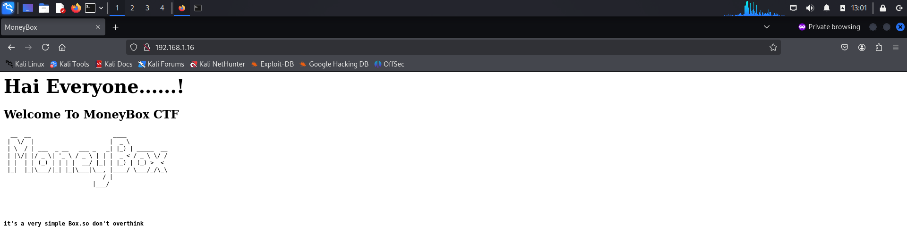
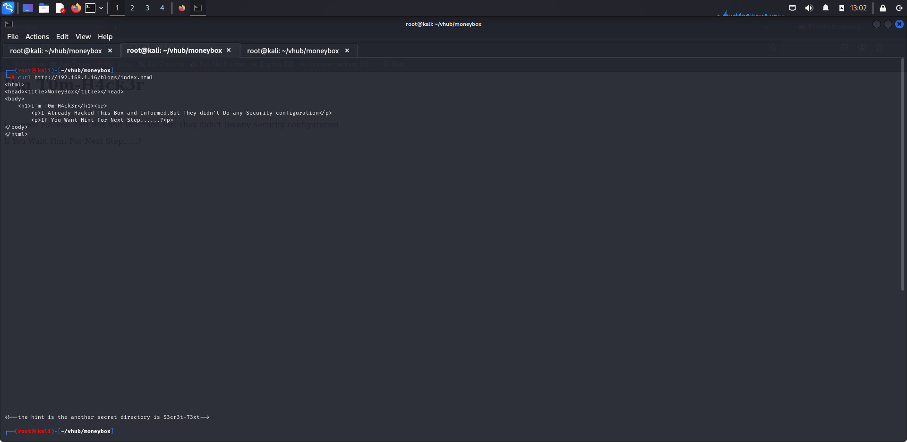
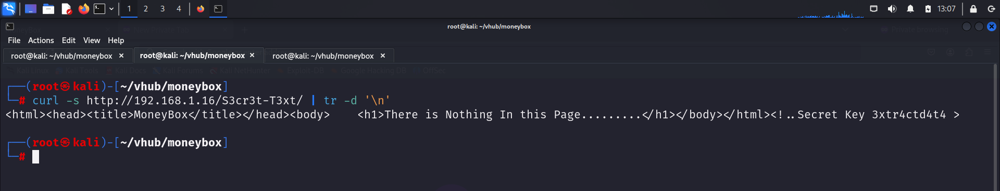
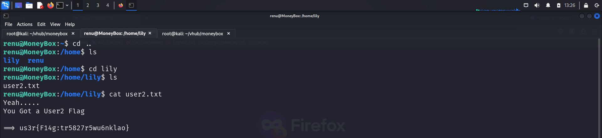
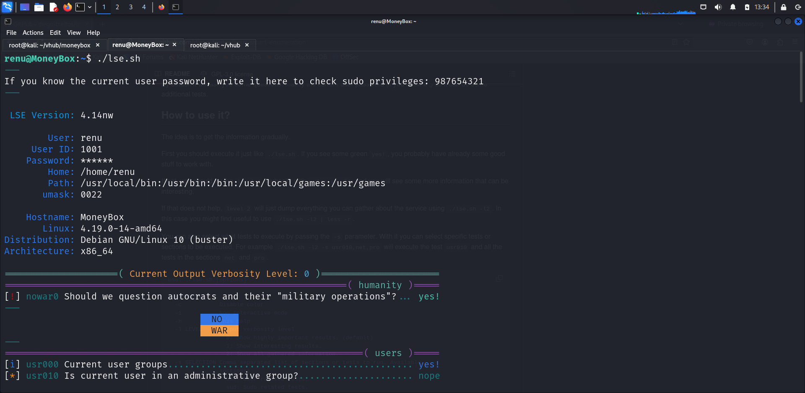

Welcome to my writeup where I am gonna be pwning the **Moneybank** machine from [VulnHub](https://www.vulnhub.com/). This challenge has 3 flags, and our goal is to capture all of them. Let’s get started!

# GETTING STARTED

To download the vulnerable machine, click on this link: https://www.vulnhub.com/entry/moneybox-1,653/

> [!NOTE] 
> This writeup documents the steps that successfully led to pwnage of the machine. It does not include the dead-end steps encountered during the process (which were numerous). This is just my take on pwning the machine and you are welcome to choose a different path.

# RECON

I ran an **nmap** aggressive scan on the target to find open ports and running services.

# FOOTHOLD

I started off with the **ftp** port as anonymous login was detected by nmap script scan.

The server contained an image so I downloaded it onto my system and analyzed it.

I did not find anything special in the metadata. I then tried extracting information stored inside it using **steghide**

Since I did'nt know the password, I moved on to the next open port i.e 80.

The webpage did not give anything interesting, so I performed directory brute forcing using **dirb**

I visited the directory.

This revealed a password. I used this password to extract the data from the image.

The only service running on the target where password is required is **ssh**. I used **hydra** to crack its password using **rockyou**.

I logged into the target.

---

# LATERAL MOVEMENT

I captured the first flag from the home directory.

I moved back to view other users and found another flag.

I then downloaded the **linux smart enumeration** script to find possible ways for privilege escalation.

Since this revealed nothing special, I tried looking inside lily's home directory to find the `.ssh` folder.

Reading the **authorized_keys** file reveals that renu is authorized to log in as lily without a password.

I hence logged in as lily and look at the sudo permissions of the user. I found that the user lily could execute **perl** as sudo without a password.

I visited **GTFObins** to look for privilege escalation methods using **perl** and found a way to do so.

I executed the code to spawn a bash shell and captured the final flag from **root** directory.

---
# CONCLUSION
Hence here's the summary of how I pwned the machine:
- I found an image in the ftp server and downloaded it onto my system.
- I found the password required to extract data from this image from the webserver after I did some recon.
- The data from image revealed that the user `renu` had a weak password so I cracked the ssh password using **hydra**.
- I logged in as renu and then switched to lily after I found renu's public key inside lily's authorized_keys folder.
- I then found that lily could run `perl` as root without a password.
- I used **perl** to spawn a shell as root and capture the final flag from the `/root` folder.

That's it from my side. Until next time:)

---
