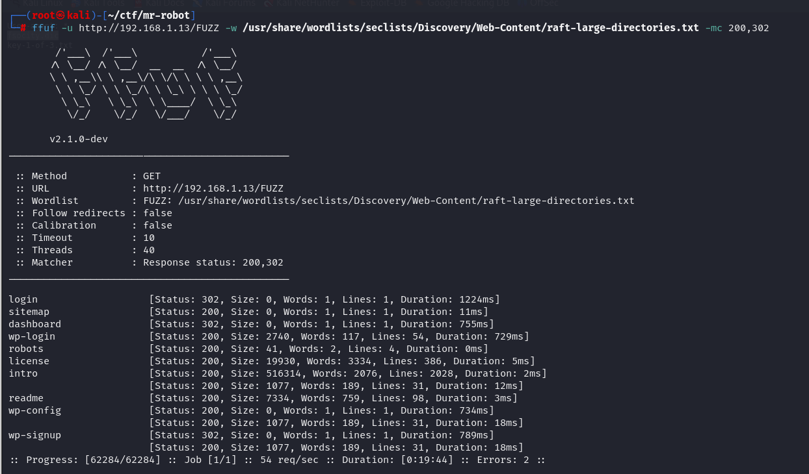
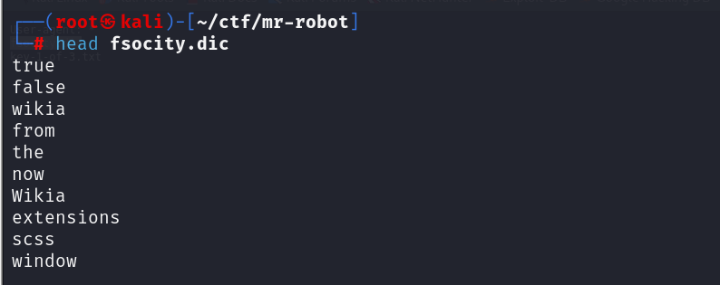
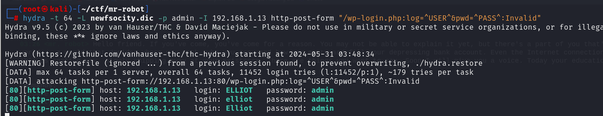

# GETTING STARTED

To download **Mr-Robot**, click [here](https://www.vulnhub.com/entry/mr-robot-1,151/).

**DISCLAIMER**

> This writeup documents the steps that successfully led to pwnage of the machine. It does not include the dead-end steps encountered during the process (which were numerous). I recommend attempting to solve the lab independently. If you find yourself stuck on a phase for more than a day, you may refer to the writeups for guidance. Please note that this is just one approach to capturing all the flags, and there are alternative methods to solve the machine.

--------------------------------------------------------------------------
# RECONNAISSANCE

I begin by scanning my network to pinpoint the target, conducting a straightforward **nmap** scan for this purpose

```bash

┌──(root㉿kali)-[~/ctf/mr-robot]
└─# nmap -sn 192.168.1.0/24      
Starting Nmap 7.94SVN ( https://nmap.org ) at 2024-05-31 02:05 EDT
Nmap scan report for RTK_GW (192.168.1.1)
Host is up (0.0037s latency).
MAC Address: F8:C4:F3:D0:63:13 (Shanghai Infinity Wireless Technologies)

Nmap scan report for linux (192.168.1.13)
Host is up (0.00028s latency).
MAC Address: 00:0C:29:0B:61:0F (VMware)

Nmap scan report for kali (192.168.1.12)
Host is up.
Nmap done: 256 IP addresses (6 hosts up) scanned in 3.20 seconds
```

As a result, the target IP is _192.168.1.13_. Following this, I conduct an **nmap** aggressive scan to gather information about the active ports and services.


--------------------------------------------------------------------------
# CAPTURING FLAG 1

The **nmap** scan revealed that ports **80** and **443** are active. I proceeded to access the target using a web browser for further investigation.


After interacting with the web server by entering various commands, I didn't find anything significant. Therefore, I conducted a **ffuf** scan on the target to gather information about directories and files.



I discovered several interesting files such as _readme_, _wp-login_, and _robots.txt_. Upon visiting _robots.txt_, I uncovered the first key.


--------------------------------------------------------------------------
# CAPTURING FLAG 2

The _robots.txt_ file contained a reference to another file named _fsocity.dic_. Upon attempting to access this file, it automatically downloaded to my system. Upon inspection, I discovered that it was a wordlist.



I used **wc** to find the wordcount of this dictionary file.


Since the wordlist may have contained duplicate words, I filtered out the unique words and saved them in a new file named _newfsocity.dic_.


During my **ffuf** scan, I also came across a WordPress login page located at _/wp-login_.


By trying default username and password combinations, I observed that the error message specified which field was incorrect. Leveraging this logic flaw, I used the wordlist accessed earlier to determine a valid username.


I used Burp Suite to enumerate the username, following these steps: 
**Note:** Since the wordlist is extensive, you'll need Burp Suite Pro to perform brute force attacks. If you're using the community edition, an alternative method is discussed after the Burp Suite method.

1. I inputted a default username and password, then monitored the requests sent by the server.


I discovered that the username is transmitted via the variable _log_, and the password is sent through _pwd_.

2. I forwarded this request to _Intruder_ and included the username field in the scope for the attack.


3. I pasted the wordlist into the _Payloads_ sub-tab.


4. I navigated to the _Settings_ sub-tab to extract the error message received.


5. I started the attack.


These usernames elicited a different response, indicating their validity.

### What if I don't have Burp Suite Pro?
In that case, I could use **hydra** to perform a brute force attack on the login panel. To learn more about how to do this,  visit  [*GeeksforGeeks*](https://www.geeksforgeeks.org/crack-web-based-login-page-with-hydra-in-kali-linux/).  

1. I attempted to login and viewed the requests made by the server through the *http-history* sub tab in **Burp Suite**.


2. The fields used to send the username and password are _log_ and _pwd_, respectively. Additionally, the response I receive is _: Invalid username_. 
3. Armed with this information, I can utilize **hydra** to perform a brute force attack on the login panel.

```bash

hydra -L <username_list> -p <password> <target> http-post-form "<login_url>:<post_data>:<failure_string>"
```



Now that I have the username, I can attempt to crack the password using the same wordlist. Given that it's a WordPress site, I can leverage **wp-scan** for brute forcing the correct password. 
**Note:** Alternatively, you can also use Burp Suite or Hydra for the same purpose.

```bash

wpscan --url http://192.168.1.13/wp-login.php -U elliot -P newfsocity.dic

```


Now that I have the username and password, I log into the website.


The _Appearance_ tab offered options to customize various aspects of the web server's appearance. Navigating to the _Editor_ sub-tab, I found templates for various response types.


To test it out, I navigated to the _404 template_ and added the following HTML code: 
`<p>HELLO WORLD!!</p>`.


Then to trigger this template, I tried accessing a page that did not exist


My query was executed successfully. Next, I navigated to [**revshells.com**](https://www.revshells.com/) and selected a payload for a reverse shell. Since the site runs on PHP, I chose the _php pentestmonkey_ script.

Alternatively, you can also download this script from _pentestmonkey's_ [GitHub repository](https://github.com/pentestmonkey/php-reverse-shell/tree/master).


I deleted the existing code from the *404 template* and pasted this


Then I started a listener using **nc** and triggered the *404 template*.

```bash

rlwrap nc -lnvp 8080
```


This granted me a reverse shell. Navigating to the home directory, I discovered another user named _robot_.


I found the second flag in this folder, but I didn't have permission to read it.


I checked the file permissions using the **ls** command.


Since I have read permission for the second file, I read it and find that it contains an MD5 hash of the _robot_ user's password.


I navigated to [**CrackStation**](https://crackstation.net/) to crack the hash.


Now that I have the password, I switch to *robot*


I couldn't run the command directly, so I needed to spawn a TTY shell. I found a Python script online from this [article](https://sushant747.gitbooks.io/total-oscp-guide/content/spawning_shells.html) and used it to spawn a TTY shell. Then, I switched to the _robot_ user.


Then I read the 2nd flag


> **ABOUT TTY SHELLS**
> If you have a non-tty-shell there are certain commands and stuff you can't do. This can happen if you upload reverse shells on a webserver, so that the shell you get is by the user www-data, or similar. These users are not meant to have shells as they don't interact with the system as humans do.
> 
> So if you don't have a tty-shell you can't run **su**, **sudo** for example. This can be annoying if you manage to get a root password but you can't use it.
>
>source :- https://sushant747.gitbooks.io/total-oscp-guide/content/spawning_shells.html

--------------------------------------------------------------------------
# CAPTURING FLAG 3

To escalate my privileges, I identified services running with root privileges

```bash

find / -user root -perm -u=s -ls 2>/dev/null
```

- `find` - used to search for files and directories within a given directory hierarchy.
- `/` - specifies the starting point for the search. Hence the search should start from the root directory.
- `-user root` - files should be owned by root user.
- `-perm -u=s` - includes only files and directories that have the setuid (s) permission set for the owner. **The setuid permission allows the file to be executed with the owner's privilege**.
- `-ls` - search results should be displayed in the form of a list.
- `2>/dev/null` - error messages should be discarded.


the **nmap** file had an suid bit which could be exploited. I visited [**GTFObins**](https://gtfobins.github.io/) and searched **nmap**


I used **nmap --interactive** to spawn an interactive shell.


I accessed privileged mode from Bash using **bash -p**.


Next, I navigated to the root directory and captured the final flag.


--------------------------------------------------------------------------
# CLOSURE

I have located all the keys in the following locations:
1. The first key was found in the _robots.txt_ file.
2. The second key was discovered in the home directory under the _robot_ user.
3. The final key was captured in the root directory.

That's it from my side! Happy Hacking :)


--------------------------------------------------------------------------