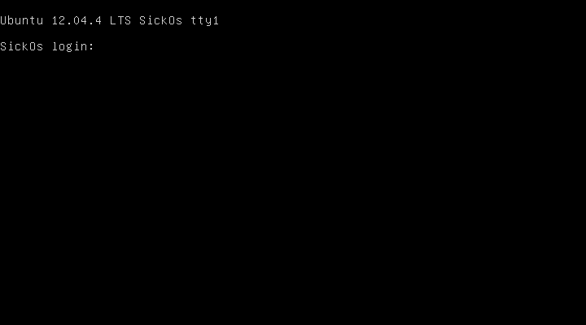
# GETTING STARTED

To download **sickos 1**, click on the link given below :-

https://www.vulnhub.com/entry/sickos-11,132/

> [!NOTE] 
> This writeup documents the steps that successfully led to pwnage of the machine. It does not include the dead-end steps encountered during the process (which were numerous). This is just my take on pwning the machine and you are welcome to choose a different path.

# RECONNAISSANCE

I found the target IP by scanning the network using **nmap**

```bash

┌──(root㉿kali)-[~/ctf/sickos1]
└─# nmap -sn 192.168.1.0/24                                        
Starting Nmap 7.94SVN ( https://nmap.org ) at 2024-07-21 23:51 EDT
Nmap scan report for RTK_GW (192.168.1.1)
Host is up (0.011s latency).
MAC Address: F8:C4:F3:D0:63:13 (Shanghai Infinity Wireless Technologies)
Nmap scan report for SickOs (192.168.1.4)
Host is up (0.010s latency).
MAC Address: 00:0C:29:25:BF:FD (VMware)
Nmap scan report for kali (192.168.1.13)
Host is up.
Nmap done: 256 IP addresses (3 hosts up) scanned in 5.04 seconds
```

Then I performed an **nmap** aggressive scan on the target.

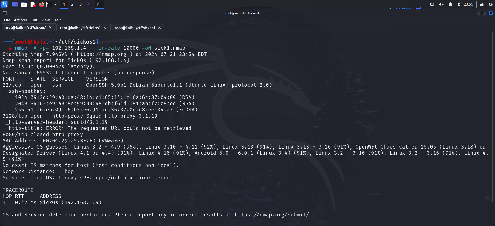

# INITIAL ACCESS

I accessed the web server on the open port.

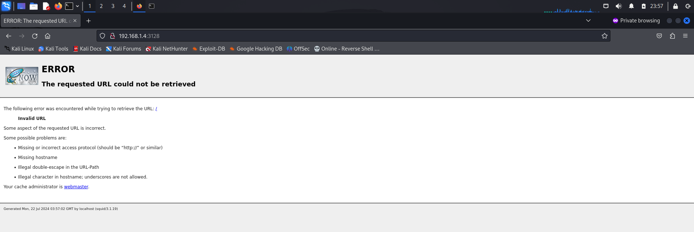

I googled the **squid** version and found this **hacktricks** article:

https://book.hacktricks.xyz/network-services-pentesting/3128-pentesting-squid

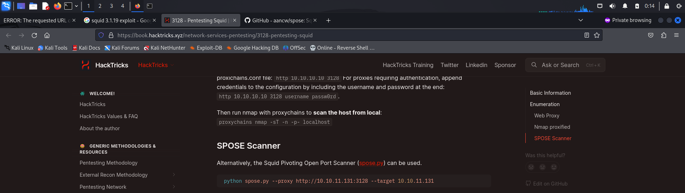

Hence, I downloaded the **python** script: https://github.com/aancw/spose

I then ran the script and found open ports.

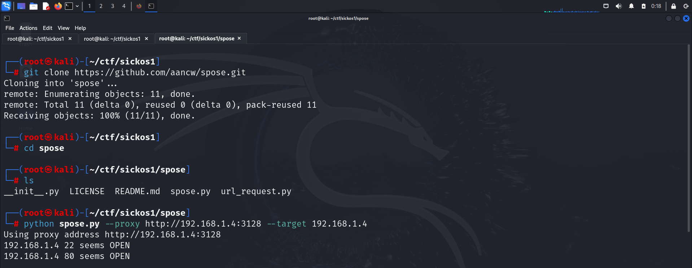

Then I used **curl** to access port 80.

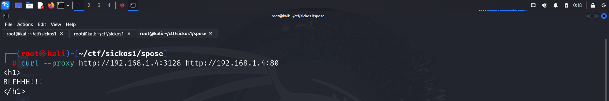

I then set the proxy on my browser and accessed it through the browser.

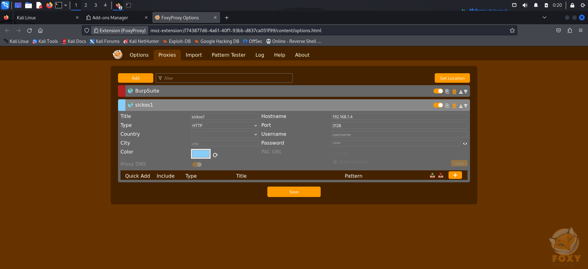

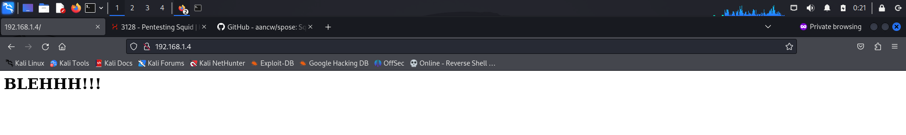

I then used **gobuster** to find other directories.

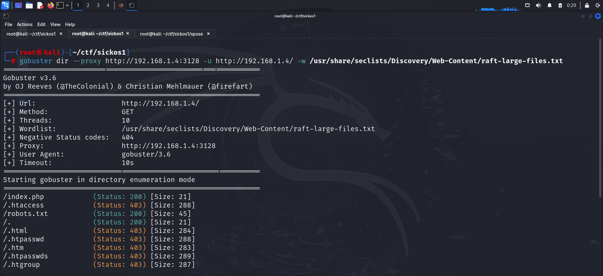

I then accessed the *robots.txt* file.

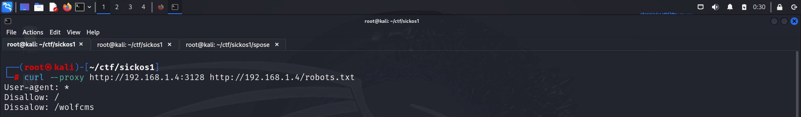

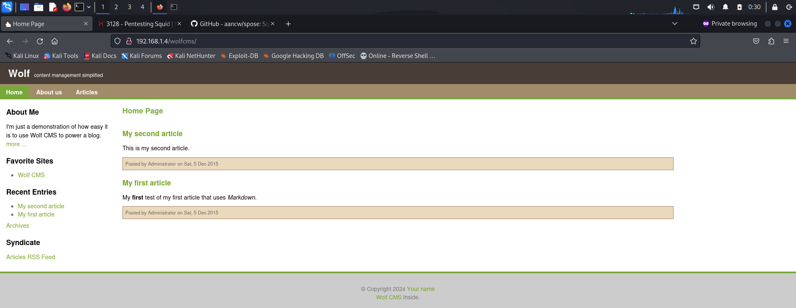

I did not find anything interesting from this page, so I ran a **nikto** scan on the target.

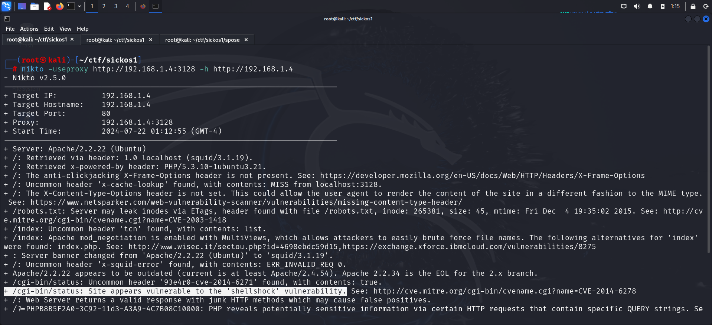

The scan identified a **Shellshock** vulnerability on the server.

> [!INFO] About Shellshock
> **Shellshock** (also known as Bashdoor) is a security bug in the Bash (Bourne Again Shell) command-line shell, widely used in Unix-based systems such as Linux and macOS. Discovered in September 2014, Shellshock allows attackers to execute arbitrary commands on vulnerable systems, potentially taking full control of the affected systems.

I read about this vulnerability and its exploitation here: https://book.hacktricks.xyz/network-services-pentesting/pentesting-web/cgi

Hence, I got a reverse shell by executing a malicious command with **Shellshock** and **curl**.

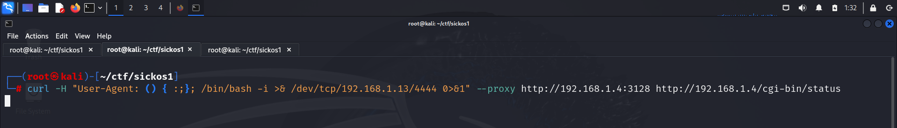

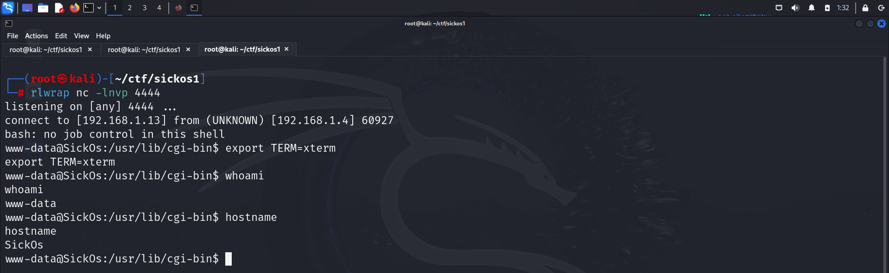

Hence I got initial access on the target.

# PRIVILEGE ESCALATION

I downloaded the **linux smart enumeration** script.

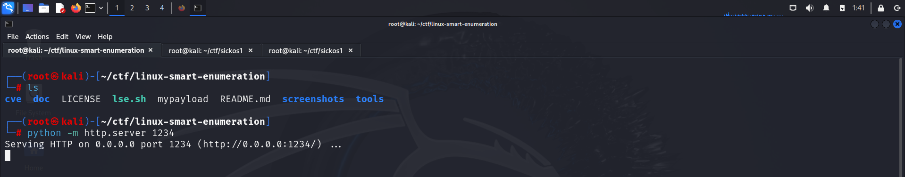

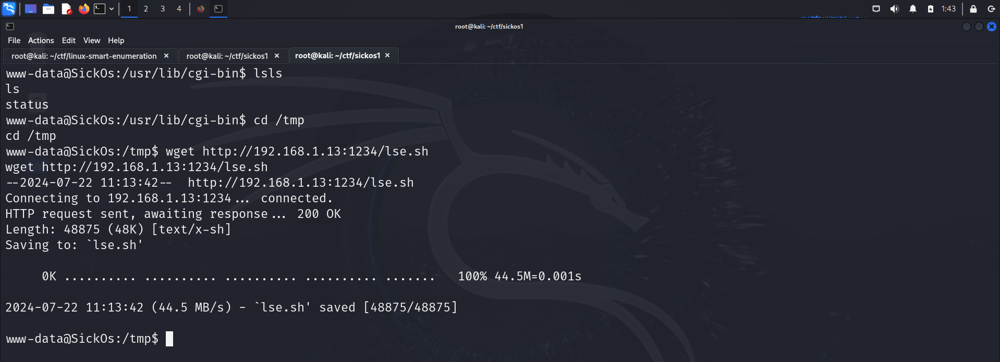

Finally I ran this and found an interesting python file

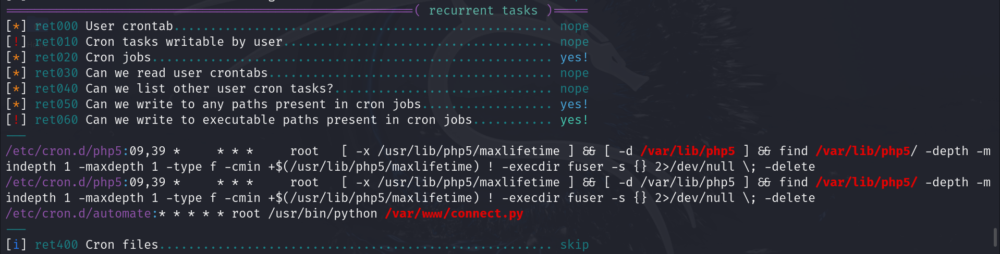

The file just contained some `print` statements.

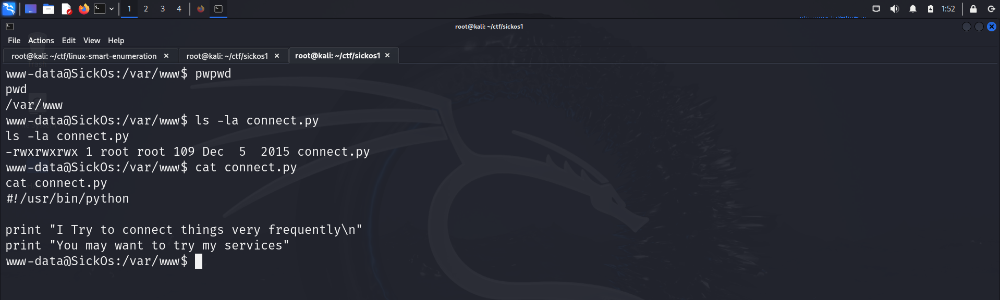

I modified this file and added a code that would give me a reverse shell.

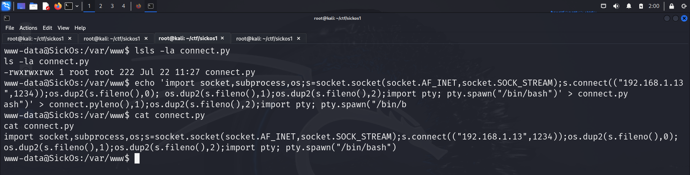

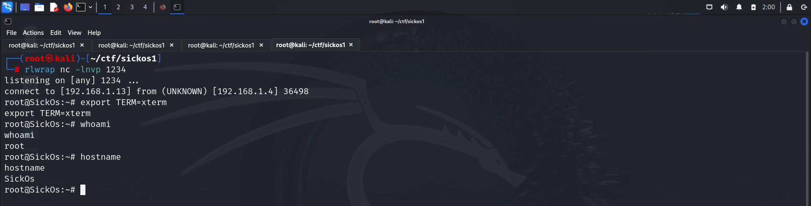

Hence, I gained root access and captured the flag from the */root* directory.

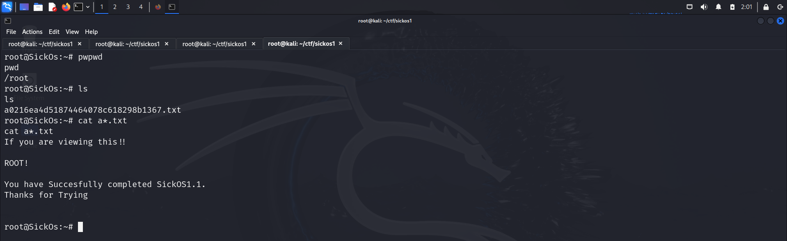

# CLOSURE

Here's a summary of how I obtained the root flag:
- I used the **squid** proxy to connect to the target web server.
- Upon accessing the target, I performed a **nikto** scan and identified a **shellshock** vulnerability in one of the paths.
- I exploited this vulnerability to execute a **bash** script and obtain a reverse shell.
- I then ran the **linux smart enumeration** script to identify misconfigurations for privilege escalation.
- I modified the Python script that was executed via **crons** with **root** privileges.
- With the reverse shell as the **root** user, I captured the flag from the */root* directory.


That's it from my side, until next time :)
Happy Hacking! 🎉

---