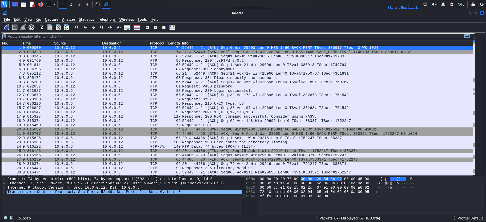
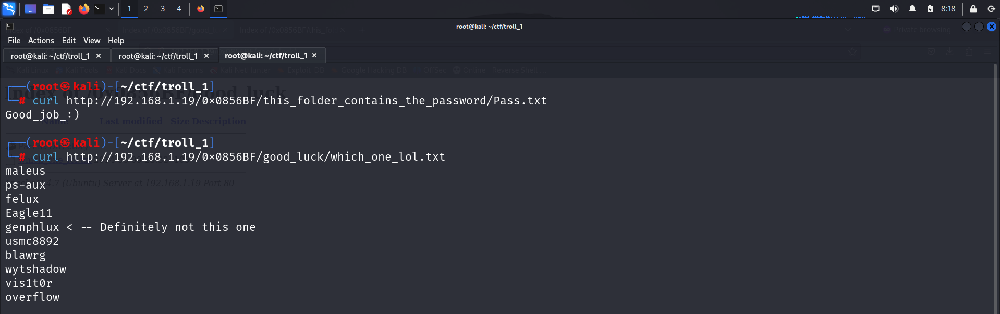

# GETTING STARTED

To download **Troll 1** click on the link given below:

https://www.vulnhub.com/entry/tr0ll-1,100/

> [!NOTE] 
> This writeup documents the steps that successfully led to pwnage of the machine. It does not include the dead-end steps encountered during the process (which were numerous). This is just my take on pwning the machine and you are welcome to choose a different path.

# RECONNAISSANCE

I performed a network scan using **nmap** to identify the target IP.

```bash

┌──(root㉿kali)-[~/ctf/troll_1]
└─# nmap -sn 192.168.1.0/24                                 
Starting Nmap 7.94SVN ( https://nmap.org ) at 2024-07-08 07:30 EDT
Nmap scan report for RTK_GW (192.168.1.1)
Host is up (0.0016s latency).
MAC Address: F8:C4:F3:D0:63:13 (Shanghai Infinity Wireless Technologies)
Nmap scan report for troll (192.168.1.19)
Host is up (0.00040s latency).
MAC Address: 00:0C:29:65:AF:BC (VMware)
Nmap scan report for kali (192.168.1.7)
Host is up.
Nmap done: 256 IP addresses (3 hosts up) scanned in 3.91 seconds
```

I then performed an **nmap** aggressive scan to gather more information about the target.


# INITIAL ACCESS

I accessed the web page through a browser.


I also visited the *robots.txt* page that my **nmap** scan discovered.


Fuzzing the page also didn't provide anything special. So I moved onto the **ftp** server. I exploited the **anonymous** login to log into the server and download a file.


This was a **pcap** file, so I used **Wireshark** to open it.



Through this message, I deduced that the client's IP was **10.0.0.12** and the server's IP was **10.0.0.6**. Upon close inspection, I found a message in a file called **secret_stuff.txt**.


From this, I found a directory named `sup3rs3cr3tdirlol`. I tried accessing it on the browser.


I downloaded this file and found that it was an executable.


I executed the binary.


I accessed this directory through the browser.


I accessed both directories thereafter.


I viewed the **txt** files through my terminal.



I saved the wordlist and tried brute-forcing the **ssh** credentials.


> [!NOTE]
> I also removed the **`Definitely not this one`** comment from the list.

I then added some more words such as the names of the **txt** files and the Troll message left behind, and tried again.


Hence I logged in as this user.


# PRIVILEGE ESCALATION

I proceeded to navigate to the */tmp* directory and downloaded the [**Linux Smart Enumeration**](https://github.com/diego-treitos/linux-smart-enumeration) script to explore methods for escalating my privileges.


However, the script did not find anything useful. So I looked for kernel exploits.


After finding an exploit, I downloaded it onto my system and transferred it to the target. Then I executed the exploit and got **root** access.


I spawned a tty shell and captured the final flag from the */root* directory.


# CLOSURE

Here's a detailed account of how I compromised **Troll 1**:
- I leveraged an **FTP** anonymous login vulnerability to retrieve a **pcap** file containing directory names.
- One of these directories contained an executable, leading to further discovery of additional paths.
- These paths included a wordlist of potential usernames and passwords.
- Using this wordlist, I successfully cracked valid credentials for **SSH**.
- With SSH access secured, I employed a **kernel exploit** to escalate my privileges.
- Ultimately, I obtained **proof.txt** from the */root* directory.


That's it from my side! Happy Hacking :)

---